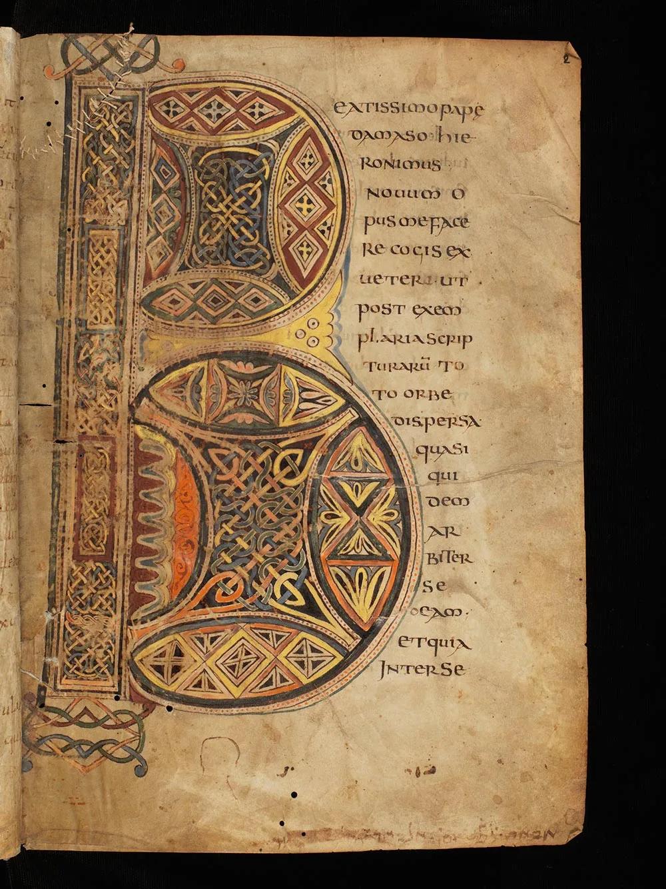
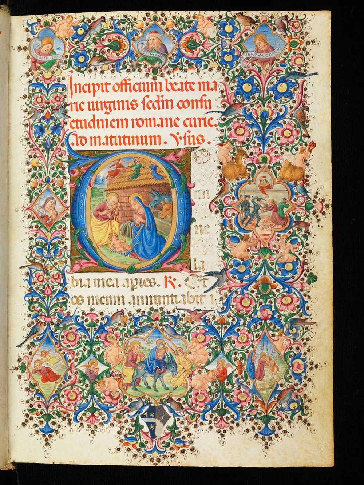
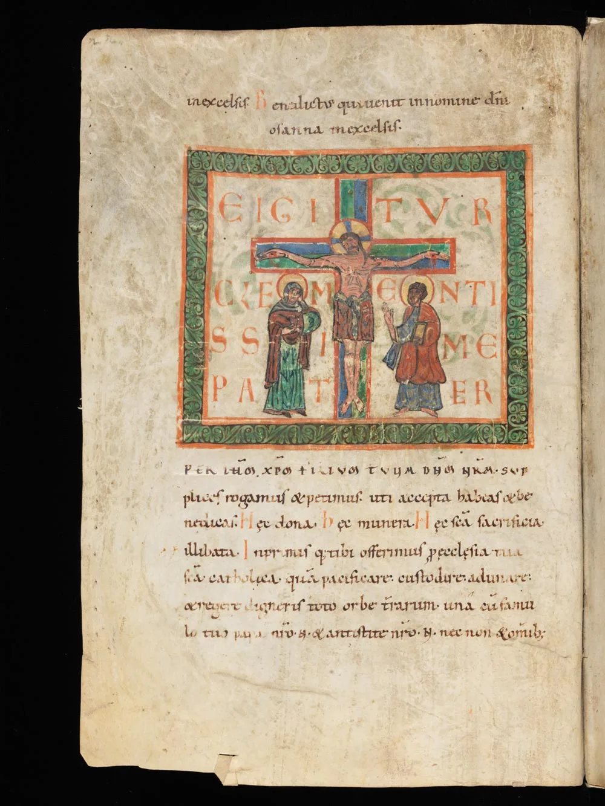
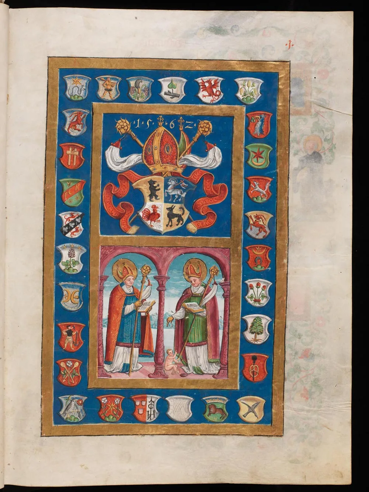

---
date:
  created: 2014-06-27
  updated: 2016-11-20
categories:
- Digital Humanities
- Social Media Codicologists
authors:
- giulio
slug: 31-new-manuscripts-e-codices
---
# 31 New Digitized Manuscripts from e-Codices!

e-Codices, the Virtual Manuscript Library of Switzerland, has added 31 new digitized medieval manuscripts to their website. Obviously, we had to go and investigate. **The new digitized manuscripts range from the 9th to the 18th century.** Difficult to choose which ones to highlight since they are all wonderful to our eyes. Let's start from the one they have highlighted themselves.

<!-- more -->

## The New Digital Manuscripts from e-Codices

### Genève, Bibliothèque de Genève, Ms. lat. 6

Parchment · I-II \+ 239 \+ III-IV ff. · 28.3 x 20.8 cm · Rhineland · second quarter of the 9th century

*Genève, Bibliothèque de Genève, Ms. lat. 6 \- Click to go to e-Codices*

> **The four Latin Gospels**
> This remarkable manuscript, created in the 9th century in the Rhineland, contains the text of the four Gospels in their Latin version, written in Carolingian minuscule. The manuscript is decorated with, among others, two initials embellished with interlace and with canonical tables presented in arcades in vivid colors.

### Genève, Bibliothèque de Genève, Ms. fr. 165

Parchment · 260 ff. · 26.5 x 19 cm · Paris · about 1412-1415
[![Pierre le Fruitier, called Salmon, Traictés de Pierre Salemon a Charles VI roy de France [Dialogues, second version] from e-Codices](assets/uploads/2014/06/bge-fr0165_004r.webp)](https://www.e-codices.unifr.ch/en/list/one/bge/fr0165)

*Genève, Bibliothèque de Genève, Ms. fr. 165 \- Click to go to e-Codices*

> **Pierre le Fruitier, called Salmon, Traictés de Pierre Salemon a Charles VI roy de France \[Dialogues, second version\]**
> Pierre le Fruitier, called Salmon, secretary to Charles VI and someone who influenced John the Fearless, Duke of Burgundy, in 1409 wrote a composite text that is simultaneously a mirror for princes, a collection of letters, and an autobiography. Salmon presents the qualities a sovereign needs in order to rule well. After his withdrawal from court in 1411 and after the change in royal politics towards John the Fearless, around 1412-1415 he presented a second version of the text; today this version is held in Geneva. With an image depicting Charles VI on a blue bed decorated with lilies, in discussion with his secretary, this manuscript is one of the showpieces of the Bibliothèque de Genève.

### Genève, Bibliothèque de Genève, Comites Latentes 54

Parchment · I\+226\+I ff. · 14.6 x 10.6 cm · Florence · 1470-1480

*Genève, Bibliothèque de Genève, Comites Latentes 54 \- Click to go to e-Codices*

> **Book of hours**
> This precious book of hours was made in Florence around 1470-1480. Its rich and elegant illumination is due to the close circle of the most famous florentine miniaturist of his time, Francesco d’Antonio del Chierico. The same hand is responsible for the major illuminations at the beginning of the various sections as well the initials in the text. The flourished initials are of great elegance. A partly erased coat of arms on the opening leaf indicates that the book of hours was made for the wedding of a male member of the Serristori family. The manuscript entered in the collection of the present owner in 1970 and it was deposited at the Bibliothèque de Genève as part of Comites Latentes.

### St. Gallen, Stiftsbibliothek, Cod. Sang. 344

Parchment · 182 pp. · 27.5 x 19.5 cm · St. Gall · 12th century

*St. Gallen, Stiftsbibliothek, Cod. Sang. 344 \- Click to go to e-Codices*

> **Missale**
> Missal containing sequences without neumes by Notker Balbulus (pp. 1-14), a calendar (pp. 15-20), a sacramentary (p. 21-82) \- beginning on p. 21 with a beautiful initial ‘M’ (a vine scroll contoured in red on a blue and green background), from p. 22 the Canon of the Mass with a Te igitur-initial with the Crucifixion \- and at the end an incomplete ritual (pp. 81-182).

### St. Gallen, Stiftsbibliothek, Cod. Sang. 543

Parchment · I-IV \+ 292 ff. · 53 x 39.5 cm · St. Gall · 1562-1564

*St. Gallen, Stiftsbibliothek, Cod. Sang. 543 \- Click to go to e-Codices*

> **Manfred Barbarini Lupus, Chants in four parts for the Liturgy of the Hours for the principal feast days of the liturgical year**
> Large-format antiphonary with chants in four parts, written and illuminated between 1562 and 1564\. By order of Prince-Abbot Diethelm Blarer (1530-1564), the Italian Manfred Barbarini Lupus from Correggio composed the pieces for four voices \- antiphons, responsories, hymns and psalms for the principal feast days of the liturgical year as well as passions according to Matthew, Mark and Luke. Father Heinrich Keller (1518-1567) wrote the text and the illuminator Kaspar Härtli from Lindau on Lake Constance created a full-page All Saints picture with Christ on the cross (f. IVr), as well as a donor portrait with the coats of arms of the then-living members of the St. Gall monastic community (f. 1r).

Make sure to give a like to the [e-Codices Facebook page](https://www.facebook.com/ecodices)! You can find all the latest uploaded manuscripts [here](https://www.e-codices.unifr.ch/en/list/all/LastUpdate).
Via: [e-codices \- Virtual Manuscript Library of Switzerland](https://www.facebook.com/ecodices)
