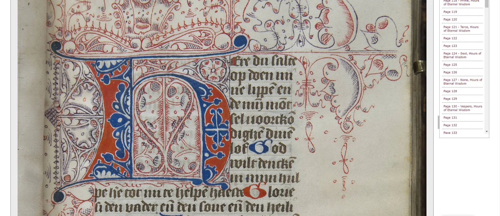

---
date:
  created: 2018-01-03
  updated: 2023-04-03
categories:
- DMMapp Updates
- New Additions
authors:
- giulio
slug: 543-2
---
# 543!

That's how many repositories, websites, libraries, etc. you can now visit through the DMMapp!

[BX 2080 1455 Vault \- Book of hours: use of Utrecht \[1455-1465\] \- "Page 26"](https://collections.mun.ca/digital/collection/rarebooks/id/1150)
Yes, we have been busy updating the data, amd we also took the occasion to delete or update a couple of links that stopped working and that we kindly notified to us via Twitter / Email.

<!-- more -->

### **What's new?**

We welcome the following new entries / updates:

- **Cambridge University Library (Digital Collections)**
- **QE2 Library, Memorial University**
- **Archivio di Stato di Firenze**
- **Bibliothèque Numerique (Lyon)**
- **New College of Florida**
- **Finnish Literature Society**
- **University Library Kassel (updated link)**
- **State Library Victoria**
- **Liège University Library (updated link)**

Have fun discovering their treasures!
Big thanks to all those that contacted us and helped the DMMapp improve. As always, anyone is welcome to improve, develop, add or remove links from the the DMMapp. Head over to <https://github.com/SexyCodicology/DMMapp> and commit!
The Sexy Codicology Team
