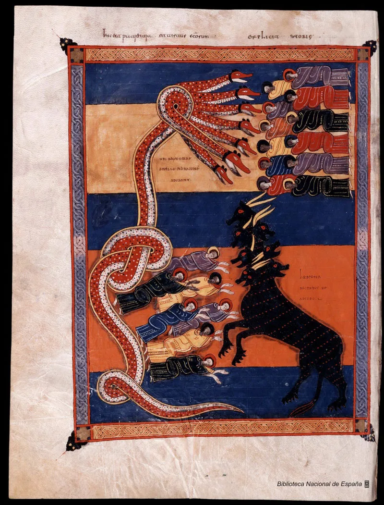
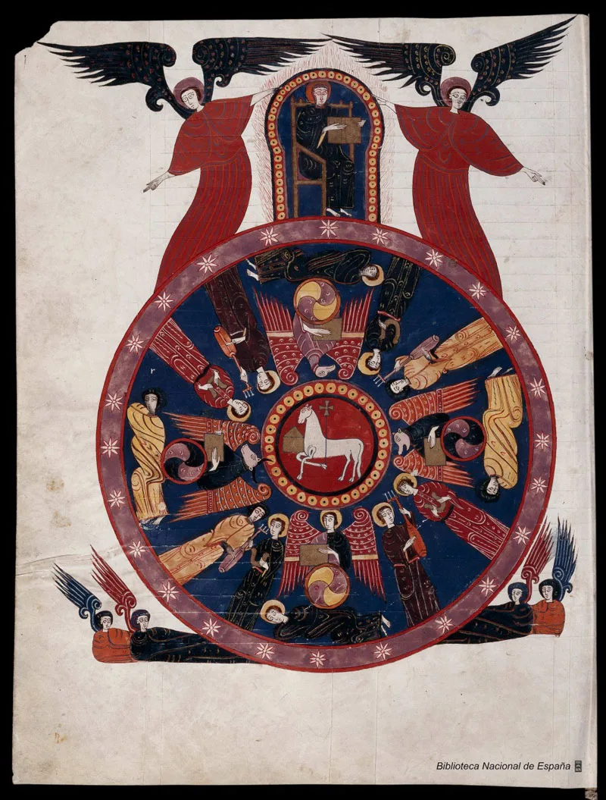

---
date:
  created: 2014-05-13
  updated: 2023-04-19
categories:
- Manuscript Curiosities
authors:
- giulio
slug: beatus-manuscripts
---
# The "Beatus" Manuscripts

For the series: "Some manuscripts are more interesting than others", we give you: *[Beatus de Liébana : Códice de Fernando I y Dña. Sancha](https://bdh-rd.bne.es/viewer.vm?id=0000051522 "Link to the full manuscript")*, call number: VITR/14/2 from the [National Library of Spain](https://bdh.bne.es/bnesearch/Inicio.do?languageView=en).

<!-- more -->

## Stumbling Upon the *Beatus*

If you have followed our blog for a while, you will know that we have developed an app that allows you to go and browse some 20'000+ digitized manuscripts from 300+ libraries around the world. It often happens that we use the app too, to go randomly exploring digitized books. Every once in a while we stumble upon a manuscript that we had never encountered before that is so amazing, so beautiful, that we can't grasp how we could have been happy until that day. That's exactly what we wondered about when we stumbled upon this masterpiece.
Some background info is necessary about VITR/14/2: The Beatus of Ferdinand and Sancha is also known as *Beatus* *Facundus*. It is an illuminated manuscript containing a **commentary on the Apocalypse by Beatus of Liebana**. It was written and painted around 1047 and is currently preserved at the National Library of Spain in document Vit.14-2. The manuscript contains 114 miniatures of [Mozarabic influence](https://en.wikipedia.org/wiki/Mozarabic_art_and_architecture) ( Mozarabs were Iberian Christians who lived under Arab Islamic rule.) **These miniatures illustrate a commentary on the Apocalypse of St. John**, originally written by Beatus of Liebana during the eighth century. The miniatures are inspired by other earlier manuscripts of the tenth century as the Beatus of Valladolid or [Morgan Beatus](https://en.wikipedia.org/wiki/Morgan_Beatus), with the same color stripes background details. In this case, however, perhaps there is a more delicate and elegant style that denotes a Romanesque influence, which was probably preferred by Ferdinand I.
For more information on the miniatures' style of this manuscript, **enjoy this free book from the Metropolitan Museum of Art:** [The Art of Medieval Spain, A.D. 500–1200](https://www.metmuseum.org/research/metpublications/The_Art_of_Medieval_Spain_AD_500_1200)

## So many *Beatus*!

You might have noticed a lot of "*Beatus*" in the titles in the last paragraph. With the word "*Beatus*" we refer to a genre of Spanish manuscripts from the X and the XI centuries CE, containing miniatures and John's Apocalypse plus, most importantly, the commentaries written in the VIII century CE by *Beato di Liebana*. This work was a profound influence on the Spanish Church development.
There is so much to know about these kind of manuscripts. Unfortunately, the only deep description we could find, available to all, is on the [Italian Wikipedia](https://it.wikipedia.org/wiki/Beatus) (also in German and French, but alas, no English!). Try using Google Translate, if you are interested in medieval miniatures, this article is so interesting and stacked with information!

We are so glad we stumbled upon this manuscript. I'll certainly be looking at all the others from the same period and region. There are 31 around the world! As always, have fun exploring!
