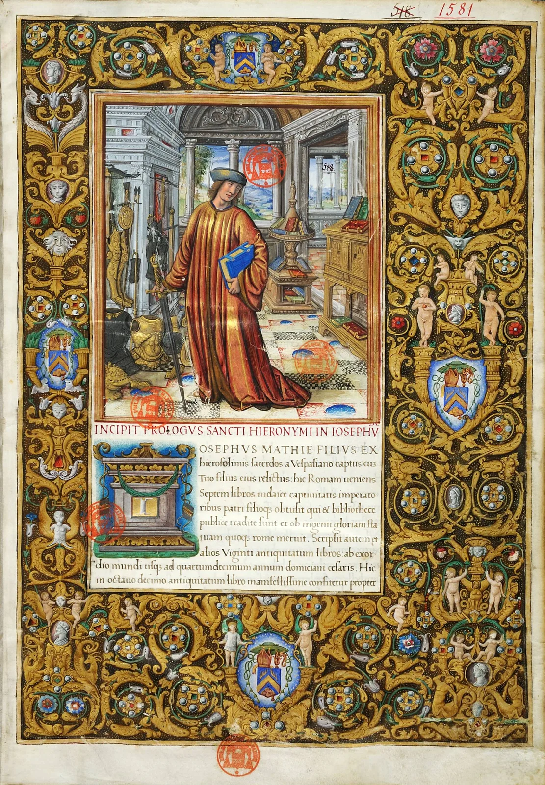

---
date:
  created: 2019-05-10
  updated: 2023-04-03
categories:
- Digitized Libraries
authors:
- giulio
slug: bibliotheque-mazarine
---
# Bibliothèque Mazarine

We have just fixed the link to the Bibliothèque Mazarine! Also, we have added the link to the same institution in the BVMM.
What's the difference?

<!-- more -->

- In the BMVV there are **more than a thousand digitized manuscripts,** but is not IIIF compliant. Also, the images are copyrighted with a **CC BY-NC 3.0 license**.
- Our updated link has instead around 200 manuscripts, in **IIIF glory, and in the public domain!**

Here are the two new links:
BMVV: https://digitizedmedievalmanuscripts.org/record/591
Original:  [https://digitizedmedievalmanuscripts.org/record/185](https://digitizedmedievalmanuscripts.org/bibliotheque-mazarine)
Antiquitates Judaicae, Bibliothèque Mazarine, Ms 1581 
 [https://mazarinum.bibliotheque-mazarine.fr/records/item/1824-antiquitates-judaicae](https://bibnum.institutdefrance.fr/records/item/1824-antiquitates-judaicae)

