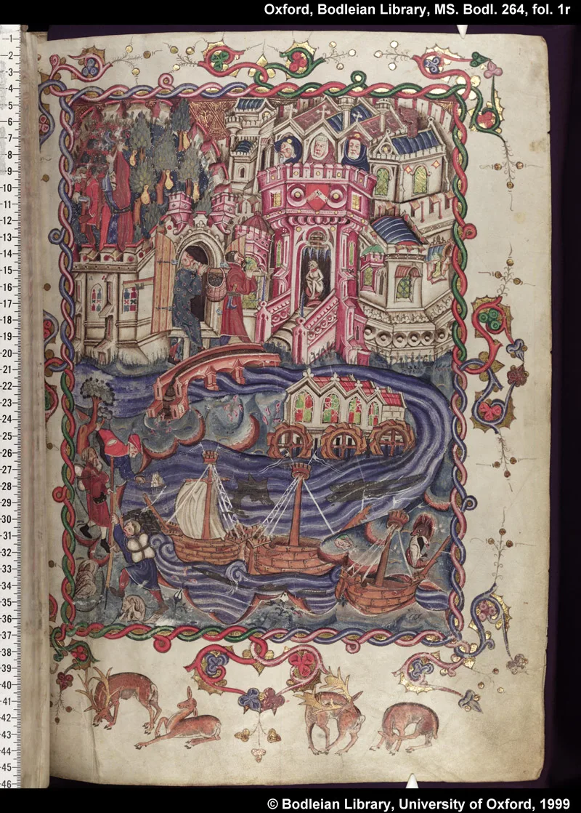
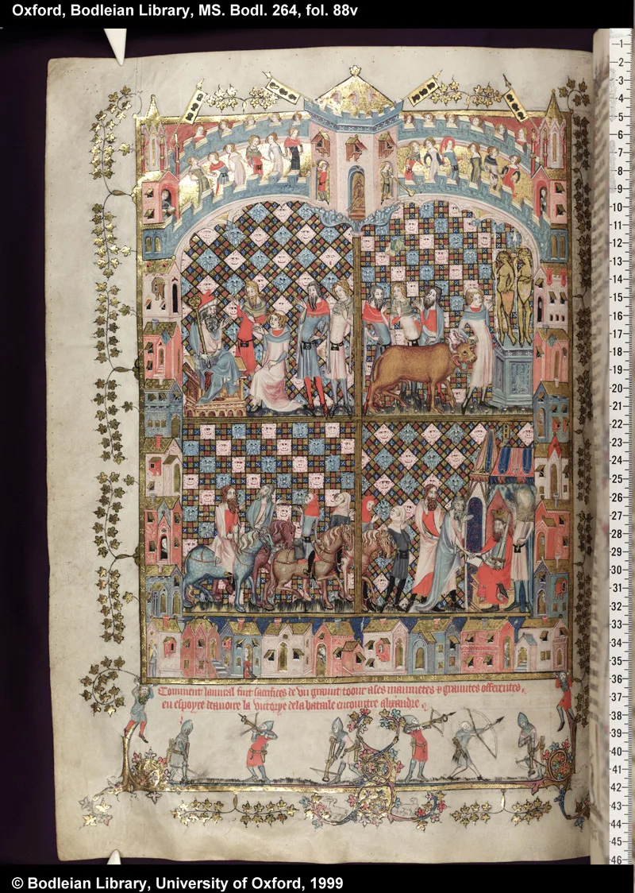

---
date:
  created: 2014-07-20
  updated: 2023-04-03
categories:
- Manuscript Curiosities
authors:
- giulio
slug: bodley-264
---
# Bodley 264: Two Worlds and Two Views

This morning a woke up to an email from my father. It was an article from the [digital edition of his favorite Italian newspaper](https://abbonamenti.corriere.it/). The title of the article is: **'Il sovrano che Unì Est ed Ovest'**, or: *The Sovereign that United East and West*. Unfortunately the newspaper's app shares the article, but excludes the author's name from it, but it's dated 20/07/14.
The article carefully explains how the three books contained in Oxford Bodley 264 (and a facsimile created by*Istituto dell’Enciclopedia Italiana*) are connected.

<!-- more -->

*Bodley 264 - Opening page, folio 1r*

## A Few Words About Bodley 264

Oxford Bodley 264 is a beautiful composite illuminated manuscript containing three different works: *The Romance of Alexander* which wascompleted in 1338 and illuminated within in 1344, the other two works were added at a later time: *Alexander and Dindimus* and *Li Livres du Graunt Caam* were bound together around the turn of the same century.
*The Romance of Alexander*, the first work contained in Bodley 264, is a collection of legends concerning Alexander the Great. Originating in 200 CE, the original versions were changed, adapted and build upon hundreds of times and were translated in many languages and at the beginning of the 12th century new French versions appeared on the scene, similar as the one in Bodley 264.
Part two of this manuscript is a poem concerning the correspondence between Alexander and Dindimu, King of the Brahmans in the East. It is written in Middle English.
Part three is *Li Livres du Graunt Caam* (The Book of the Grand Khan), part of *The Travels of Marco Polo*.

*Bodley 264, f. 88v*

## What's the Point of this Composite Manuscript?

The question that the author of the newspaper article answers is: "Why where these three books bounded together?". The answer is as simple as it is deep in meaning: in the last two lines of the article we can read:
> Alessandro rappresenta la conquista e la violenza, questi grandi viaggiatori rappresentarono e inverarono la mescolanza di civiltà.

**Alexander represents the conquest and the violence, while the great travelers represent and embody the mix of civilizations.** These books were bound together in Bodley 264 to have both worlds, in every sense: The East and the West, conquest and exploration.
And this is exactly what makes codicology "sexy" to me: pondering how the texts, the scripts, the illuminations, the bindings, the historical happenings of the time, the readers, and the owners come together in a manuscript and answer the question: **"why does this manuscript exist in this form in the first place?"**
