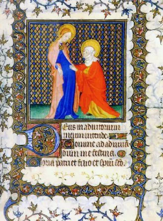
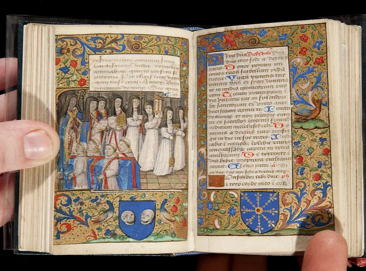

---
date:
  created: 2014-01-20
  updated: 2023-04-03
categories:
- Digital Humanities
authors:
- marjolein
slug: books-hours-phaidon-press-review
---
# From the Codicologist’s Bookshelf I

## Review of *Books of Hours* by Phaidon Press

<!-- more -->

In this very first book review by Sexy Codicology I will discuss *Books of Hours* published by Phaidon Press. This book was first published in 1996 and has had various reprints over the years. Even though the book might be eighteen years old (the nineties don’t feel that long ago, do they? ;)) the quality of the publication is good. I wouldn’t have guessed that this book would be more than a couple of years old.

*The front cover of "Books of Hours" by Phaidon*

As the title quite clearly states, this book is about the medieval book of hours. Sometimes these sort of works are called the ‘medieval best-seller’ as it was quite popular from about the late 13th century to roughly the 16th century. It was Christian devotional literature of which quite many manuscripts have survived. What makes these books particularly special and amazing medieval objects is that the content and decorations would be made according to the client’s wishes. So these books can be very rich sources of information about their owners.
When I ordered the book I knew that it was going to be small format, but it still surprised me how small it really was (10x12cm). However, I don’t think this is a bad thing, it makes it an adorable little book. In my opinion, one of the strong points of this publication is that some of the reproduced images from books of hours are printed at their original size. This is a really cool feature, that you hold this book in your hands and get a glimpse into what the medieval reader of the book of hours would be looking at. I knew that some manuscripts are tiny, yet *Books of hours* made me realize even more what incredible works of art some miniatures are.
One of the downsides of this book for me is that the descriptions of the illustrations are rather short. Some of the manuscript pages have been reproduced in their original size, but not all of them. It’s a shame that the captions of the photos don’t mention which ones are original size. Other than that, some descriptions mention (in short) what you see in the pictures, some don’t. As it turns out, at the end of the book there is a whole section with really nice and informative descriptions. I just wish this info wasn’t banned to the end of *Books of Hours*. I very well understand it would be difficult (if not impossible) to incorporate all that into the main text and the captions. However, now the reader has to go back and forth to combine the right image to the right explanation. Not super practical.
Don’t read this book if you are looking for an in-depth work on books of hours. I think this publication is a nice place to start when you want to read some ‘beginner’s literature’ on this subject. The text is well-written and informative. It discusses the contents of books of hours and explains how it can vary. **Overall I believe this book is worth buying, also because it costs very little. It could make a nice gift for your fellow manuscript lover.** *Books of hours* is a nice, quick read with an interesting variety of images to illustrate the text.

Rating: 3

*Vault Case MS 131 Newberry library; a book of hours and a breviary*

## More on Books of Hours

- On the Hours of the Duc de Berry see [our other blog post](https://blog.digitizedmedievalmanuscripts.org/free-online-books-metropolitan-museum-art/) for the free book on the subject by the Metropolitan Museum of Art
- And see [our section on the book of hours](../../codicology/book-of-hours.md)
- Some other sources of information:
- Private Devotion: Humility and Splendour from the Fitzwilliam Museum.
- [The Prayer Book of Claude de France](https://www.themorgan.org/collection/Prayer-Book-of-Claude-de-France), a very cute and small book of hours from the Morgan Library and Museum.
