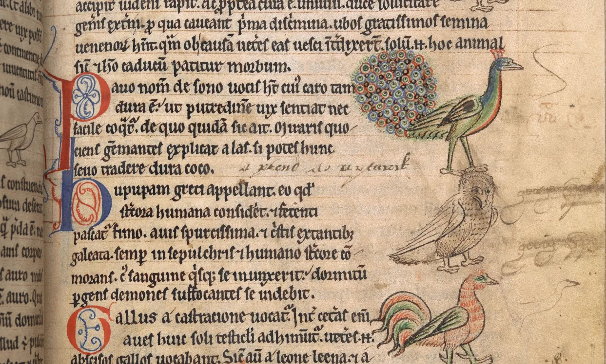
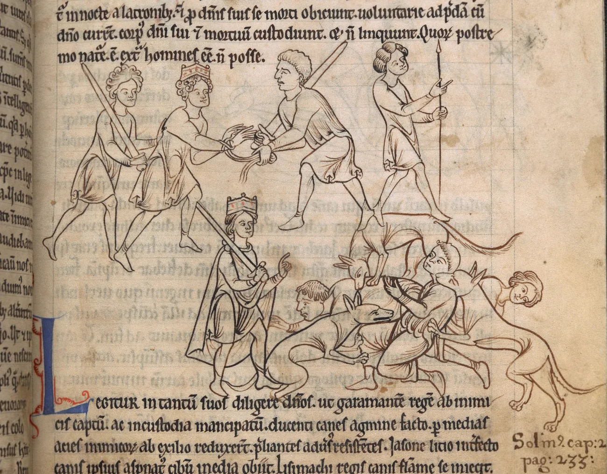

---
date:
  created: 2017-03-16
  updated: 2023-04-19
categories:
- Digitized Libraries
- Manuscript Curiosities
authors:
- giulio
slug: british-library-new-manuscripts
---
# 100 newly digitized manuscripts online

There is no way we could have come up with a better title. **The British Library and the *Bibliothèque nationale de France* have just digitized 100 manuscripts**, all dated between 700CE and 1200CE, and made them available online! The news is so awesome that as soon as we saw it on Twitter we decided we would write this post.
> 100 pre-1200 manuscripts have been added to the British Library's Digitised Manuscripts site. Get the list at <https://t.co/GZkK4TtD0m> [pic.twitter.com/FhrQrB19at](https://t.co/FhrQrB19at)
>
> — Medieval Manuscripts (@BLMedieval) [March 16, 2017](https://twitter.com/BLMedieval/status/842165028920934400)

<!-- more -->

## The more digitized manuscripts by the British Library, the merrier!

What is there to find in this new “release”? Well, as the title says: **100, fully digitized medieval manuscripts, available for everyone to browse for free.** Which, you ask? The British Library has prepared a tidy [Excel Sheet](https://blogs.bl.uk/files/100-mss-online.xlsx) for you with everything you need to know!
We gave a quick look, and here is just three examples of the awesomeness that awaits you!

### Add MS 11283 - Bestiary

*Add MS 11283 - Bestiary - f. 23r Describing the voice of the peacock: Martial 13.72 – Pavo nomen de sono vocis habet; cuius caro tam dura est ut putredinem vix sentiat, nec facile coquatur. De quo quidam sic ait...  (Text taken from an online version of the Isidore's Book XII from the Etymologiae, see: [https://penelope.uchicago.edu/Thayer/L/Roman/Texts/Isidore/12*.html](https://penelope.uchicago.edu/Thayer/L/Roman/Texts/Isidore/12*.html))*

> *This manuscript is the earliest extant manuscript of Clark's Second-family bestiaries that brings in new materials by following a system of classification into beasts, birds and reptiles. (As it is often the case with the British Library, always read their full description of the objects. Very detailed and interesting. In this case see: [https://www.bl.uk/manuscripts/FullDisplay.aspx?ref=Add_MS_11283](https://www.bl.uk/manuscripts/SetupFullDisplayHandler.ashx?ref=Add_MS_11283))*

*Add MS 11283 – Bestiary – f.10r King Garamantes captured by his enemies and then rescued by his dogs. The text under the miniature reads: "Legitur [canes] in tantum suos diligere dominos ut Garramantem regem ab inimicis captum ac in custodia mansipatum, ducenti canes agmine feto, per medias acies inimicorum ab exilio reduxerint, preliantes adversus insistentes…" [Hugo III, xi] (We have extracted the text from an online transcribed text of the [Bestiarium of Anne Walsh](https://manuscripts.org.uk/chd.dk/gui/gks1633_guide.html))*

### Add MS 11850 - Hieronymus, Epistula ad Damasum papam

*Add MS 11850 f. 10r Hieronymus, Epistula ad Damasum papam - Detail, St. Peter*

The *Préaux* Gospels from Normandy and datedearly 12th-century*.* This gives us the possibility to highlight the **Quality** with which the digitization has taken place. *Bravo*!

### Add MS 38818 - Composite manuscript

*Add MS 38818 - Palladius, De Agricultura; Vitruvius, De Architectura; Flavius Vegetius, De re militari; Extracts from Justinian, Institutiones; Indexes of words and concepts related to different works of St Augustine and to Prosper of Aquitaine's Epigrammata ex sententiis Sancti; an anonymous treatise on signs; A table of chapters of the Sententie libri iii; a collection of 50 sermons including Robert of Basevorn's Forma predicandi; extract from Isidore of Seville, Synonyma - Yep, all in one book!*

If you like BIG manuscripts full of different text and styles of writing, this one is for you! This manuscript contains:

- Palladius, *De Agricultura*
- Vitruvius, *De Architectura*
- Flavius Vegetius, *De re military*
- Extracts from Justinian, *Institutiones*
- Indices of words and concepts related to different works of St Augustine and to Prosper of Aquitaine, *Epigrammata ex sententiis Sancti Augustini*
- An anonymous treatise on signs
- A table of chapters of Isidore of Seville, *Sententie libri iii*
- A collection of 50 sermons followed by Robert of Basevorn, *Forma predicandi*
- Excerpt from Isidore of Seville, *Synonyma de lamentatione animae peccatricis*

A [complete description](https://www.bl.uk/manuscripts/SetupFullDisplayHandler.ashx?ref=Add_MS_38818) is available on the British Library's website.

## Who do we have to thank for this?

This digitization effort is part of **The Polonsky Foundation England and France Project: Manuscripts from the British Library and the *Bibliothèque nationale de France*** which couples the two libraries in a collaborative project that aims to create two innovative new websites that will make 800CE manuscripts decorated before the year 1200CE available freely!  (See the [official post](https://blogs.bl.uk/digitisedmanuscripts/2016/10/england-and-france-700-1200-manuscripts-from-the-biblioth%C3%A8que-nationale-de-france-and-the-british-li.html) on this for more information.)
**100 digitized manuscripts in 7 months!** Fantastic. We applaud the project, and sit impatiently behind our desks in anticipation of all the other jewels that will soon be online. Go to the British Library's website and get lost in manuscript heaven!
You can follow the British Library on [Twitter](https://twitter.com/BLMedieval) (The account is focused in medieval manuscripts) and on [Facebook](https://www.facebook.com/britishlibrary/), but you can also follow their medieval manuscripts’ adventure on their [blog](https://blogs.bl.uk/digitisedmanuscripts/).
