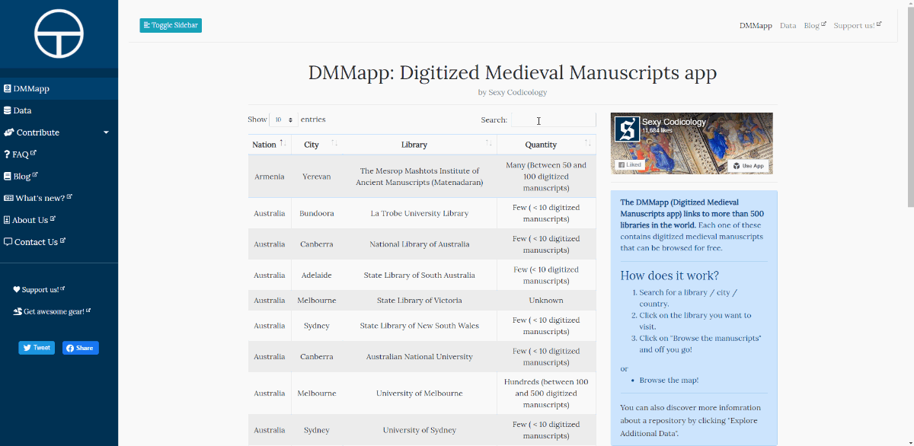
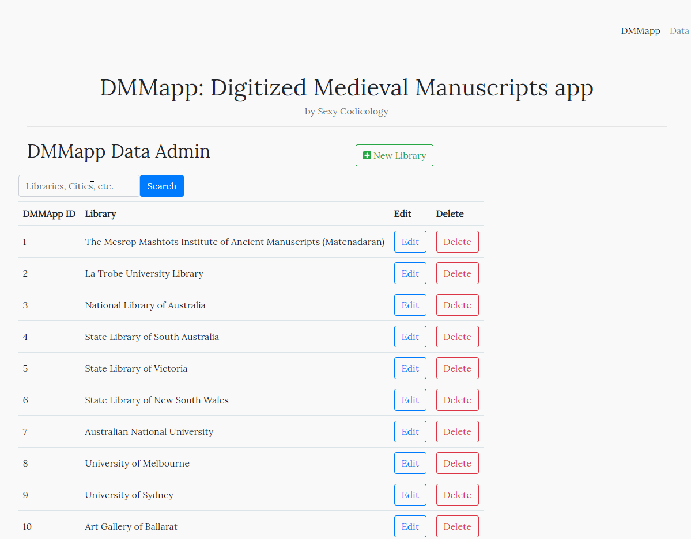

---
date:
  created: 2020-02-07
  updated: 2023-04-03
categories:
- DMMapp Updates
authors:
- giulio
slug: create-your-own-dmmapp
---
# Create your own DMMapp!

Yes!  **We are delighted to announce that the code makes the DMMapp work is now** **available for everyone on GitHub****!**

When we developed the new [DMMapp](https://digitizedmedievalmanuscripts.org/), we were of the opinion that the application we created should be reusable: everyone should have the possibility to recreate the DMMapp, or to create a similar app.
So, we took what we created, removed most of the Sexy Codicology modifications and links, and release the code on GitHub and **as of today, you can create your own project based on the DMMapp!**
What does this mean? Although Sexy Codicology focuses on digitized medieval manuscripts, there are so many other potential projects that might benefit for an app with a similar structure as the DMMapp:

<!-- more -->

- You would like to create an easy-to-access database concerning incunabula and their location.
- Someone would like to pin on a map where Beneventan monasteries were located and add metadata about them.
- Maybe a researcher would like to show the location of printing presses in the 1500's.

...and so on. The applications are endless.
Thanks to your amazing support on Patreon we were able to convert our DMMapp into what it was meant to be: a free-for-all tool that can be reused, by anyone, to create something amazing.

## The DMMapp vs. the Open Source edition

The Open Source version is very similar to what you are used to see on the DMMapp: an interactive map, together with tables to show off the data.
Besides some structural edits (i.e.: the name of the pages) the main difference between the Open Source edition and the DMMapp is that the the administrative side of the DMMapp is available only to us, Sexy Codicology Team, to edit the contents of the database. **The Open Source edition, instead, allows you to create, read, update, and delete database entries ("CRUD", in jargon), register admins, reset passwords, etc.**

### "I am not an expert at programming. Can I make it work?"

Yes. **Getting the Open Source edition up and running is simple**. We have written a quick-start guide, and the Wiki associated to the GitHub repository will help you further as we fill it with information. Don't be scared to try, even if you have very little programming experience!

### The Next Steps

We are not done yet. While the code is already available for everyone to play with, there is still much to do:

- **The Wiki**: we want to make the app **as easy as possible for everyone to understand and customize**. This means a lot of writing and editing has to be done in [the Wiki](https://github.com/SexyCodicology/DMMapp-Open-Source/wiki).
  "How do i get the Map working?", "How do I create an admin account?", "How do i put this application on the server?", "How do edit the structure of the database?" While there are many Laravel tutorials ("Laravel" being the framework we build the app on) out there that will explain these details, these are mostly aimed at experienced developers**. We would like institutions, enthusiasts, passionate people who might not have extensive development experience, to also be able to create something great.** We had very little experience ourselves when we started developing the up the DMMapp, and we would like to share what we learned with as many people as possible. This will require translating the technical developers' jargon into something maybe a little less arcane. **This our current main priority.**
- **The  App itself**: Although what we developed is, in our opinion, ready to be placed on a server and work, it still requires refining.
  For example: when you add a new item to the database, you don't get any notification that the action was successful. It just happens, and gives no feedback to the user. Even worse, when you click on the "Delete" button to delete an item in the database, the action is immediately executed. No "Are you sure?" questions asked. You can see it in the gif posted above. This makes for a thrilling experience, but not a user-friendly one.

If you have any questions, please feel free to contact us by any channel you prefer, and thank you for your continued support!
The Sexy Codicology Team
