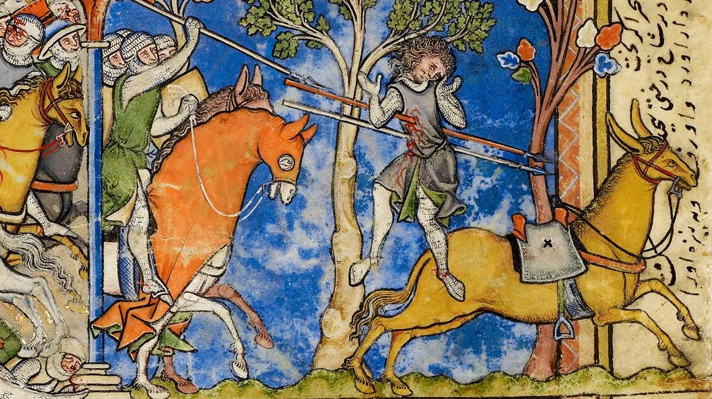
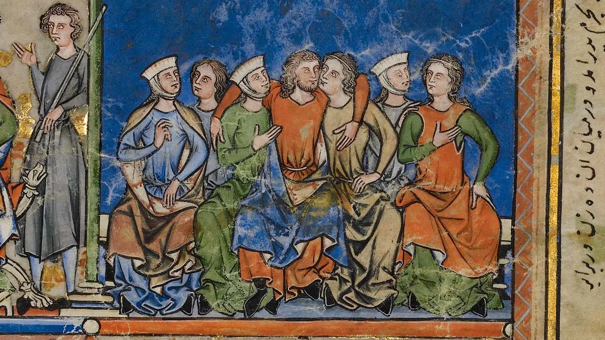
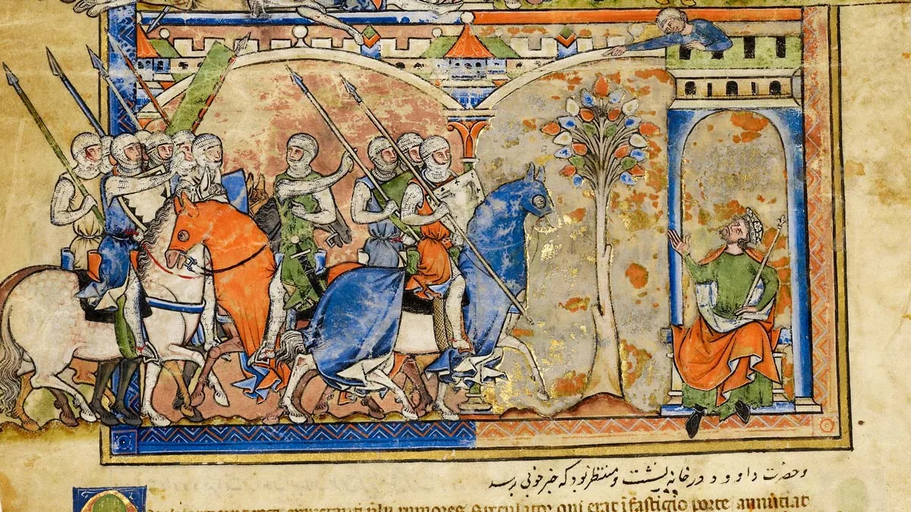
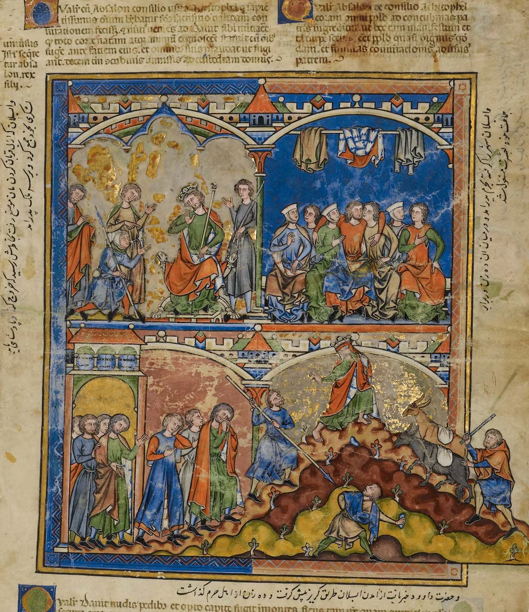
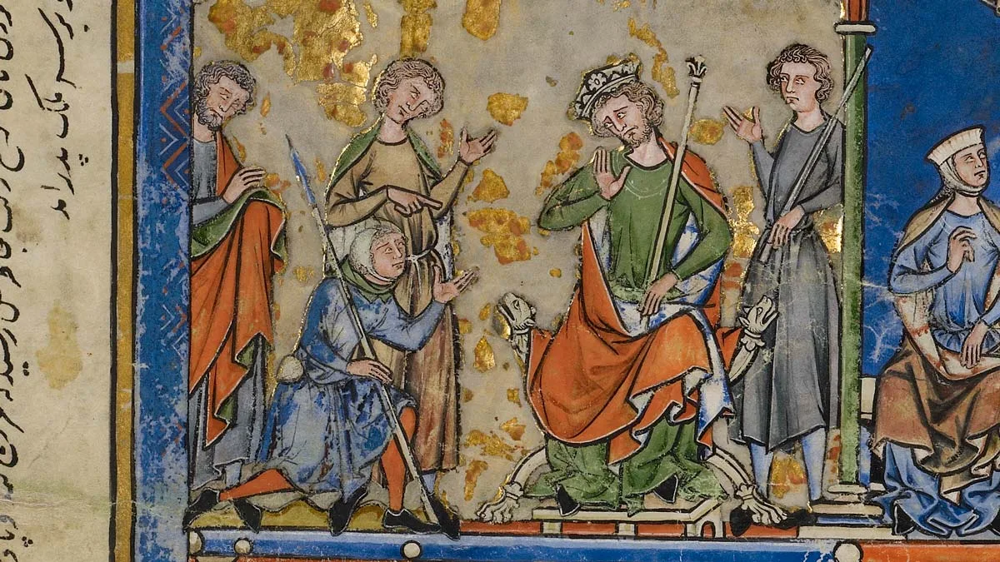
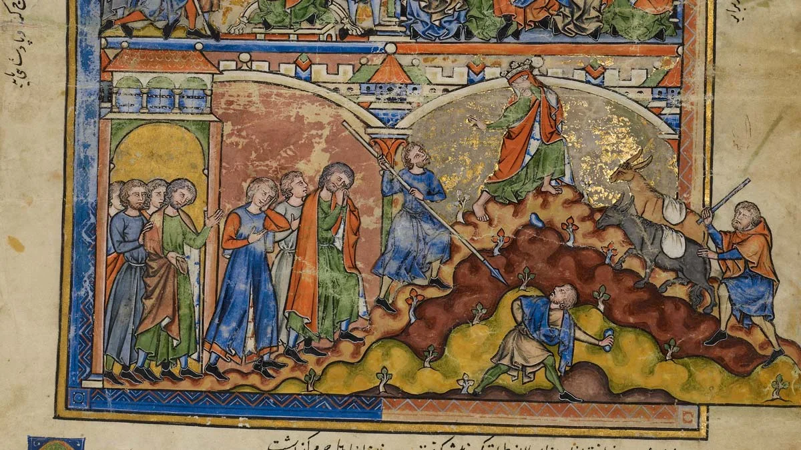

---
date:
  created: 2014-10-24
  updated: 2023-04-03
categories:
- Manuscript Curiosities
authors:
- marjolein
slug: crusader-bible-morgan-library
---
# The Crusader Bible from the Morgan Library

The manuscript that we want to highlight for you today is the Morgan Library’s Crusader Bible. It is also known as **the Morgan Picture Bible, the Maciejowski Bible or the Shah ‘Abbas Bible**. The book is an Old Testament that was originally **made with only miniatures to tell the stories**. Later, inscriptions in Latin, Persian and Judeo-Persian were added.
According to the Morgan Library, it is not only one of the most awesome and beautiful manuscripts they own, but also one of the highlights of French Gothic illumination.

<!-- more -->

*2 Samuel 18:9 - And Absalom met the servants of David. And Absalom rode upon a mule, and the mule went under the thick boughs of a great oak, and his head caught hold of the oak, and he was taken up between the heaven and the earth; and the mule that was under him went away.*

This manuscript was, for some time, **associated with the French King Louis IX and his Seventh Crusade (1244-1254)**. Unfortunately, there is no clear and definitive evidence to support the claim that this manuscript was owned or commissioned by this king. The proof is only circumstantial.

## The Crusader Bible, a bit of history

**The Crusader Bible was possibly made in Paris**, but for certain in Northern France. Even in the 13th century this would've been an extremely valuable book and very expensive to have made. So, in any case, the patron of this work was from high society in France (in the manuscript the Biblical kings are wearing crusade armor with the French royal fleur-de-lis on it). The work was created as a 46 folio-manuscript with only miniatures. This would have been no problem for most readers in those times; they knew the Bible so well that they would recognize the scenes right away. However, the Crusader Bible does not cover the entire Bible, only parts of the books of Genesis, Exodus, Joshua, Judges, Ruth and Samuel.

When it was made, there were actually 48 leaves in this book. Most of them (43) are now in the Morgan Library, two you can find in the Bibliothèque National de France, one in the J. Paul Getty Museum and two are unfortunately missing.
According to the Morgan Library, **the scenes that were painted in the manuscript depict famous and less famous Biblical events**. But, most of all, the battles are portrayed in a very gruesome, yet super detailed way. So detailed, that the machines of war can be replicated from the miniatures only! All of this, of course, painted in a landscape and costume of 13th-century France.

About 40 % of the Crusader Bible was painted by one master, the rest by at least 4 other people. It remains a great mystery who they were and no other works by their hands are known at this point in time.
Just this month a new exhibition titled *The Crusader Bible: A Gothic Masterpiece* was opened in the Morgan Library. For those of you that are, like us, too far away to pop by for a visit, you can [see their online exhibition](https://www.themorgan.org/collection/Crusader-Bible). It’s an interesting read, especially how the manuscript travelled all over the world in the last centuries! Or you can go [browse the digitized manuscript](https://www.themorgan.org/collection/Crusader-Bible/thumbs) and enjoy all its beauty!
  
