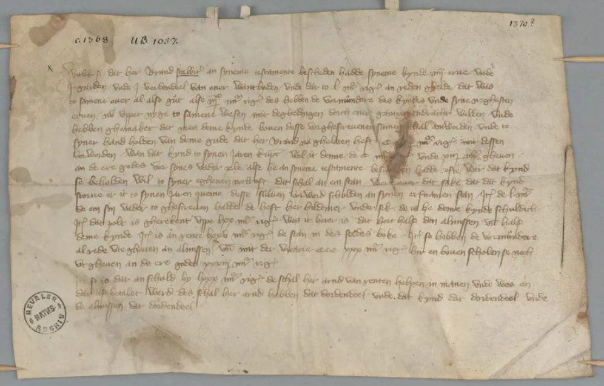
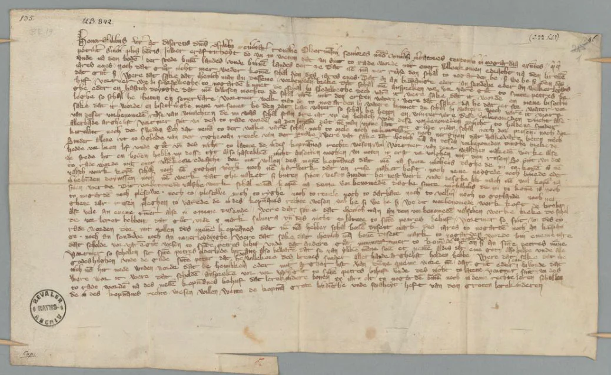
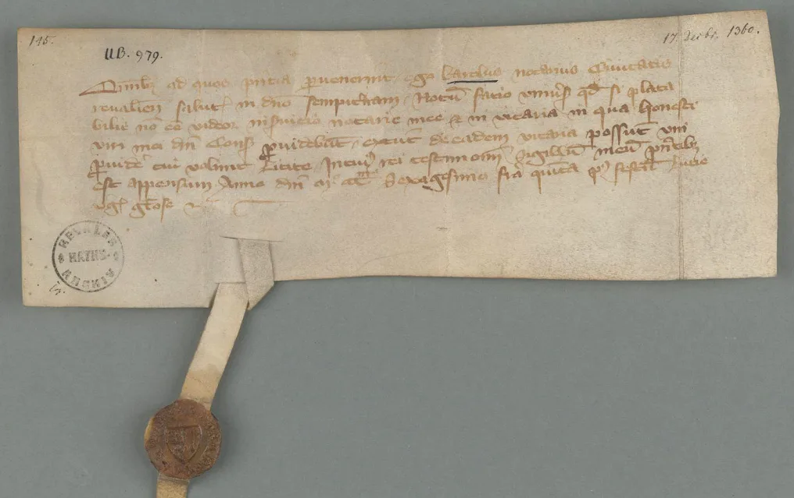

---
date:
  created: 2014-06-01
  updated: 2023-04-03
categories:
- Digital Humanities
- Social Media Codicologists
- Estonia
authors:
- giulio
slug: digital-libraries-estonia
---
# Rising in the East: 3 Digital Libraries in Estonia added to the DMMmaps

A quick update from the DMMmaps project: **we have added 3 digital libraries in Estonia.**
Today we posted on the [Sexy Codicology Tumblr](https://sexycodicology.tumblr.com/post/87494769108/booksnbuildings-medieval-books-from-tallinn) a post concerning a manuscript coming from the Tallinn city archives, Estonia. After a little investigation, I noticed that these archives were not in the [DMMmaps database](https://docs.google.com/spreadsheets/d/1et_XkYeTJVG-qj3N4ECt9dGTHSgRdto4VICC3VWXAow/pub?output=html). I followed the link in the original post by booksnbuildings and found that there were two other institutions that had digitized manuscripts available online.
**You can now find the [*Eesti Ajaloomuuseum* - Estonian History Museum](https://www.ra.ee/apps/pargamendid/index.php/en/parchment/search?institution=AM&end_year=1500&q=1&sort=years), the [Estonian Historical Archives](https://www.ra.ee/apps/pargamendid/index.php/en/parchment/search?institution=EAA&end_year=1500&q=1&sort=years), and the [Tallinn City Archives](https://www.ra.ee/apps/pargamendid/index.php/en/parchment/search?institution=TLA&end_year=1500&q=1&sort=years) directly on our map**, Together with other 324 digital libraries.
**These three institutions deliver together 1217 digital objects.** Most are deeds, testaments, and concessions. Some books can be found for sure, but I haven't had the time to explore the whole collection.
Nonetheless, these are extremely interesting documents that are very well digitized. No doubt that they will be useful to many researchers! I'll leave you with some of the examples of what you can find. Have fun exploring!

<!-- more -->

*TLA 230-1-IIIB - Testament - Tallinn City Archives - Digital Libraries in Estonia*

*TLA-230-1 Tallinn City Archives - Digital Libraries in Estonia*

*TLA-230-1-I Tallinn City Archives - Digital Libraries in Estonia*
