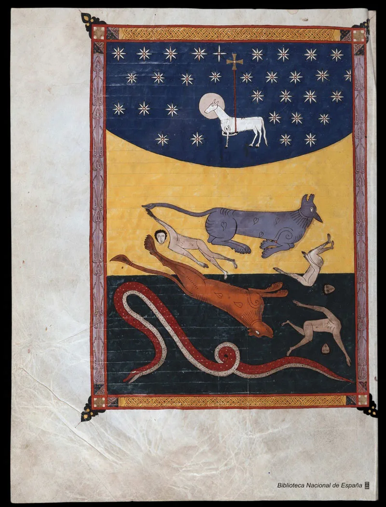
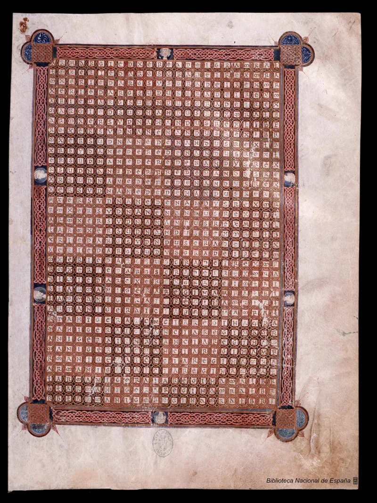
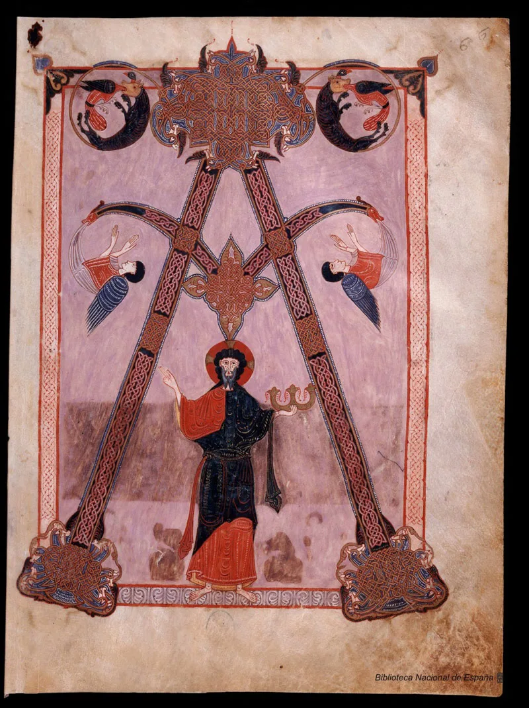
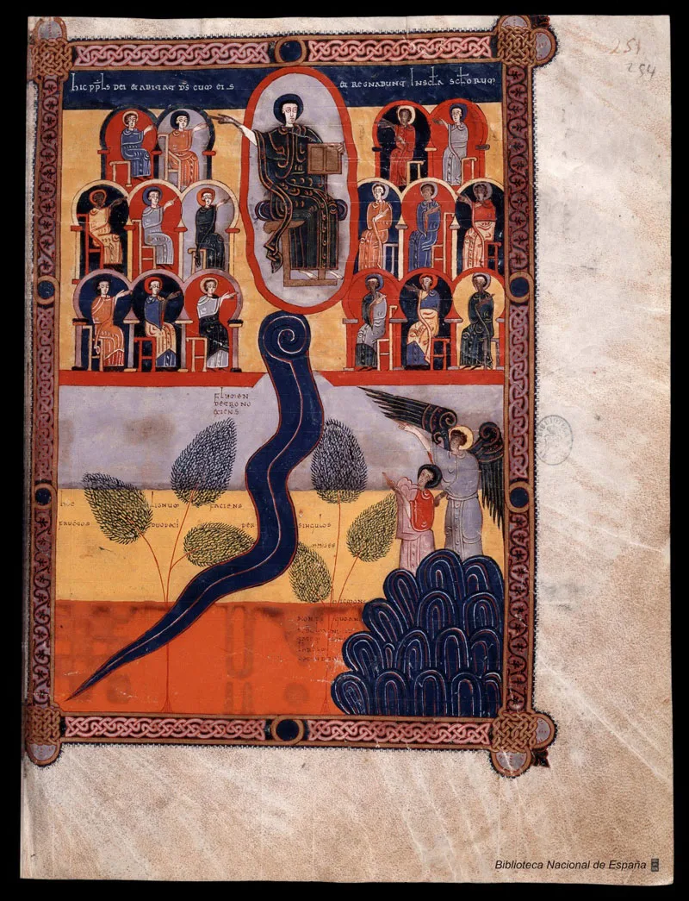
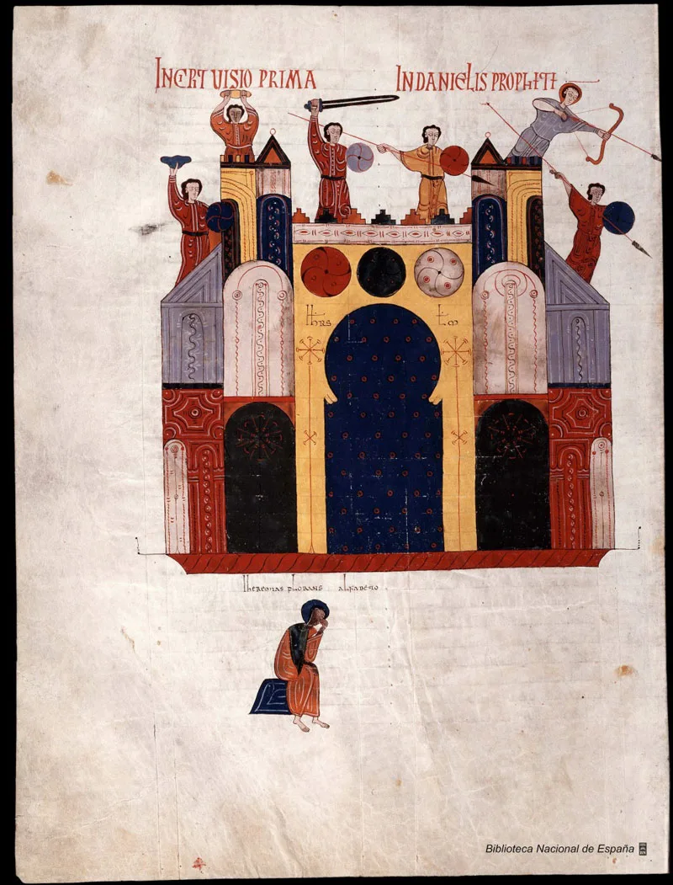

---
date:
  created: 2014-05-14
  updated: 2023-04-03
categories:
- Digitized Libraries
- Spain
authors:
- giulio
slug: digital-library-spain
---
# Digital Library of Spain and the Biblioteca Nacional de España

Yesterday we wrote about [a beautiful manuscript on the Sexy Codicology blog](https://blog.digitizedmedievalmanuscripts.org/beatus-manuscripts/). Today, we give a look at the repository where we found that pearl: the Digital Library of Spain ([access it here](https://bdh.bne.es/bnesearch/AdvancedSearch.do?showAdvanced=true)).
As understandable, **the Digital Library of Spain is the digital library of the *Biblioteca Nacional de España*.** It aims to give free access to thousands of digitized documents: books from the 15th to the 19th century, manuscripts, drawings, engravings, pamphlets, posters, photographs, maps, atlases, music scores, historic newspapers and magazines and audio recordings.
It was created in 2008 and back then the Digital Library of Spain had around 10,000 works which were selected by experts in different subjects as a cross-section of the bibliographic and documentary heritage of the *Biblioteca Nacional de España*. **Today it comprises more than 134,000 works on all topics in all documentary forms, freely accessible from anywhere in the world.**

<!-- more -->

## Image Quality of the Manuscripts in the Digital Library of Spain

The images are perfectly digitized and in high-resolution. Colors are well-balanced, although, in rare cases, it is possible to notice some discrepancies in color tones and saturation between two consequent folia.
**The Digital Library of Spain has decided to present their manuscripts in the form of PDFs**, embedded directly on the website. It is possible to download each individual folio as PDF, or download the manuscript in the same format. This is a perfectly fine and easy-to-implement solution, but it has its drawbacks. For example, it is difficult to share the beautiful images of  illuminated manuscripts on social media, or embed them on a website; to add the images that you see in this post, I had to use the ancient art of the Screenshot, followed by the mysterious cropping technique. According to me this is always a big problem for digital libraries: It has been said thousands of times: today, images are king on the internet; allowing to share images of manuscripts quickly on social media, or allowing embedding of these, would greatly boost the number of visits to digital repositories.

## The Digital Library of Spain's Copyright

Digital Library of Spain does not use Creative Commons, or clearly show the copyright with which images are protected. The only note I could find is the following:
> *Uso de las imágenes*
> *Puede descargar las imágenes que sean de dominio público si son para uso privado o personal.*

Roughly translated as:
> Using the Images
> You can download the images that are Public domain for private or personal use.

Which, legally talking, is a contradiction in terms: if it's Public Domain, I can do whatever I please with an image; if I cannot do everything, then the images are not in the Public Domain, but are copyrighted. Once again, according to how things are explained on the Digital Library of Spain's  website, posting images of the manuscripts on this blog would be illegal.
Enjoy these leaves nonetheless. Clicking on them will lead you to the whole digitized manuscript. **Then go discover many other from other institutions through our app!**

*Full page miniature from the Book of Hours of Charles VIII, King of France - The Virgin Mary*

 Full page miniature from the Book of Hours of Charles VIII, King of France - Charles VIII
 Miniature from the Poetic Works by Francesco Petrarca
 Miniature from the Poetic Works by Francesco Petrarca
 Miniature from the Poetic Works by Francesco Petrarca
 Incipit folio from the Poetic Works by Francesco Petrarca
 Incipit folio from the Poetic Works by Francesco Petrarca

*Liber de laudibus Sanctae Crucis*

*Liber de laudibus Sanctae Crucis*

 Full page miniature from the Book of Hours of Charles VIII, King of France
 Full page miniature from the Book of Hours of Charles VIII, King of France

*Beato de Liébana : códice de Fernando I y Dña. Sancha*

*Beato de Liébana : códice de Fernando I y Dña. Sancha*
