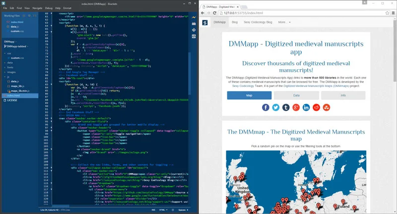

---
date:
  created: 2016-03-14
  updated: 2023-04-03
categories:
- Digital Humanities
- DMMapp Updates
authors:
- giulio
slug: dmmapp-2-0
---
# The DMMapp 2.0!

## An improved DMMapp is on the way!

**"We are dedicated to making digitized collections as easy to access as possible."** That's the objective of the DMMapp Beta. Since its release, the DMMapp has been linking digital repositories to it users; but we believe it can always be better. That is why we have been reworking the app and are now releasing a public beta version for users to test and give us feedback.
With this release we particularly wanted to address various issues, mainly regarding **performance and usability**.

<!-- more -->

*A sneak-peak behind the scenes!*

### The Map and the searchable database

The map is awesome, and we have lots of fun in randomly clicking on the pins to (re)discover a collection; but it can be impractical for users that are searching for a specific library (or city, or anything.) Yes, there are filters, but it is not the fastest, nor handiest way to go around. This is why we created the "Data-page" some time ago: no fancy graphics, but a super-fast filterable table.
The issue with the current version of the DMMapp is that its two souls (map and data pages) behave like two different entities: when you go to the DMMapp, and then click on "Data", the page has to reload, instead of being a streamlined experience. A far from perfect. Plus, we are not on the fastest servers ever, and it can take quite some seconds before the page loads, and every reload means that server resources are being used, and that the whole blog will be slowed down.
Therefore, in the DMMapp 2.0 we have made it so that **map and data load simultaneously**, and that switching between map and data is instantaneous!

### "You get to contribute! You get to contribute! Everyone gets to contribute!"

The [DMMapp has been on GitHub](https://github.com/SexyCodicology/DMMapp) for years, but we have never really promoted its presence there until now. GitHub is a place where people share their code. It's where the base for the DMMapp was found.
Well, let it be know that it is there and it's for you to play with. There are issues that you can help fixing (typos, dirty code, bugs...) We have dropped the foundations for the tool, but it is open to everyone to improve, like it should be! So, come and have fun with the code of the current DMMapp branch!
Even if you love codices more than code, you can give a look at what we are doing and where the DMMapp is going.

### CDNs for a faster DMMapp

We have outsourced some the scripts necessary to make the DMMapp 2.0 run (jQuery, for example.) Again, we use dirt-cheap servers and we cannot use many resources from them (remember, we are just two guys with no founding from anyone!). In the original DMMapp we used our own scripts coming from our own server, now these are delivered by CDNs (content delivery networks) in order to put **less strain on the server** and leverage on their speed. The downside is that, in case of an update on these scripts, the DMMapp might break. This possibility is remote, and we believe that the advantages of using CDNs outweigh the risks, for now.

### Desktop, tablet, and mobile

We want the DMMapp to be usable on every device: are you at special collections and need to check if another library has a digital version of a manuscript? IPad next to you? DMMapp! At home, bored, and feel like exploring some digital collections? Laptop? DMMapp! On the train, sudden urge to see how many libraries have digitized manuscripts in Spain? IPhone? Android phone? Windows phone? DMMapp!
That is the goal. We are almost there, but not quite. What's not working? You can see it on GitHub, and try to fix it if you want!

### "DMMapp 2.0? Cool, I want to try it!"

Feel like giving the DMMapp 2.0 a try? Please visit the public beta and let us know what you think about it!
