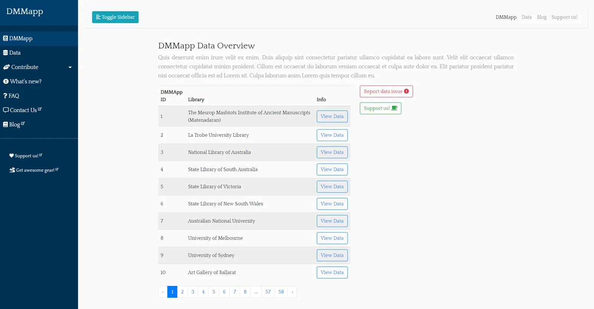
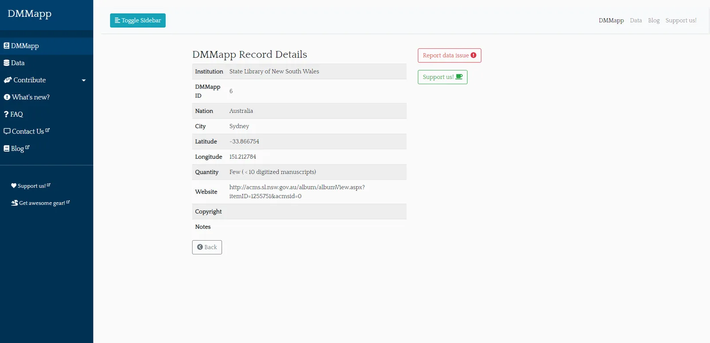

---
date:
  created: 2018-10-24
  updated: 2023-02-23
categories:
- DMMapp Updates
authors:
- giulio
slug: dmmapp-4-0-is-on-the-way
---
# DMMapp 4.0 is on the way!

Yes! There is more on the way for what concerns the DMMapp.
As you might know, we have recently given you the possibility to report broken links in our DMMapp. We are happy to communicate that it has been a great success, and its working better than expected. A big thank you for all those who have reported an issue with the links!
Now, this has been a great improvement for everyone; but it has lead to a new problem for the micro-team behind Sexy Codicology:
**Links break all the time, and we want all the links fixed, so: how can we update the data on the DMMapp, in a timely and efficient manner?**

<!-- more -->

### **The issue**

Some background information for the curious ones:
All the data that generates the pins on the DMMmap and the browsable table at digitizedmedievalmanucripts.org is contained in a JSON file called data.json, a copy of which is [publicly available for everyone at GitHub](https://github.com/SexyCodicology/DMMapp/blob/master/js/data.json).
To update this JSON file we have to:

- pull the file from our GitHub repository
- find the data we want to change
- update the data
- push to GitHub
- copy the updated JSON file to our server
- push for a refresh
- pray it all went well...

Now, that was perfectly fine when we have a couple of hundred of libraries in our database, and we had few users. Now we have almost 600 different items in that JSON, and the DMMapp is used by a much larger audience.
Making small changes like updating a URL or a tile should not take more than 2 minutes per item, but today, with our current method, changing anything in our data takes between 30 minutes to 1 hour.
**This is not maintainable.**
Furthermore, we find it important to have the possibility to expand the data we collect from libraries and institutions we add to the DMMapp, and this is not possible at the moment.
For example: we think it is essential that we display under which copyrights the images are published by each institution in the DMMapp; What if a researcher is searching for copyright-free material? Can we help? Can we add this? Nope (well yes... but it would take forever!)
And what about notes? Maybe we want to let our visitors know that on repository "X" there is no direct link to the material, but that they will have to click on a certain button to access them. Or make a note that only partial manuscripts are available, or that there is only one image per manuscript, etc.
None of this is currently possible.

### Solution

So, first of all, we let nothing scare us. We can do everything! We got to work by opening a code editor one day an throwing stuff at the wall until something sticked.
Just like we did for the DMMapp a few years ago.
What sticked in the end was Laravel, PHP, and SQLite3. Scary names, and we are not going to bore everyone with extremely technical stuff, but this is the magic that is happening at the moment behind the screens:

- We have migrated the JSON that makes the DMMapp to a database. Codename: **DMMappDB** (DMMapp branding everywhere!)
- We have created an interface that will allow everyone to browse all our database entries, and, most importantly, **explore all the individual entries that make the DMMappDB,** in every detail.
- **You will be able to report data errors with one button** (example: the database states that an institutions' images are copyrighted, but they are actually CC-0. With a click, you can report that to us and we'll fix it!)
- We have made an interface for us administrators, where we can easily create, update, and delete items in the DMMappDB.
- **Each item (institution) in the  DMMappDB will have its own, individual web address**, and a unique ID. This means that if you wish to directly link to an item on the DMMapp data, you will be able to do so.
- The same  DMMappDB  will send data to the map, the table, and the database overview section. One update to update them all.

The advantages of this structure are clear and can be summarized in a few words:
**Transparency**

- Everyone will be able to see the metadata we have about any institution we have added on the DMMapp, and have the possibility to report an error.

**Scalability**

- We will be able to expand (or reduce) the DMMappDB as much as we need. Copyright statements and notes are only the beginning!

**Efficiency**

- We will be able to update or add new libraries to the DMMapp faster, allowing better access for everyone to our beloved medieval manuscripts.

**Free (as always)**

- We created the DMMapp for free years ago, we have maintained the DMMapp for free, and no matter how big the DMMapp will become, we will keep it available for everyone for free.

**Here's a preview of what awaits (development phase, keep in mind!)**

Your Sexy Codicologists,
Giulio \& Marjolein
