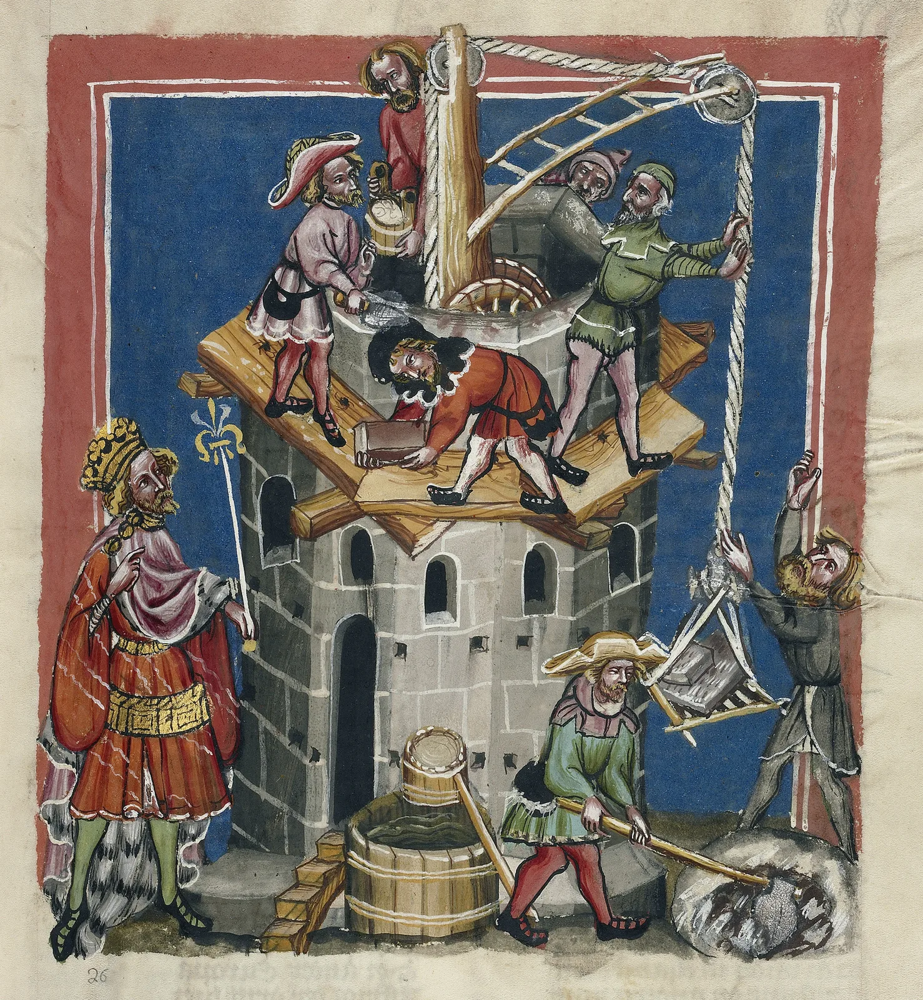

---
date:
  created: 2019-01-09
  updated: 2023-04-03
categories:
- DMMapp Updates
authors:
- giulio
slug: dmmapp-4-0-open-beta-ending-soon-release-planned
---
# DMMapp 4.0: Open Beta ending soon, release planned!

In over two months you have helped us spotting quite some bugs on our new DMMapp, and now we believe that the time has come to embrace the future and archive the old DMMapp completely. An what better period to do so if not early in the new year?

> *Unknown -The Construction of the Tower of Babel, about 1400 \- 1410, Tempera colors, gold, silver paint, and ink on parchment*

<!-- more -->

> *Leaf: 33.5 × 23.5 cm (13 3/16 × 9 1/4 in.), Ms. 33, fol. 13*

> *The J. Paul Getty Museum, Los Angeles*

**When Will it happen?**
We are taking our sweet time: we have prepared the data in the past couple of weeks. Now, from the 11th until the 13th of January, we will start the real migration. Be prepared: **the DMMapp will be offline for an extended period of time during this week-end!**
**What Will Happen?**

- https://digitizedmedievalmanuscripts.org/app/ 's contents will be replaced with what is currently https://digitizedmedievalmanuscripts.org/beta/
- https://digitizedmedievalmanuscripts.org/beta/ will no longer be public and will disappear for the time being; until a new DMMapp will be developed in the future, or if we'll need some testing on new features.
- The JSON at https://digitizedmedievalmanuscripts.org/app/js/data.json will not disappear: It is currently used by third parties as a base for their project's functionalities. This data will, for the time being, **receive no further updates**. We plan to replace this JSON output with one coming directly from the new SQLite database every time we update it. This is on the to-do list, but there is no current ETA.
- Downloading the data will still be possible. Anyone interested in using the data from the DMMapp (Links, coordinates, Copyright statements, etc.) will have to contact us for now, and we will provide the data (the SQLite database) with a lot of love. In the future we will either have a simple "download data" button, or a link to the JSON output above.
- The new DMMapp will also be on GitHub, just like the previous iteration. We will have to clean some of the details before be publish it there; also, this time around, it will be a little bit more complex to recreate: you will need to know some PHP and some Laravel.

**Who will make the magic happen?**
But you trusty Sexy Codicology team, of course: Giulio \& Marjolein.
**How will you carry out this migration?**
We will explain technicalities on a separate post. Let's say that, due to technical limitations, a lot of drag-and-drop will be involved.
**Why is this migration necessary?**
We have explained the reasons for this migration on our previous post. Long story short: the DMMapp project has grown too big and its current structure is no longer maintainable. It needs un update.
**"I have questions!"**
We hope this post will answer all your questions. If not, please do not hesitate to contact us via all our channels: Facebook, Twitter, Websites, etc. We will be happy to provide all the answers we can!
