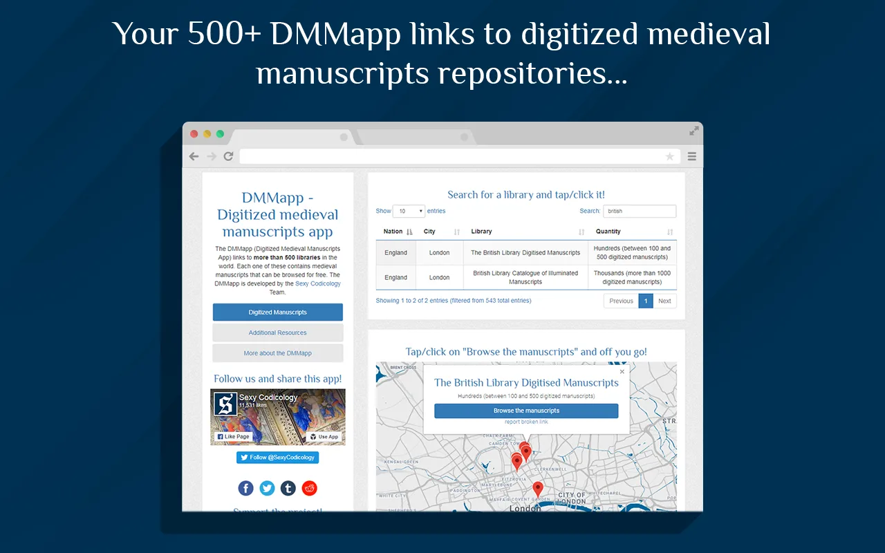
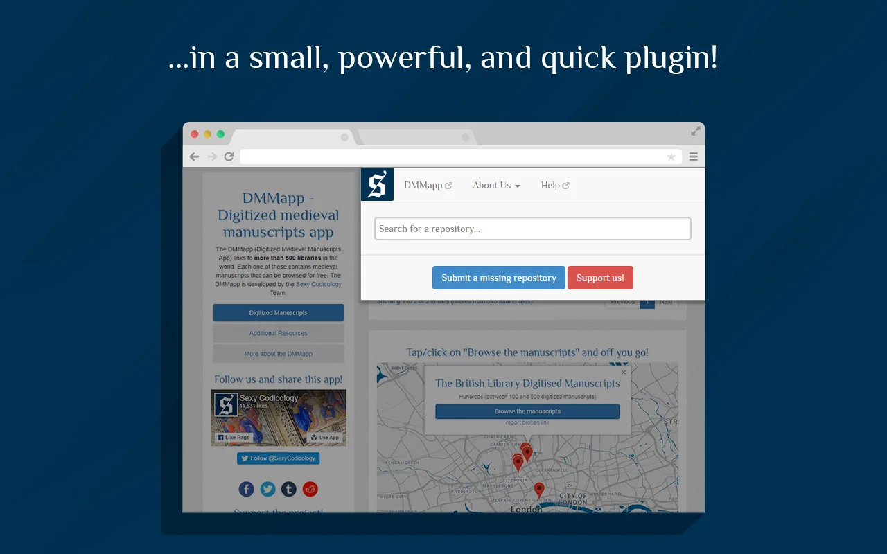

---
date:
  created: 2018-09-07
  updated: 2023-04-03
categories:
- DMMapp Updates
authors:
- giulio
slug: dmmapp-plugin-for-chrome-firefox
---
# DMMapp plugin for Chrome &amp; Firefox!

Yes! Just like the medieval monks, we have sat behind our desks writing the code(x)!
The result? An improved DMMapp plugin, now also available for Firefox users.
The DMMapp plugin allows you to search the DMMapp's database directly, without having to go the website first.
For example: Searching for the manuscripts from the Getty Museum?
Simply click on the plugin's icon, start typing "Getty", and the link will appear, ready to take you to the digitized objects you need.
You can search by:

<!-- more -->

- **Library** ("Getty", "Laurenziana", etc.)
- **Country** ("Italy", "France", etc.)
- **City** ("Rome", "Oxford", etc.)

Developed with love by the Sexy Codicology team!

### "How can I get it?!"

Chrome users can [click here](https://chrome.google.com/webstore/detail/dmmapp-plugin/lfddboglgfimpmokggiapioogkhgical) 
Firefox users can click here 
Please do let us know what you think. Any feedback is welcome!
As always, the code we used to create this plugin is on [GitHub](https://github.com/SexyCodicology/DMMapp-plugin).
