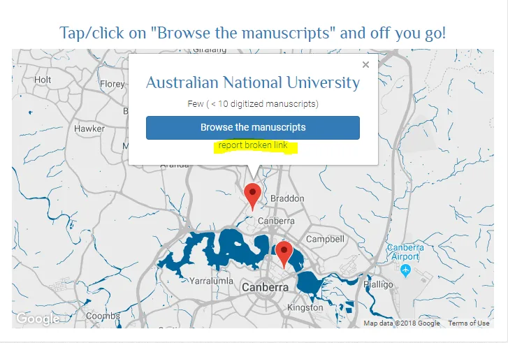
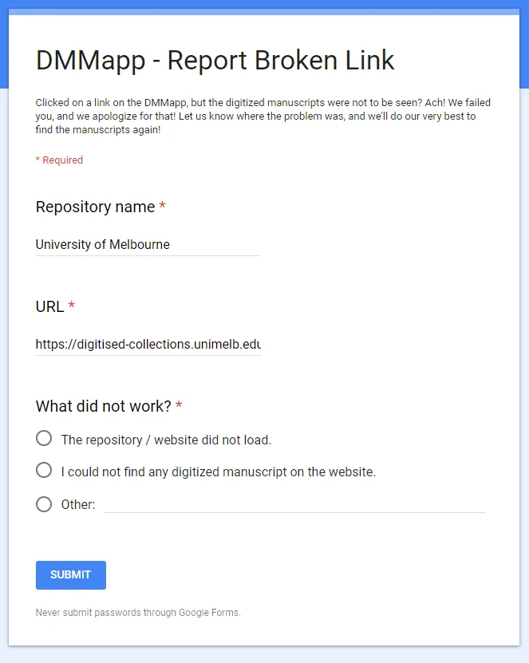

---
date:
  created: 2018-03-24
  updated: 2023-04-03
categories:
- DMMapp Updates
authors:
- giulio
slug: dmmapp-update-with-a-new-important-feature
---
# DMMapp update with a new, important, feature!

We have added a new button on the DMMapp - https://digitizedmedievalmanuscripts.org/app/
We are introducing the legendary "Report Broken Link" button.
From now on you can inform us if there is a link in our app that does not lead to digitized medieval manuscripts! The link will automatically be added to the form, together with the name of the institution.
We'll look at URL, start searching for a working alternative, and restore access to the books!
If you do not see the button yet, refresh your browser's cache or wait a couple of days!

<!-- more -->
