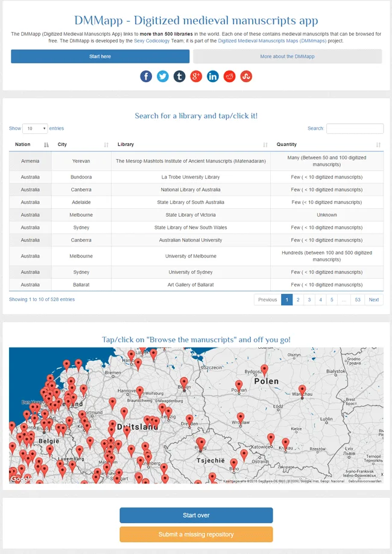

---
date:
  created: 2016-11-28
  updated: 2023-04-03
categories:
- Digital Humanities
- DMMapp
- Maps of Digitized Medieval Manuscripts Available Online
- Resource
authors:
- giulio
slug: dmmapp3
---
# DMMapp 3.0!

We have been working hard, and we are super-proud to announce that the DMMapp 3.0 is out there and available for everyone to explore and enjoy!
Critics say:
*"It's the best DMMapp yet!"**"It just works!"**"10/10 would DMMapp again"*
No they don't, but we like to imagine they do! Let's go and see what has happened in the past months.

<!-- more -->

*The new DMMapp 3.0*

## What has Changed in the DMMapp? And Why?

What we wanted to address in this release were two things: maintainability and usability of the DMMapp.
We'll start with the latter: the DMMapp 2.0 worked fine; but "fine" was not good enough in our opinion.
We believed that there was no need for two different tabs  ("Data" tab, and the actual "map"), but rather we thought that there should be a single tab where the user could choose what to see and explore. In our vision, the data and the map should have been in a single page, interacting with each other. Furthermore, we considered the filtering tool inadequate and rather clunky.
With these two problems in mind, we went to work: we implemented an omni-search box that replaced the old, clunky, filtering method: just type any text in the search box, and the app will start filtering instantaneously the results as you type: Searching for libraries in "London"? Type it in, and magically the list will display only the libraries from that city. Want to know which libraries are from Italy? Type "Italy", and ta-daah! - only the libraries in Italy are displayed.
That took care of the filtering, but what about the "Single tab" dream? We addressed that too: The table interacts with the map now!  (Datatable and Google Maps simply didn't like each other. Google Fusion Tables is also a non-Mobile Friendly solution. A good 15% of the traffic to the app happens via mobile devices) After you find the library you want to browse in the table, you tap on the table and you will be taken to the map. The link to your library will appear, zoomed in and highlighted, on the map. All that is left to do is tap the button and off you go to the manuscripts from the institutions you chose!
If you simply want to browse the map you can still do that too!

## Back Office stuff

This is the boring part of the post which involves the technical stuff; the "maintainability" mentioned above.
Originally, the DMMapp was based only on Google Fusion Tables, then it became a mess of GFT + Google Maps + JavaScript/JSON, etc . Why? Simply said, we did not have the technical knowledge  (Read: "We didn't know how to code well enough") to do otherwise. The solutions we adopted back then (2013) offered the quickest development option for our idea. The biggest problem was that it was all extremely cumbersome. It would take around 15 minutes to add a single library to the map and another 10 minutes to add it to the data list.
Essentially we had to do the same work, twice, per each link we wanted to add to the app.
The front-end worked, and it looked good, but the core was a bit rotten in our view.
We knew the whole process could be optimized: the map and the data have mostly the same technical details; they could come from the same origin point. "Could" became "MUST" in the end.
The only way to do this, in our eyes, was to redesign the whole DMMapp, dropping Google Fusion Tables entirely in favor of an code-only solution (HTML, JS, JSON, CSS.) So we got to work again.
This resulted in a super-light, lean, and quick app, which is also easier to manage and update. A win-win situation for both the users and the Sexy Codicology team! If you are interested in how we coded exactly, please go to our [Github page](https://github.com/SexyCodicology/DMMapp/tree/single-data-source), you will find all our code there.
Now, we simply have to add a line in the JSON code whenever we receive the link to a new library, and query the JSON code to monitor for broken links in the app! Awesome!
All in all we are very satisfied of how the app turned out and we hope you will make some awesome discoveries in the medieval manuscripts' field while using it!
