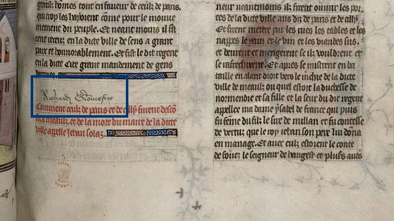

---
date:
  created: 2014-06-29
  updated: 2023-04-03
categories:
- Digital Humanities
- Community & Events
authors:
- marjolein
slug: england-time-king-richard-iii
---
# Free Online Course: England in the time of King Richard III from the University of Leicester

## King Richard III and the MOOCs

Since the last couple of years, more and more universities are participating in collaborations where they create so-called MOOCs (Massive Open Online Courses). These are a way for anyone that is interested to participate in open-access, free from costs university courses. The courses are basically on any kind of subject you can think of: from art and history to literature, computer science and medicine. You can find lists of courses on pages like [Coursera](https://www.coursera.org/) and [Futurelearn](https://www.futurelearn.com/). I just finished a six-week course on Futurelearn by the University of Southampton about the archaeology of the old Roman port of Rome, [Portus](https://www.futurelearn.com/courses/portus). My experiences with this were so good, I decided to also enroll for [England in the time of King Richard III](https://www.futurelearn.com/courses/england-of-richard-third) which is offered by the University of Leicester also on Futurelearn.
One of the biggest news items in the field of archaeology last year was the discovery and identification of the (in)famous King Richard III under a parking lot in Leicester. Now, the University from this same city has created a six-week course starting coming Monday 30th of June about all sorts of aspects of the time of this King of England.
You might wonder, however, how this connects to codicology and medieval manuscripts. Richard III was a medieval king during a time of change in the field of book history. Handwritten books were less produced and printing was on the rise. This English king might not have had one of the most famous libraries, but nevertheless a very important one. He was one of the few people in high society of those days that signed his books.

<!-- more -->

*Richard III's signature in BL Royal 20 C VII f.134.*

This makes it easier to identify copies from his library (which have nowadays spread throughout collections in the world). Some of these books still have original bindings yet many are simple text editions without much illumination. Scholars have concluded that Richard’s library is a very nice cross-section of popular literature of the time (except professional books like medicine). This, I think, is very interesting because it gives us a better understanding of what was read in (mostly upper layer) society at the time. Also, in this library a number of manuscripts survive that are the only existing copies of various texts.
Coming back to the MOOC course, it seems to promise the participants a variety of subjects that will be discussed. Here, it seems that a nice share of the course will be about culture, reading (and very possibly also literacy) and the introduction of printing. For anyone interested in a wider book historical course about England in this period, I believe it looks very promising. For a more strictly codicological and paleographical course this seems not the right one. I do not know yet, of course, how deep the matter will be discussed or many manuscripts we will see come by. But in any case, I thought it was very worth sharing here for anyone wanting to participate. You can join in on the course anytime these next weeks. For more info and subscribing go [here](https://www.futurelearn.com/courses/england-of-richard-third).
