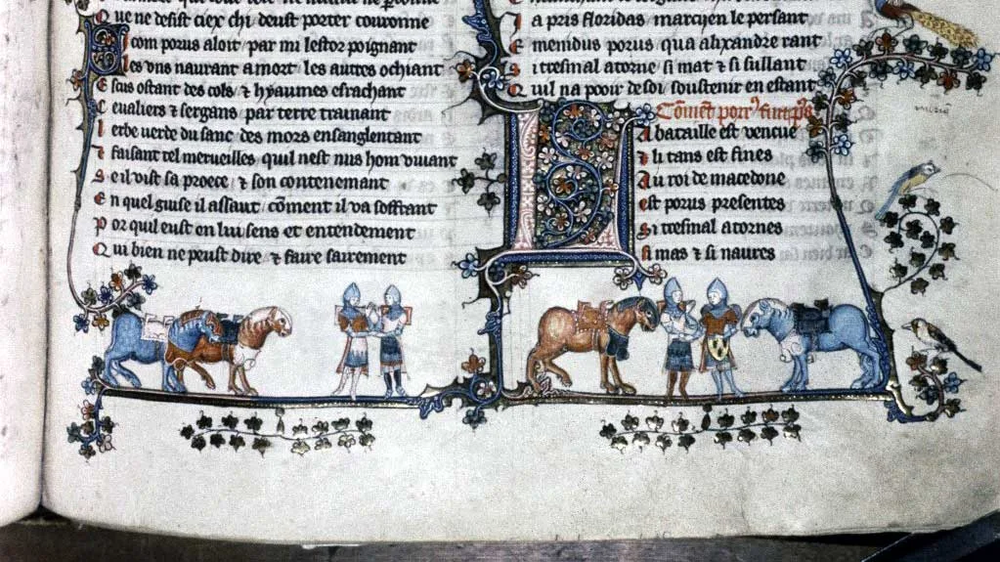

---
date:
  created: 2013-09-05
  updated: 2023-04-03
categories:
- Digital Humanities
- European Library
authors:
- giulio
slug: european-library-widget
---
# The European Library Widget

## A Widget for Book Lovers

A few days ago, while looking at the newstream of the [Sexy Codicology Facebook Page](https://www.facebook.com/SexyCodicology), we notice the [European Library](https://www.facebook.com/EuropeanLibrary) promoting their widget. We contacted them and asked if it was possible to install the widget also on our blog. This lead to an exchange of emails that helped us installing the widget. In 24 hours, after a bit of tweaking on our side, the plugin was installed and ready to be used.
Today, we got promoted on their Facebook Page.

<!-- more -->

[Post](https://www.facebook.com/login/?next=https%3A%2F%2Fwww.facebook.com%2Fphoto.php%3Ffbid%3D10151575430126431%26set%3Da.476764331430.256290.11772356430%26type%3D1) by [The European Library](https://www.facebook.com/EuropeanLibrary).

Useless to say, **we are very proud to have their widget on our website.** Hopefully, this will help you readers discover and fall in love even more with manuscripts.
**This widget allows you to search for anything you might be interested in and that might be contained in a library.** In our case: medieval manuscripts, but also papyri, scrolls, incunabula, early printed editions, etc. Personally, I wanted to test the plugin and I searched for the name of the author of a manuscript I love: "Dioscordies". The results came out and I got lost browsing for hours. As usual.

*MS. Bodl. 264, pt. I: Knights Shaking Hands.*

### Where to find the Widget

You can find the widget [here](https://www.theeuropeanlibrary.org/).
It is fairly easy to install. In case there are any issues, you can contact the European Library. They will surely help you. You might notice that our widget looks slightly different. We made some modifications to the code to make it better fit in our website. Clearly, slightly more complex coding, but not necessary in many cases. Just copy and paste the code that is given and you will be fine 99% of the times!

### Share the word!

Bottom line is: If you have a blog or a website, do implement the widget. It's very easy to install and it is a big added value to all you write.
Also, make sure to like the [European Library Facebook page](https://www.facebook.com/EuropeanLibrary) and visit [their website](https://www.theeuropeanlibrary.org/). Most importantly, **if you know anyone who owns a website or a blog related to books, make sure to mention him/her the widget!**
