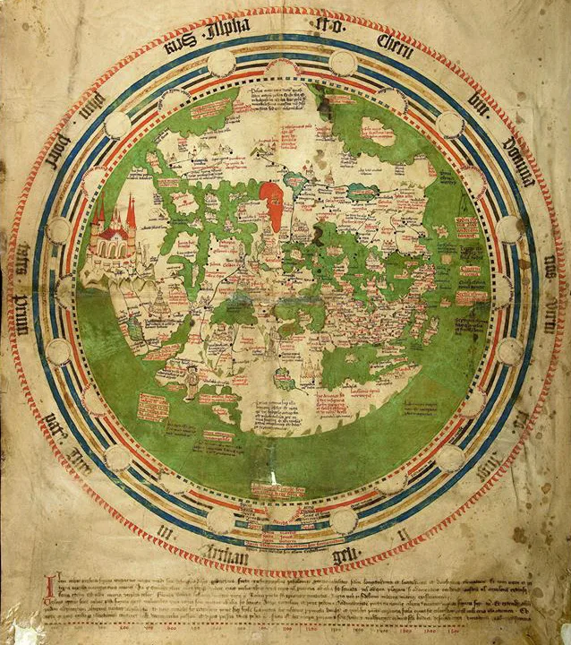

---
date:
  created: 2013-07-20
  updated: 2024-08-07
categories:
- DMMapp Updates
authors:
- giulio
slug: few-words-digitized-manuscripts-map
---
# A Few Words on the Digitized Medieval Manuscripts Map

## Uncharted  Manuscripts' Territory, charted.

<!-- more -->

We have all seen those medieval maps on manuscripts: Fascinating! So fascinating that here at Sexy Codicology we decided to create several of our own: The Maps of Digitized Manuscripts Available Online.
The aim is simple: **Create maps that link to digitized special collections,** so that everyone, at any time, can explore medieval manuscripts on their own.

*Vatikan, Biblioteca Apostolica Vaticana, Pal. lat. 1362 B, Andreas Walsperger*

## The Good Points

- **The time is right.**

The time is right to do something like this: Maps are available online, the tools are easy to use. All that was missing, I believe, was the idea and the will to do something like this. Moreover, there is a clear interest for medieval manuscripts through the internet. The clearly exercise a fascination on thousands of people and want to have an access to these objects.

- **It's easy to use and update.**

The maps take advantage of [Google Map Engine Lite](https://accounts.google.com/v3/signin/identifier?dsh=S1544322131%3A1678725254244788&continue=https%3A%2F%2Fwww.google.com%2Fmaps%2Fd%2F&followup=https%3A%2F%2Fwww.google.com%2Fmaps%2Fd%2F&ifkv=AWnogHf1E4SCovfbxejWQ9HQm0OHtOJX7gMgWWiExhctZNug87oXk2hkii3v_K5n5s6Ss5XKtWvw&passive=1209600&flowName=GlifWebSignIn&flowEntry=ServiceLogin). It reads a datasheet and creates the pins on the map. Clearly format the datasheet, carefully enter the data and it is done. Adding new elements and correcting the old ones is extremely easy and fast.

- **Open access, culture for everyone.**

This project is intended to be free for everyone: Everyone will be free to access the data and use it for any purpose.

- **Fascinating results ahead**

Data visualization is something I personally love: having a lot of data summed up and presented in a clear way leads to great information. With the maps completed as much as possible, we will be able to see gaps in digitization, have a place where to access thousands and thousands of manuscripts, explore objects long forgotten.

## The Issues

It's a big project, and there are problems. For example:

- **Links can break.**

A library might decide to renew their digital special collections website, along with that the links to that particular section, making it no longer accessible from the map.

- **The number of digitized manuscripts varies every day.**

Take the British Library, for example. They are wonderful at what they do, and digitize manuscripts all the time. One day there are 800 digitized manuscripts, the next day 850 (exaggerating, but it explains the issue).

- **This project is being created for free, and has to use tools available for free (and therefore limited).**

We are using Google Map Engine Lite. This means that, for every map, we can insert maximum 300 links to digitized collections. Not enough to cover all Europe in one map. We have decided to divide Europe in four parts: Northern Europe, Western Europe, Southern Europe and Eastern Europe. This will allow us to stay within our sensational 0 Euro budget.

- **The Libraries are not placed precisely on the maps.**

Libraries are placed on the map by the city they are in. This means that if a city has more than one library, they will overlap. The dataset is correct, but not the map. We are aware of this and the issue will be fixed in later versions of the maps.
