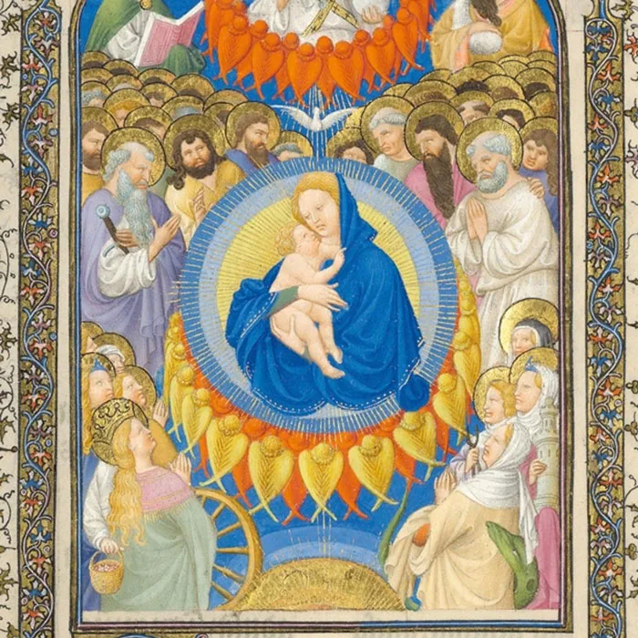
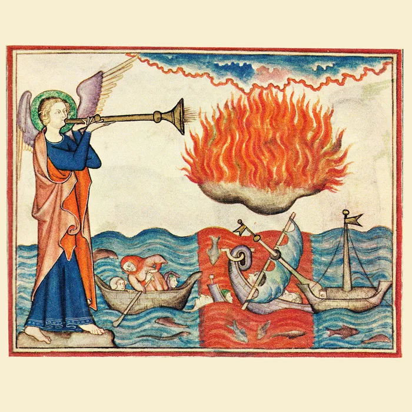
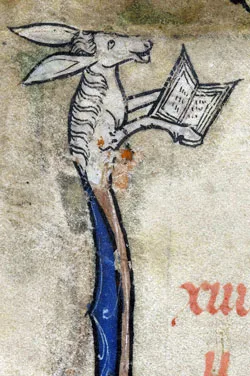

---
date:
  created: 2013-10-20
  updated: 2023-04-03
categories:
- Books
- Digital Humanities
- Free Books
- Metropolitan Museum of Art
authors:
- marjolein
slug: free-online-books-metropolitan-museum-art
---
# Free Online Books from the Metropolitan Museum of Art

## **A short overview of medieval goodness for your reading list!**

<!-- more -->

Through this tweet from @brianberni we learned about a great online source of free online books from the Metropolitan Museum of Art’s (MET) website.
> Art Brooks for free! <https://t.co/5xLG5qCz1V>
> — brianberni (@brianberni) [October 16, 2013](https://twitter.com/brianberni/statuses/390601430132068352)

Among the great number of publications from this museum there is a subsection of mostly out-of-print books that have been made available for free: either directly readable online through Google Books or fully downloadable as a PDF. **You can find the full list of available titles here:** [https://j.mp/19SIHrH](https://www.metmuseum.org/art/metpublications/titles-with-full-text-online?searchtype=F).
It is amazing and great of the MET to share their publications as free online books. **For people who love art and history there is much, much goodness to find and read.** For this blog post we went through this list and we will highlight the most interesting and awesome books for you here (in random order). These are not book reviews, we just wanted to share this list as soon as we could – reading all of the titles mentioned here would’ve taken much too long.
The focus will be mostly on medieval manuscripts of course, but we include also other books about medieval life, history, art and culture that are just too amazing not to mention.

### **1\.****[The Art of Illumination: The Limbourg Brothers and the Belles Heures of Jean de France, Duc de Berry](https://www.metmuseum.org/art/metpublications/The_Art_of_Illumination_The_Limbourg_Brothers_and_the_Belles_Heures_of_Jean_de_France_Duc_de_Berr?title=&fmt=0&Tag=limbourg&tc=0&author=&dept=0&pt=0)**

*A book focusing on the Belles Heures of Jean de France, Duc de Berry is one of the many free online books!*

The title of this publication already makes it clear that it will be full of manuscript goodness. It has the looks of the perfect book about this sort of subject: first a nice background overview and then it continues to discuss the manuscript in quite some detail. **The author explains a massive number of the illuminations of the *Belles Heures* including small transcripts and translations of the text with the miniatures.** Furthermore, there are chapters on the books that the Limbourg Brothers worked on and, also quite fascinating, who and what influenced their artistic style. We can say nothing other about this book than that it is simply amazing (on first browsing it). It is chock-full of colour photos and stacked with information. Why is this book of out print? We want to buy it now! Very much recommended.

### **2\.****[The Unicorn Tapestries](https://www.metmuseum.org/art/metpublications/The_Unicorn_Tapestries?title=&fmt=&Tag=&tc=&author=&dept=&pt=)**

 
In the Cloisters Museum (part of the MET) in New York, on permanent display you can find seven late Gothic tapestries that portray the Hunt of the Unicorn (believed to have been made in the Southern Netherlands). The unicorn is a common imaginary animal that can be found in medieval art and in manuscripts (some books have margins full of unicorns!). **The tapestries are an amazing, captivating and fascinating pieces of art and *The Unicorn Tapestries* discusses various aspects of it.** For manuscript enthusiasts we believe this is a recommended read since the first chapter of the book discusses the unicorn in ancient and medieval texts. Also in other chapters we find many links to medieval manuscript and literary culture. Because of this, this book could be of interest for anyone that wants to know more about beasts and fantastic creatures in medieval manuscript, literature and art. Because of this, this book could be of interest for anyone that wants to know more about beasts and fantastic creatures in medieval manuscript, literature and art.
More on this subject: [Masterpieces of Tapestry from the Fourteenth to the Sixteenth Century](https://www.metmuseum.org/art/metpublications/Masterpieces_of_Tapestry_from_the_Fourteenth_to_the_Sixteenth_Century?title=&fmt=&Tag=&tc=&author=&dept=&pt=)

*The Cloisters Apocalypse: An Early Fourteenth-Century Manuscript in Facsimile is one of the many free online books from the Met!*

### **3\.****[Pen and Parchment: Drawing in the Middle Ages](https://www.metmuseum.org/art/metpublications/Pen_and_Parchment_Drawing_in_the_Middle_Ages?title=&fmt=&Tag=&tc=&author=&dept=&pt=)**

Another beautiful book from the MET collection! **This one also begins with an introduction on the subject of pen drawings in medieval manuscripts in various areas (such as Anglo-Saxon England) and how it changed throughout the centuries.** The largest part of the book is a catalogue stocked with beautiful colour pictures and interesting (not too short, not too long) descriptions of what you are looking at. This books shows the reader very well how ‘simple’ pen drawings can also make beautiful manuscripts.

### **4\.****[The Secular Spirit: Life and Art at the End of the Middle Ages](https://www.metmuseum.org/art/metpublications/The_Secular_Spirit_Life_and_Art_at_the_End_of_the_Middle_Ages?title=&fmt=&Tag=&tc=&author=&dept=&pt=)**

This title contains information on all the various aspects of medieval life that you can think of: the household, fashion, music, ceremonies and traditions, science and technology, music, food, travel, trade and of course also a part on the medieval book. **The authors discuss how books were made (including the early printed book), readership and books as artefacts of learning, private libraries and what sort of titles were the ‘bestsellers’ of the middle ages.** Also this book is full of nice illustrations of amazing and curious objects, which is a great addition. This book appears to be a good read for someone who is interested in medieval life and wants a general overview with lots of cool and fascinating facts.

### **5\.****[The Armored Horse in Europe, 1480-1620](https://www.metmuseum.org/art/metpublications/The_Armored_Horse_in_Europe_1480_1620?title=&fmt=&Tag=&tc=&author=&dept=&pt=)**

Already reading the title made us very curious! This book is about quite a specific subject, but fascinating. It is a different way of looking at medieval battles and the life of knights and warriors.  The book starts out with an introduction with some pictures from manuscripts and the second part of the book is a catalogue of related items in the collection of the MET. This might not sound particularly exciting, but on the contrary, it is. **The book has all sorts of images of objects with nice explanations and some background information.** They include, for example horse armour from famous medieval people (Henry II of France, Emperor Charles V), cute but amazingly made chess pieces of knights on horses. Also, the pictures give you a nice idea of a particular aspect of medieval warfare and it shows well how the horse armour is also often a beautifully decorated piece of art.
For more related awesomeness about medieval chivalry, weapons and armour, also take a look at this MET publication: [The Art of Chivalry](https://www.metmuseum.org/art/metpublications/The_Art_of_Chivalry_European_Arms_and_Armor_from_The_Metropolitan_Museum_of_Art?title=&fmt=0&Tag=&tc=%7B9652921F-519F-4987-BA2A-FA6BD8E0BF33%7D&author=&dept=0&pt=0) and [European Helmets, 1450–1650: Treasures from the Reserve Collection](https://www.metmuseum.org/art/metpublications/European_Helmets_1450_1650_Treasures_from_the_Reserve_Collection?title=&fmt=&Tag=&tc=&author=&dept=&pt=).

### **6\.****On Illuminated Manuscripts and Manuscript Culture:**

[Medieval Art from Private Collections](https://www.metmuseum.org/art/metpublications/Medieval_Art_from_Private_Collections?title=&fmt=&Tag=&tc=&author=&dept=&pt=) – with a section on Illuminated manuscripts
[Treasures of Early Irish Art, 1500 B.C. to 1500 A.D.](https://www.metmuseum.org/art/metpublications/Treasures_of_Early_Irish_Art_1500_BC_to_1500_AD?title=&fmt=&Tag=&tc=&author=&dept=&pt=) – amazing book with great detailed pictures of artworks. Furthermore, contains also information and pictures about Insular manuscripts. Recommended!
[The Year 1200: A Centennial Exhibition at The Metropolitan Museum of Art](https://www.metmuseum.org/art/metpublications/The_Year_1200_A_Centennial_Exhibition_at_The_Metropolitan_Museum_of_Art?title=&fmt=&Tag=&tc=&author=&dept=&pt=) and part II: [The Year 1200: A Background Survey](https://www.metmuseum.org/art/metpublications/The_Year_1200_A_Background_Survey?title=&fmt=&Tag=&tc=&author=&dept=&pt=) – contains information and illustrations on various areas such as painting and architecture, but also a section of manuscript culture and illuminations.
[The Robert Lehman Collection. Vol. 4, Illuminations](https://www.metmuseum.org/art/metpublications/The_Robert_Lehman_Collection_Vol_4_Illuminations?title=&fmt=&Tag=&tc=&author=&dept=&pt=)

*Abbeville Bibl. mun. ms. 3*

[The Cloisters Apocalypse: An Early Fourteenth-Century Manuscript in Facsimile](https://www.metmuseum.org/art/metpublications/The_Cloisters_Apocalypse_An_Early_Fourteenth_Century_Manuscript_in_Facsimile?title=&fmt=0&Tag=apocalypse&tc=0&author=&dept=0&pt=0)

### **7\.****Variety of titles on Medieval Art \& Architecture:**

[The Art of Medieval Spain: A.D. 500-1200](https://www.metmuseum.org/art/metpublications/The_Art_of_Medieval_Spain_AD_500_1200?title=&fmt=&Tag=&tc=&author=&dept=&pt=)
[The Cloisters Cross: Its Art and Meaning](https://www.metmuseum.org/art/metpublications/The_Cloisters_Cross_Its_Art_and_Meaning?title=&fmt=&Tag=&tc=&author=&dept=&pt=)
[The Cloisters: Medieval Art and Architecture](https://www.metmuseum.org/art/metpublications/The_Cloisters_Medieval_Art_and_Architecture_2005?title=&fmt=&Tag=&tc=&author=&dept=&pt=)
[The Cloisters: Studies in Honor of the Fiftieth Anniversary](https://www.metmuseum.org/art/metpublications/The_Cloisters_Studies_in_Honor_of_the_Fiftieth_Anniversary?title=&fmt=&Tag=&tc=&author=&dept=&pt=)
[A Walk Through the Cloisters](https://www.metmuseum.org/art/metpublications/A_Walk_through_the_Cloisters?title=&fmt=&Tag=&tc=&author=&dept=&pt=)
[English and French Medieval Stained Glass in the Collection of The Metropolitan Museum of Art](https://www.metmuseum.org/art/metpublications/English_and_French_Medieval_Stained_Glass_in_the_Collection_of_the_Metropolitan_Museum_of_Art?title=&fmt=&Tag=&tc=&author=&dept=&pt=)
[From Attila to Charlemagne: Arts of the Early Medieval Period in The Metropolitan Museum of Art](https://www.metmuseum.org/art/metpublications/From_Attila_to_Charlemagne_Arts_of_the_Early_Medieval_Period_in_The_Metropolitan_Museum_of_Art?title=&fmt=&Tag=&tc=&author=&dept=&pt=)
[Radiance and Reflection: Medieval Art from the Raymond Pitcairn Collection](https://www.metmuseum.org/art/metpublications/Radiance_and_Reflection_Medieval_Art_from_the_Raymond_Pitcairn_Collection?title=&fmt=&Tag=&tc=&author=&dept=&pt=)
**We want to thank @brianberni a lot for sharing this great website with us.** All of the books mentioned here are very much worth a couple of minutes of your time to browse through and maybe it inspires you as much as it has us to read some of them. The titles that we talked about in this post is only a small part of everything that the MET has available for free. There are so much more books that are very worth exploring about art and history. Whatever your fancy is, chances are great that you will find something to your taste amongst those books.
