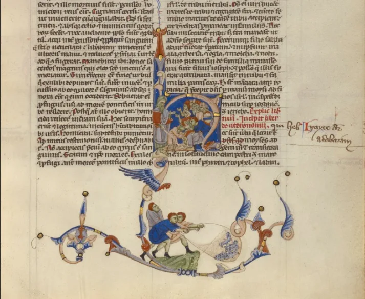

---
date:
  created: 2020-01-01
  updated: 2023-02-23
categories:
- Digital Humanities
authors:
- giulio
slug: happy-new-year
---
# Happy New Year!

Dear Sexy Codicologists,
We would like to wish everyone of you the best for this 2020!
At  the same time we would like to thank everyone for their continued support for our projects. We have set some great goals for ourselves and the DMMapp / Sexy Codicology Blog for this year.
Thank you, from the bottom of our hearts, for making all of this possible.
Let's make this a great year!
The Sexy Codicology Team

 Unknown
*Abbey Bible*, about 1250–1262, Tempera colors, gold leaf, and ink on parchment covered with oak boards backed in white alum-tawed pigskin
Closed: 27 × 19.7 cm (10 5/8 × 7 3/4 in.), Ms. 107 (2011.23)
The J. Paul Getty Museum, Los Angeles, Ms. 107

<!-- more -->
