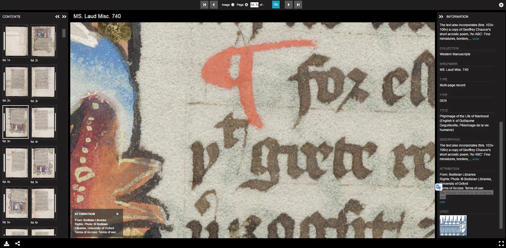
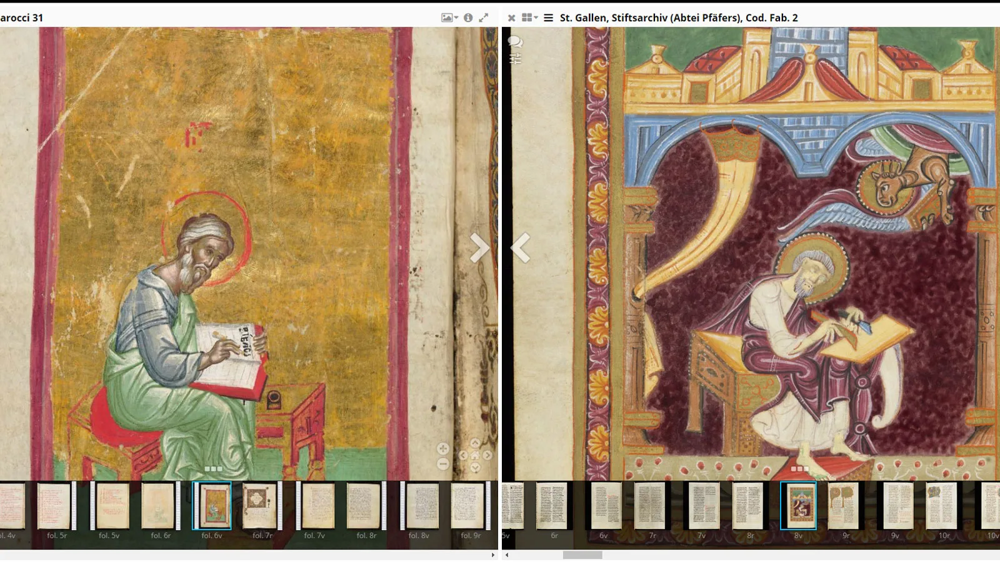
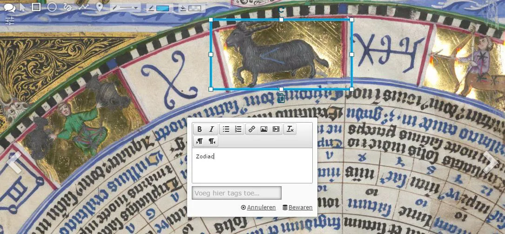
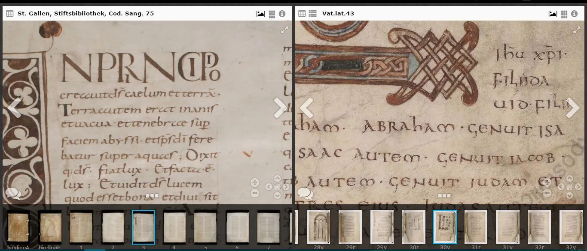

---
date:
  created: 2017-03-27
  updated: 2023-04-19
categories:
- Digital Humanities
- Digitized Libraries
- IIIF
authors:
- marjolein
slug: iiif-international-image-interoperability-framework
---
# IIIF - The digitized manuscripts revolution we've all been waiting for!

We created the DMMapp to make it easier for you to find collections of digitized manuscripts - and **IIIF is making it easier for you to view, study, and compare manuscripts**. In this post we are going to tell you all about why it’s awesome!
In 2011, a group of international libraries and universities  (Stanford University, The British Library, Bodleian Libraries, The Bibliothèque nationale de France, the National Library of Norway, Cornell University, and Los Alamos National Laboratory Research Library) set up the [International Image Interoperability Framework](https://iiif.io/), or, in short, IIIF (pronounced as triple-I-F).

<!-- more -->

*Example of the zoom capabilities in a manuscript from the Bodleian Libraries
See the manuscript in Mirador yourself by clicking this image.*

## Why IIIF?

One of the biggest issues that we at Sexy Codicology have always run into is the fact that **almost every library, museum, or other heritage institute, deals with the presentation of digitized manuscripts in their own, unique, way.** There is a big variety in the viewers that are used for images, and you can only use *their* viewers or download the images yourself. Some of these viewers are not always easy to work with, and have often big limitations to how you can view the manuscript or what you can do with it.
This is exactly the issue that the collaborating libraries are addressing with the IIIF initiative (See the original "[about page](https://iiif.io/about/)" on the International Image Interoperability Framework website for more info.). **Scholars and programmers from all over the world are working together on providing a technology that give researchers, and heritage enthusiasts, a rich and uniform experience when viewing digitized heritage**. Most of all, they want to make it possible that as many digital collections as possible all work in the same way, so that any image from any museum or library can be seen in any viewer online, together with any other manuscript or artwork that is IIIF compliant! Side-by-side!

## I want IIIF! Where do I get it?

**IIIF is not a program or app to install on your device**. The International Image Interoperability Framework is a standard that institutions can use; a sort of list of rules to stick to. These rules describe the way to present the images and the descriptive data about it. If a library follows all these rules, they have “IIIF-ified” their images. The more libraries and museums all stick to these rules, the better, because this means that any image from any digitized collections can be seen in any of the IIIF-compatible viewers.

## So what does IIIF mean for me?

In short, IIIF means a revolution in viewing, browsing, and comparing digitized manuscripts. Better image quality, more zoom, and extra possibilities, such as annotation and colour tweaking. When you are just browsing on institutions’ websites you will see more viewers that are alike, with the same options.
What is the best about IIIF? The fact that **you can compare any two (or many more!) manuscripts that have been IIIF-ified side by side regardless of what institution they come from!** You want to compare the script of manuscripts that are being held at the Bodleian Libraries, Stanford Libraries, and the Vatican Library? No problem!
[See this example](https://e-codices.unifr.ch/en/mirador/csg/0075/csg-0075_e001?json=9c9808a2-1320-11e7-a0ba-d78f9ad487fe) of a manuscript held in Bern alongside one held at the Vatican (wait for them to load!).

*Comparing two images of the Evangelists, one from the Bodleian Libraries, the other from St. Gallen.*

Combine and compare manuscripts from various libraries and museums in one viewer with a simple copy-and-paste of a link (we will explain in another blog post how to do this yourself). Then **you can even share your own collection or comparison with anyone by simply copying the link to the viewer!**
**Another possibility of IIIF is the annotations option**. This means that you cannot only make notes on the images for yourself, but also share these with others. Think of creating a gallery or exhibition with selected manuscripts and notes about interesting features, ready to share with your students, fellow researchers, or just for you own fun!

*Annotation example from the Bayerische Staatsbibliotheek - BSB CLM 826.*

## Awesome, but...

Yes, IIIF is a great revolution that creates lots of possibilities for manuscript studies and revolutionizes viewing digital material, but there are also some downsides to it at the moment.
One of these is pointed out by [Dot Porter on her blog](https://www.dotporterdigital.org/freely-available-online-what-i-really-want-to-know-about-your-new-digital-manuscript-collection/). She explains that even though collections might be IIIF-ified and made available in high resolution with deep zoom, we have to be careful. These images might not have have open rights licenses, and you would not be allowed to use them as you want to. In a perfect world, IIIF-ified manuscripts would be also made available with public domain licenses, but there is still a long road to go in this field.

*Comparing two 9th-century Bibles, one from the Vatican Library, one from e-codices.*

An example of this: the Vatican has recently launched a new shiny website and is digitizing at a fast rate, but the manuscripts are covered by a strict "all rights reserved" copyright license. Nothing can be re-used without permission. They provide the IIIF link in the information box so you can add it to any viewer, but you cannot re-use these images in any other way than look at them. But this might be the only thing that you need.
It's great that anyone can see these books for free online, but we hope things will be further optimized. It is always tempting to think that, when images are available in such a high resolution, that they are options for re-use, but this is the catch. So tread with care!
Many institutions are working very hard on implementing IIIF for their collections, but these things take time and effort. We have to be patient at the moment. Not all the manuscripts we would like to have in our own, personalized, digital collection can be added yet until an institution will provide the IIIF service.
Still, this is moving so fast right now, with many libraries picking up this technology. Also, IIIF is constantly moving forward, so who knows what other cool options we will have in the future!

## Who is IIIF-ied?

Want to check out some institutions that have live IIIF-ified collections already? This is a short overview of institutions that we found (a full list of all institutions working on IIIF can be found [here](https://iiif.io/community/consortium/#members)):

- [The Digital Bodleian](https://digital.bodleian.ox.ac.uk/migration/#/?p=c+,t+,rsrs+0,rsps+10,fa+ox%3Acollection%5EWestern%20Manuscripts,so+ox%3Asort%5Easc,scids+,pid+,vi+)
- [Houghton Library](https://hcl.harvard.edu/libraries/houghton/collections/early_manuscripts/about.cfm#collection)
- [Universitätsbibliothek Heidelberg](https://www.ub.uni-heidelberg.de/helios/digi/handschriften.html)
- [E-codices](https://e-codices.unifr.ch/en)
- [Vatican Library](https://digi.vatlib.it/)
- [Wellcome](https://wellcomecollection.org/collections) (Click a manuscript and scroll down to see if the IIIF-logo is there)
- [Bayerische StaatsBibliothek](https://www.digitale-sammlungen.de/en/)

If you have become as enthusiastic about the possibilities of IIIF as we are, keep on watching this space! Soon we will publish a short guide on how to work with a viewer and make awesome comparisons and collections yourself!
And for some further reading and interesting websites:

- Digital Manuscripts Toolkit from the Bodleian: https://dmt.bodleian.ox.ac.uk/
- https://web.stanford.edu/group/dmstech/cgi-bin/wordpress/tag/iiif/
- Reconstructing a cut-up manuscript (tick the box “*Afficher les miniatures*”): [https://demos.biblissima-condorcet.fr/chateauroux/osd-demo/](https://demos.biblissima.fr/chateauroux/osd-demo/)
- <https://github.com/IIIF/awesome-iiif>
- https://iiif.harvard.edu/portfolio/harvard-library/
- https://player.digirati.co.uk/
- <https://bav.bodleian.ox.ac.uk/news/the-polonsky-project-and-iiif>
