---
date:
  created: 2014-12-24
  updated: 2016-11-20
categories:
- Medieval Bunnies
- medieval instruments
- music
authors:
- marjolein
slug: killer-bunny-vacation
---
# The Adventures of Medieval Killer Bunny: A Musical Vacation

It's Xmas time! Christmas songs and carols everywhere! In this newest instalment of [The Adventures of Medieval Killer Bunny](https://blog.digitizedmedievalmanuscripts.org/medieval-killer-bunny/ "The Adventures of Medieval Bunny, Part I: The Killer Rabbit") we are going to look at what the medieval bunnies are planning for theholidays! Like everyone, also they sometimes need some relaxation and fun, and most importantly, a break from their killer jobs; and since we are sure you have heard "Jingle bells" and "Joy to the World" for the past month or so, it is only appropriate that in this post we will **meet the Musical Killer Bunnies.**

<!-- more -->

## Rudolphus, the red-nose killer bunny

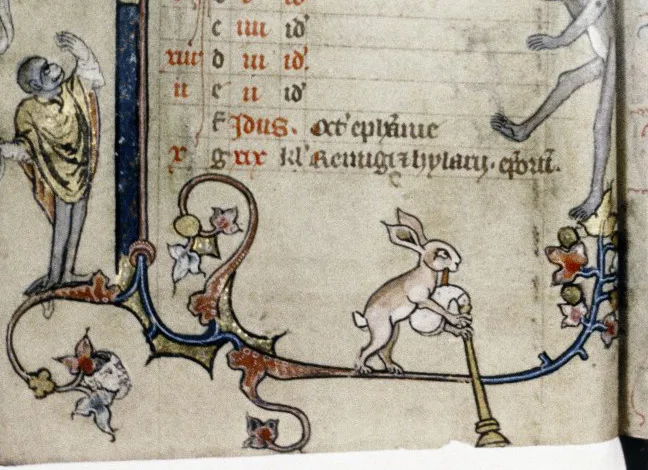

*Bodl. Douce 5 roll 208 H*

Browsing manuscripts you might have often seen rabbits blowing on a horn, but you might have also noticed that this is not the only instrument that they can play. As we see in the pictures below, medieval rabbits were also good at playing all kinds of instruments.... Or perhaps they only made it seem so, to distract you before they nibbled your bum.
What is particularly interesting about these marginal drawings is that animals, human figures and grotesques (defined by the British library as: “a hybrid and comic figure, often combining elements from various human and animal forms”) were all mixed together. There was no regard for proportions, which gave you man-sized rabbits, or miniature deers next to human figures. Sometimes these animals, grotesques, or humans were drawn as an extension of the border decoration. It is common to see all sorts of animals doing human things like hunting, jousting, battling and as we are showing you in this post, playing musical instruments. This kind of decoration was accepted in medieval times; marginal scenes depicted daily life turned upside down. **Particularly interesting is that often we see the most curious and ridiculous scenes in the margins of religious texts.** It always surprises me that this was allowed in such books.
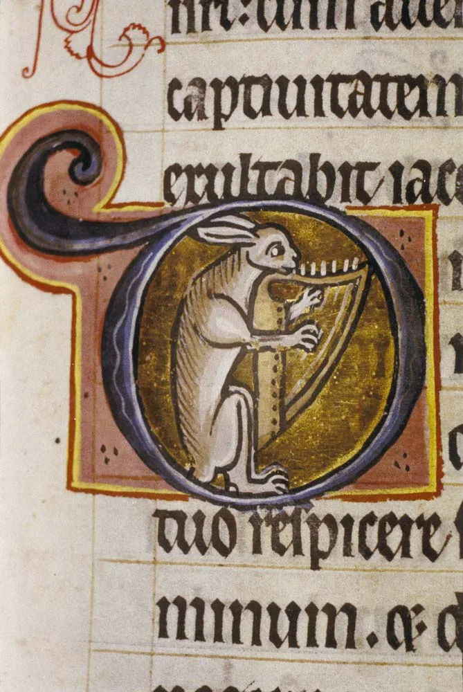

*Bodl. Ashmole 1525*

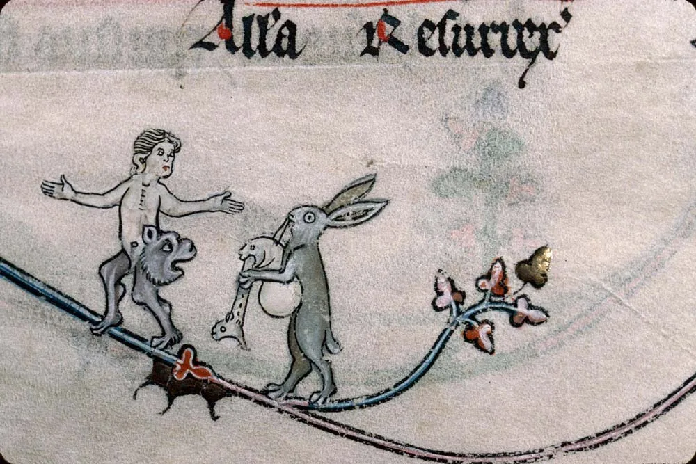

*Verdun, Bibl. mun., ms. 0107*

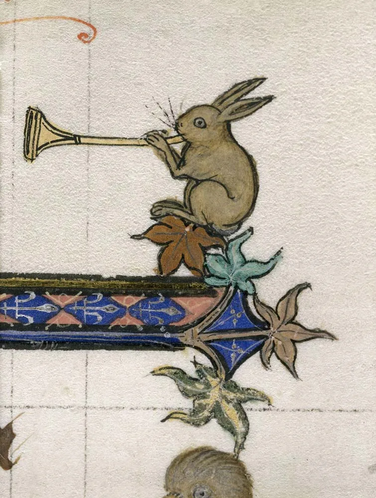

*BL Royal 3 D VI*

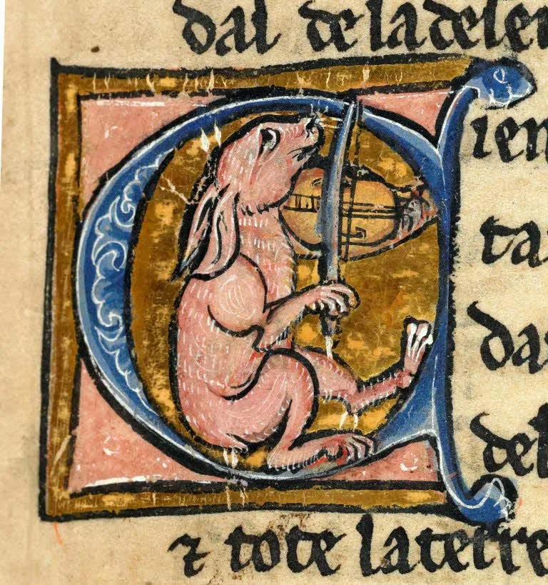

*Rennes Ms0255*

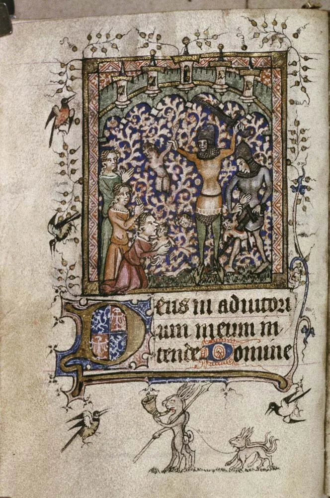

*Bodl. Lat. liturg.*

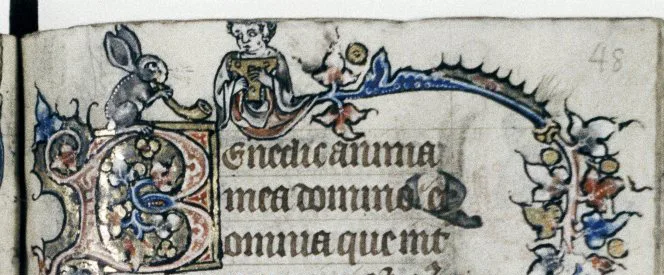

*Bodl. Douce 6*

So there you have it: as the marginalia shows us, the ninja killer bunnies don't only like to spend their time killing stuff; they also enjoy having some fun and making music. In the manuscript pictures above you can see that in those days of merry feasting, the bunnies make temporary peace with their enemies and party together in full Christmas mood!

### Not only medieval bunnies!

Whereas some manuscripts have bunnies making music aplenty, we also found quite a nice collection of **other animals playing musical instruments;** as you have seen in this post, the bagpipes are a very popular instrument together with the harp, organ/organetto and horn. This does not only apply to the hares, but all sorts of animals. Beside the laughs, it could be really interesting to research the connections between the instrument displayed in these manuscripts and their counterparts in real medieval life!
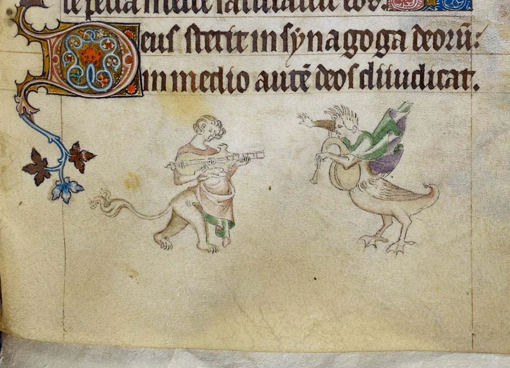

*Royal 2 B VII, f. 192. Grotesques playing instruments*

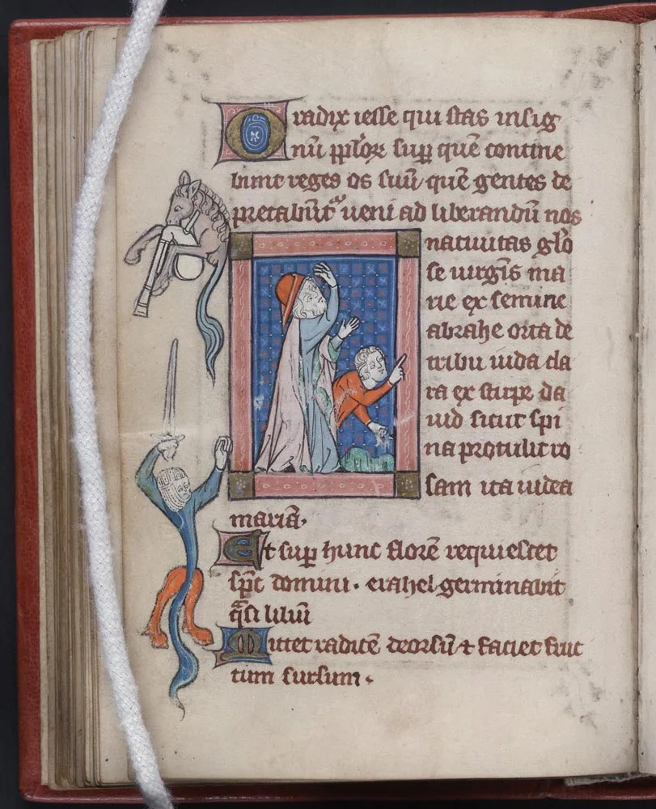

*Beinecke, Rothchild f. 45v, "horse" playing a bagpipe.*

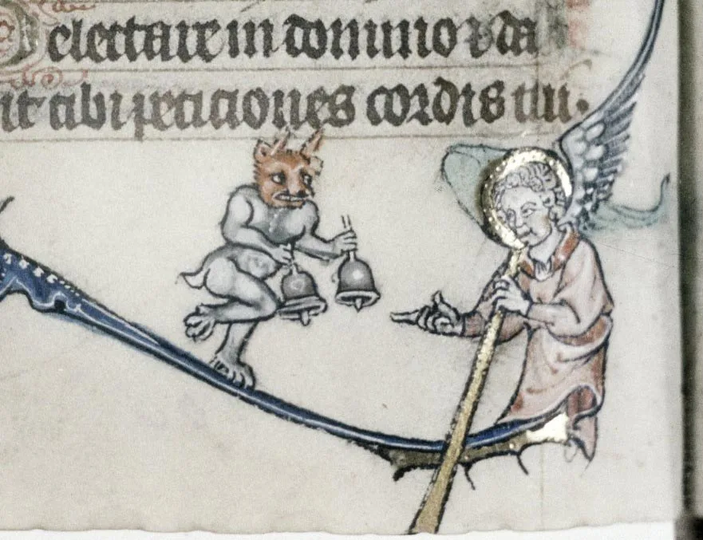

*Douce 5, f.100r, Jingle all the way!*

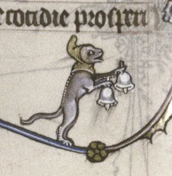

*Douce 5, f. 180v - Jingle bells!*

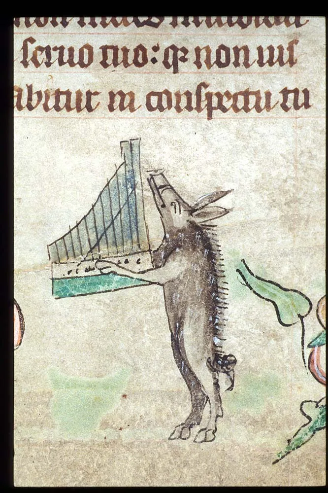

*Harley 6563, f. 41, Boar and organetto*

Together with the killer bunnies and their instruments (musical, and killing instruments that is) **the Sexy Codicology team wishes you a merry Xmas and a joyful 2015!**
PS! Stay tuned: Soon, we will be posting another instalment of the Killer Bunny Adventures!
