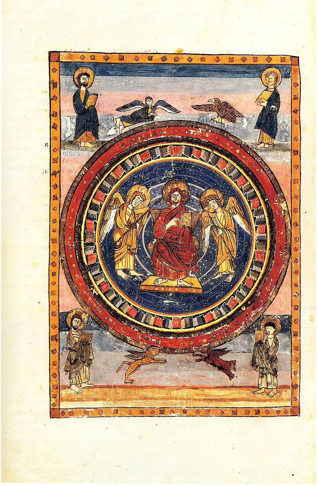
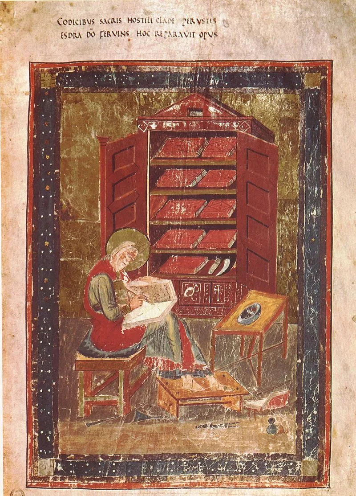
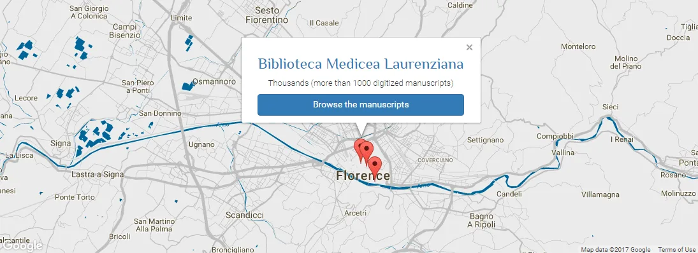

---
date:
  created: 2017-02-24
  updated: 2023-04-03
categories:
- Digitized Libraries
authors:
- giulio
slug: laurentian-library-manuscripts
---
# The digitized manuscripts of the Biblioteca Medicea Laurenziana

## The Laurentian Library, in context

Florence is a beautiful city. The kind of city many people from Rome like myself would like to move to; so similar is it to the Capital: full of art, culture, history… but without the broken roads, the traffic, and a bit more calm. Florence is also home to the Laurentian Library, or, as it's called in Italian: *Biblioteca Medicea Laurenziana,* or more simply "*La Laurenziana"*. **One of the greatest libraries in the world**; one of the places that you have to visit. If you can't get there, you can view their digitized manuscripts on their recently launched new interface!
But how did the Laurentian Library come to be? The history of the library is extremely long; so let's go back to the beginning: it's 1519 and you are [Giulio di Giuliano de' Medici](https://en.wikipedia.org/wiki/Pope_Clement_VII). You are a powerful Cardinal that will be pope just four years later. You want a library. Who do you call? Well, Michelangelo, of course! You spare no expense.

<!-- more -->

*Maiestas Domini (Christ in Majesty) with the Four Evangelists and their symbols, at the start of the New Testament; page from Codex Amiatinus (fol. 796v), Firenze, Biblioteca Medicea Laurenziana. Source: Wikipedia, Public Domain.*

What then? Well, Michelangelo began working on the architectonic masterpiece the same year, with consistency, until 1534. That year, after the death of his father and Giuliano de' Medici, and the displeasing political situation in Florence, Michelangelo decided to abandon Florence for greener pastures, leaving the Laurenziana incomplete.
The works on the Biblioteca Medicea were then carried on by other architects, based on drawings and indications by Buonarroti himself. As a result, in 1571, year of the inauguration, the library finally had become a masterpiece fit for the extraordinary books kept inside.

## What's in the Laurentian Library?

**The Laurentian Library is home to around 11,000 manuscripts**, 2,500 papyri, 43 *ostraca* (Usually small pieces of stone or pottery with writing scratched onto the surface.), 566 incunabula, 1,681 16th-century prints, and 126,527 prints of the 17th to 20th centuries. (<https://www.bmlonline.it/la-biblioteca/fondi-principali/> - *La Biblioteca conserva oggi all’incirca 11.000 manoscritti [...], 2.500 papiri, 43 ostraka, 566 incunaboli, 1.681 cinquecentine, 592 testate di periodici specializzati e un totale di 126.527 edizioni a stampa (dal XVII al XX secolo).*)
The story of these manuscripts starts with Cosimo I, Grand Duke of Tuscany, in 1571, who first opened the Library. Navigating the Laurentian Library's website you will notice the signature *Pluteus* or *Pluteo* (*Plut*.) This refers to the early manuscripts present in the library that were on display on the book-shelves designed by Michelangelo that served and serve as shelving, lecterns and seating. Book-shelf = *pluteus* ( [https://www.perseus.tufts.edu/hopper/text?doc=Perseus:text:1999.04.0059:entry=pluteus](https://www.perseus.tufts.edu/hopper/text?doc=Perseus:text:1999.04.0059:entry=pluteus) - V. A book-shelf, bookcase, desk, Pers. 1, 106; “with busts upon it,” Juv. 2, 7; cf. Dig. 29, 1, 17, § 4; Sid. Ep. 2, 9. — A Latin Dictionary. Founded on Andrews' edition of Freund's Latin dictionary. revised, enlarged, and in great part rewritten by. Charlton T. Lewis, Ph.D. and. Charles Short, LL.D. Oxford. Clarendon Press. 1879.). Mindblowing. These include the manuscripts that were collected by the Medici family and that Giulio di Giuliano de' Medici (future Pope Clement VII) took to Florence in the 1520s.
Angelo Maria Bandini, a famous librarian who also looked after the [Biblioteca Marucelliana](https://en.wikipedia.org/wiki/Biblioteca_Marucelliana), was appointed to the Laurentiana in 1757, and made sure to expand on the printed catalogues.

## The *Biblioteca Medicea Laurenziana*, online

*Portrait of Ezra, Amiat. 1, 5r - Biblia Sacra - Biblioteca Medicea Laurenziana, Florence. Source: Wikipedia, Public Domain.*

Let's start off by saying that **the amazing Codex Amiatinus is fully digitized**. That's the oldest extant manuscript of the Latin Vulgate (Murray, Peter, Murray, Linda, and Jones, Tom Devonshire. "Codex Amiatinus." *The Oxford Dictionary of Christian Art & Architecture* (2013): The Oxford Dictionary of Christian Art & Architecture. Web.). **The Syriac Rabula Gospels are also there! All in all, 4000 are freely accessible to browse!**

### Interface

**The interface works as expected in 2017**: you can zoom in to see the smallest detail, or have an overview of all the manuscript's thumbnails. The quality of the digitization is high; although **we did come across some manuscripts that were underexposed and dark**. We would show you what we mean with two screenshots, but we cannot due to copyrights. Speaking of this, the images are covered all over by the copyright symbol.
You are also able to invert the colors of a folio to help you read the text and identify details.
All very cool, but **we were not able to find a "download" button for the images**. Although this didn't come as a surprise, this is a serious problem for ever-moving researchers (Tip: you can rotate the image 90 degrees, set full screen, and take a screenshot of the page; theoretically you could then save a 4K image, depending on the resolution of your monitor. Also, right-clicking and saving the image will do!).

*The Laurenziana on the DMMapp*

**The interface is in English and very easy to navigate.** Maybe the background isn't ideal; a bit "noisy", which does not help when you are trying to read a 10th century manuscript, or a post 16th century one. **A monochromatic background might have been better.**
**Search could be a bit improved.** Finding the treasures like plut. 39.1 (*Mediceus* of Virgil) was difficult: Inserting "plut. 39.1" didn't show the results I wanted; the vernacular name didn't work either, but I expected that. In the end, I filtered the results: "Manuscripts dated 0400 to 0500, by collection "Plutei", and there it was. Not ideal, but Search Engines are tricky to set up, so in my opinion this is a forgivable fault.

### Copyrights

**There is also no clear indication of the copyrights except the superimposed watermarks and the copyright symbol in the footer**. This caused us to investigate before posting anything, and thank the Tremulous Hand of Worcester we did (See the note at the end of the post). It is a shame that the rules concerning how you can use the images are not clearly explained on the website.

### Final Remarks

**The new interface is based on "MagusOnline" software.** We wanted to read some more technical details to understand it better, alas we were unable to find any documentation.
**It's a shame that the Laurentian Library did not implement [IIIF](https://iiif.io/)**, the International Image Interoperability Framework. This would have allowed researchers, and users in general, to compare medieval manuscripts coming from *La Laurenziana,* to others coming from libraries that have already adopted IIIF. (See IIIF at work over at the [Bodleian](https://iiif.bodleian.ox.ac.uk/iiif/viewer/?iiif-content=https://iiif.bodleian.ox.ac.uk/iiif/canvas/721597e7-0840-4c76-90d4-5d328f0eb7c4.json#?c=0&m=0&s=0&cv=4&z=-0.4177%2C0.0864%2C1.861%2C1.1573)!) A lost occasion that makes the project feel almost already old and outdated. Don't know what IIIF is? Want to know more? Stay tuned as Marjolein finishes her post on this subject!
Although the silly copyright issues and the technical uncertainties, having the Laurentian Library so easily accessible is awesome, and will certainly please all the culture-loving internauts out there!

## Editor's note: about the images in this post

*After we finished writing this post, we turned to adding the images. We were trying to figure out from the website what the rights statements were that are applied to these images. What you usually expect is an explanation that clearly describes how you can or cannot use images (no commercial use, for example).*
*The only thing that we could find on the website about this is the © in the footer. This gave us an indication that there were copyrights put on these images, but still we wanted to know some more about the exact terms of re-use for this material. So, we contacted the Laurentian Library and we were told that **the images are "protected by current regulations*** (This happened via a Facebook chat. At first I thought I expressed myself badly; that I had been misunderstood. So I sent an example of which detail I wanted to post. The answer was: "Yes. The images have to be authorized even if there are no commercial ends." - "*si. Le immagini devono essere autorizzate anche se non ci sono scopi commerciali*")**."** ***This means that no one can create a screenshot of a detail and publish it on a blog**, even with the correct attribution, link to the source, etc.*
*To add any image to this post we would have to ask for authorization, possibly pay a fee, and only then embed the pictures coming from the Laurentian Library's new website. The same goes for any digitized manuscript held by an Italian institution. **This is not the Laurenziana's fault, but the Italian law's.***
*We will not discuss here how masochistic, ridiculous, out-of-this-time the Italian law is. As an Italian, I feel very ashamed of this situation. And I apologize.*
***We have chosen to use the images that come from Wikipedia instead**, and link to those. These images are also possibly unauthorized, but these have been uploaded to Wikipedia as being in the Public Domain.*
*Of course, we are very thankful that these manuscripts have been digitized at all and made accessible for browsing for free. But we hope this small adventure of us will make you think and **be grateful to all those institutions that share their material under a Public Domain or Creative Commons license**.*
*We welcome the Biblioteca Laurenziana to contact us and correct us on this topic, should we have made any mistakes.*
