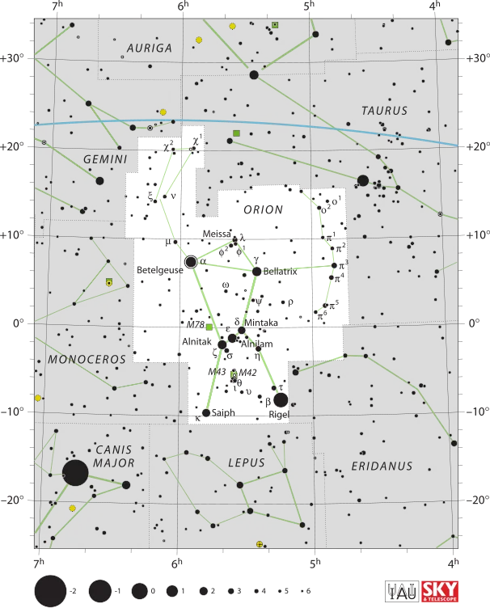
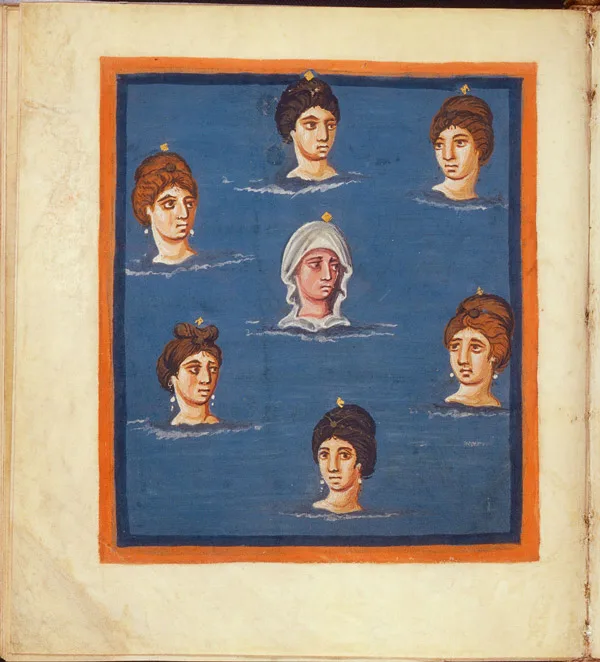

---
date:
  created: 2015-04-25
  updated: 2023-04-03
categories:
- A Medieval Manuscript a Week
- Digital Humanities
- Leiden Aratea
authors:
- giulio
slug: leiden-aratea
---
# Ad Astra - The Leiden Aratea and the constellations in the early Middle Ages

One of my biggest passions has always been astronomy: studying the names of the stars, the constellations' myths, the planets' movements. This passion has often met my other big love, medieval manuscripts, in the form of awesome astronomical manuscripts. The combination has always been fascinating to me: "Wow, someone hundreds (or thousands) of years ago was looking at the same stars I am looking at today, and was in love as much as me with the spectacle!" If you have ever had a chance to browse through an astronomical manuscript, you will have certainly noticed one thing: the constellations represented on parchment only seldom resemble the ones we see in the night sky. Sometimes, they look just like random dots.
Let's go and give a look at one of such books; an extraordinary one, to be precise, created more than a thousand years ago: **the Leiden Aratea.**

<!-- more -->

### The Leiden Aratea's history

A manuscript dated between 816 and 840, the Leiden Aratea was created possibly near Aachen (other say the Lorraine region.) For over a thousand years it has traveled around northern Europe, eventually ending up at Leiden University Library:
But what is the Leiden Aratea about?  It is **an astronomical treatise** written by Germanicus Julius Caesar (15 BCE –19 CE), also known to be the father of Caligula. The Aratea is a Latin translation of the Greek *Phaenomina* of Aratus (c. 315-240 BCE); a didactic poem used to describe the constellations and other astrological phenomena to the Macedonian court. It was **never meant to be considered an accurate description of the night sky.** The books (both the *Aratea* and the *Phaenomina*) were intended more for "entertainment". At the core of the Leiden Aratea there are **38 full-page miniatures**, possibly copies of a 4th-century work.
A beautiful and interesting description of this book is available on [this article written by Jenneka Janzen.](https://medievalfragments.wordpress.com/2013/03/08/new-exhibition-starring-the-leiden-aratea/)

### Compare and contrast

If it's true that the book was not intended for scientific observation, how much artistic freedom did the illuminator take? It's simple: let's compare the miniatures with contemporary imagery of the sky! We begin with something easy to identify to us all: the constellation of Orion. The first thing we have to know is that the constellation is represented looking towards left, while the real constellation in the sky has the hunter looking towards the right. In order to better compare the two, the Aratea's miniature has been turned to the right. 
As you can see from the slider above, the depicted constellation does recall the real counterpart, but sometimes it is simply impossible to correctly identify the individual stars. For example, the "sword of Orion" is depicted as being on the right side of Orion's Belt, while in truth it is found directly under it. Also the miniature appears to have a "backbone" made of three different stars which find not real counterpart. Betelgeuse,  Meissa, Bellatrix (the stars that constitute "head and shoulders" of Orion, together with Rigel and Saiph (the "knees", or "feet") and Alnitak, Alnilam and Mintaka (the "belt") are there, and easy to identify. Curious to see that the constellation "Lepus" is also represented running between the legs of Orion, while in the sky it actually runs further down towards the horizon, chased by "Canis Major".

*IAU and Sky \& Telescope magazine (Roger Sinnott \& Rick Fienberg)*

Let's take for another example the representation of the Pleiades. According to the legend these were the seven daughters of the titan Atlas:
• Maia, eldest of the seven Pleiades, was mother of Hermes by Zeus.
• Electra was mother of Dardanus and Iasion, by Zeus.
• Taygete was mother of Lacedaemon, also by Zeus.
• Alcyone was mother of Hyrieus, Hyperenor and Aethusa by Poseidon.
• Celaeno was mother of Lycus and Eurypylus by Poseidon.
• Sterope (also Asterope) was mother of Oenomaus by Ares.
• Merope, youngest of the seven Pleiades, was wooed by Orion. In other mythic contexts she married Sisyphus and, becoming mortal, faded away. She bore to Sisyphus several sons.
(Wikipedia)
The way they have been represented in the Aratea is, well: nice and tidy, possibly to accommodate the aspects of the seven sisters. If we compare it to the way the stars look nowadays, it is difficult to indicate with certainty which real star belongs to the faces in the miniature.

*Pleiades in folio 42v.*

So, why are the stars placed in a rather imprecise manner?
Well, the answer appears to be that **the stars themselves didn't matter that much.** What mattered in the Aratea was the poem, the iconography, the mythology; not the scientific accuracy.
**The Aratea was not meant to be taken outside on a starry night,** to compare the stars with what was drawn in the book as we do today with our tablets and smartphones.
Even in manuscripts that had more to do with the stars themselves ([CLM 210](https://daten.digitale-sammlungen.de/~db/0004/bsb00047183/images/index.html?fip=193.174.98.30&seite=243&pdfseitex=)), the stars were depicted in an apparently random manner.
Truth is, **who drew the illuminations wasn't an astronomer**, someone who actually had the will to go outside at night, find the constellation and draw it again. They were illuminators: they were told to draw the constellations, and so they did. But not by looking at the stars in the sky, but by looking at other books. Older books. "That's how the old masters drew them, they must be correct!"; "Well… the text says there is a star in the Dog's tongue in the Dog's constellation. I'll draw a dog; a tongue; a star!". This creative decision suggests that miniaturists who copied the Aratea, and many other manuscripts dedicated to stars, considered **the drawing of any similar form of a constellation an adequate copy of that constellation**. If we follow this principle then we can explain some of the diversity displayed by these pictures of the constellations.
**This is clearly a very, very, simplified explanation of what was going on.** For example, we also have to consider all the theological/philosophical influence that would have had an impact on the whole manuscript and its miniatures. An extremely intriguing aspect that would make a solid base for another blog! There are entire books dedicated to this matter. I particularly found the following dissertation "illuminating" and helpful while writing this blog: Ramirez-Weaver, Eric. "Carolingian Innovation and Observation in the Paintings and Star Catalogs of Madrid, Biblioteca Nacional, Ms. 3307." Order No. 3312920 New York University, 2008\. Ann Arbor. Highly recommended, have fun reading it!
