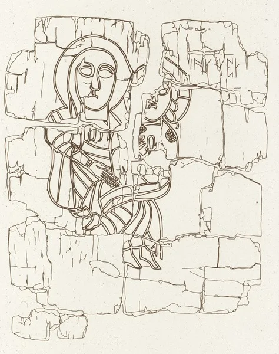

---
date:
  created: 2013-12-09
  updated: 2023-04-03
categories:
- Social Media Codicologists
- Book of Kells
authors:
- giulio
slug: madonna-child-book-of-kells
---
# The Book of Kells and its Madonna and Child

Inaugurating a new series of posts: **The Social Media Codicologists.**
You might not know it, but out there, in the social media sphere, there are hundreds of people like Sexy Codicology that share fantastic images of medieval manuscripts, along with great and interesting information. We want to highlight some of the posts we come across on our Tumblr.
The first post of this series is a miniature shared by [buonfresco](https://buonfresco.tumblr.com/post/68268201920/madonna-and-child-from-the-book-of-kells-folio):
> Madonna and Child from the Book of Kells, Folio 7v, Late 8th or early 9th century, Scotland

<!-- more -->

The Book of Kells, or  MS A. I. (58), or the Book of Columba, is a very well known illuminated manuscript: Considered Ireland's finest national treasure, it is in Latin and it contains the four Gospels from the New Testament, along with prefatory text and tables. It dates back to around the year 800 CE, or maybe slightly earlier and **it is a renowned masterwork of calligraphy and Insular illumination.**

## The Book of Kells: the earliest known portrait of Madonna and the Christ child in Western art?

We have shared images from the Book of Kells on our Tumblr in the past, but what made this post even more interesting was [buonfresco](https://buonfresco.tumblr.com/post/68268201920/madonna-and-child-from-the-book-of-kells-folio)'s comment to it:
> This is the earliest known portrait of Madonna and the Christ child in Western art.

Personally, I had never thought about it: "When was the Madonna and Christ first depicted?" After a little investigation on Wikipedia, I discovered buonfresco's comment is correct, but only in part.
**The miniature from the Book of Kells is the earliest surviving image of the Madonna and Child, in a Western illuminated manuscript**; not in general western art.
Nonetheless, without this comment I wouldn't have known; and I also wouldn't have learned that on St Cuthbert's coffin, dating  698 CE, there is a similar representation of the Virgin.

*St. Cuthbert's Coffin: Virgin and Child detail*

Fascinating.
How many things can the Book of Kells tell us in its beautiful leaves?
