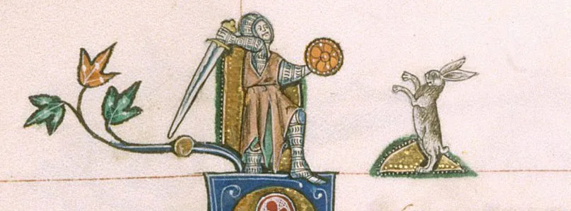
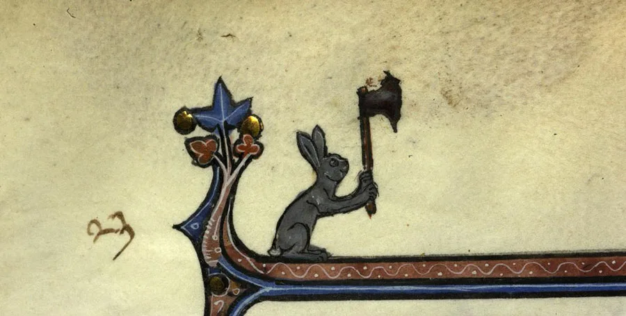
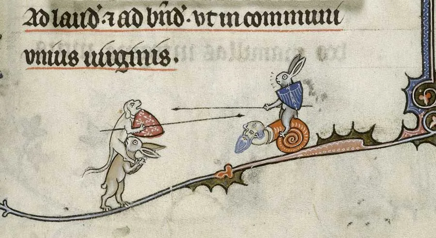

---
date:
  created: 2013-07-27
  updated: 2023-04-03
categories:
- Medieval Bunnies
- Bestiaries
authors:
- marjolein
slug: medieval-killer-bunny
---
# The Adventures of Medieval Bunny, Part I: The Killer Rabbit

## The Killer Rabbit in Medieval Manuscripts

<!-- more -->

Back in early May 2013 we came across some intriguing and awesome marginalia of rabbits in medieval manuscripts, in curious situations and topsy-turvy worlds, among which we found **the killer rabbit!**
On May 10th we posted this picture on our [Facebook Page](https://www.facebook.com/SexyCodicology):

*The Original Killer Rabbit. - BL. Add. 49622 f. 149v.*

As imaginable, the first thing that this marginal decoration reminded our followers of was **the hilarious scene of the Killer [Rabbit of Caerbannog](https://en.wikipedia.org/wiki/Rabbit_of_Caerbannog)**, in Monty Python's famous movie: *Monty Python and the Holy Grail.*
**UPDATE**
Eric Idle approves:
> <https://t.co/O3WvQZbfc3> Killer Rabbit page....
> — Eric Idle (@EricIdle) [December 24, 2015](https://twitter.com/EricIdle/status/680053081522831360)

Often, in medieval manuscripts’ *marginalia* we find odd images with all sorts of monsters, half man-beasts, monkeys, and more; even in religious books the margins sometimes have drawings that simply are making fun of monks, nuns and bishops. For example: The monkey is a popular animal to take over the human role in the marginal decorations; but so is the rabbit, along with many other animals.
In this blog post we like to show you images of bunnies that have decided to go killer or ninja, the Bunnies striking back!

## Hunting the Medieval Killer Rabbit in Illuminated Manuscripts

Hunting scenes are common in medieval manuscripts’ *marginalia*. This usually means that the bunny is the hunted; however, as we discovered, often the illuminators decided to change the roles around, ending up with something like this miniature here:

*A psychotic killer rabbit from - Paris, Bibl. de la Sorbonne, ms. 0121, f. 023*

### The Hare as a Medieval Symbol

Here at Sexy Codicology, we got curious and asked ourselves: “**What do Bunnies represent in Medieval Culture?”**
A very useful primary source to consult is a **medieval Bestiary** (a so-called “Book of Beasts”), a genre of manuscripts typical of England, which present a collection of various animals’ descriptions, both real and mythical ones. In these books it is also explained what their symbolism was in the middle ages, and what they represented within Christian religion. For example: **the panther** was thought to be a “multi-coloured beast” that breathed “a very sweet smell” that would attract other animals; **the beaver** would amputate its testicles because it knew that the hunter wanted them alone, rather than the whole animal, in order to make a powerful medicine; or **the foul dragon** (aka, the Devil), the only arch-enemy of the elephant and the panther (aka, Jesus Christ).
As it is easy to understand, these texts contained myths and superstitions and had quite the share of fantasy in them. **Their main objective was to moralize the reader.** Today, Bestiaries are fascinating sources that give us a peek into the medieval mind and culture. The information that people would get from these manuscripts would influence their daily lives, to a certain point.
Yes, but, what about the hare? Well, **the hare**, called by its latin name ‘*lepus*’, also has a entry in the Bestiaries and, of course, it has a Christian symbol behind it: **In theory, the hare represented the man that feared God, but put his trust in him, and not in people** (unlike the hedgehog… but that is another story.)
From a more scientific point of view, Pliny the Elder tell us:
> The white hares of the Alps are thought to eat snow in the winter, for they turn color when the snow melts. Some say that the hare is as many years old as it has folds in its bowels, and that it is a hermaphrodite that can reproduce without a mate. (Natural History, Book 8, 81)

### The link between the Killer Rabbit and Monty Python

Speaking about Pliny the Elder, it is extremely interesting to read what he has to say about rabbits:
> The fertility of rabbits is enormous. By eating all the crops, rabbits brought famine to the Balearic Islands, to such extent that the **people there petitioned Augustus to send troops to fight the beasts.** Rabbits are hunted with ferrets. (Natural History, Book 8, 81)

FANTASTIC! **Pliny actually mentions a desired military action against Rabbits!** Which were actually killer rabbits, since they caused death through famine! Who knows, maybe Graham Chapman, or John Cleese, or Eric Idle, or Terry Gilliam, or Terry Jones, or Michael Palin (writers of *Monty Python and the Holy Grail)* came across Pliny’s writing and took inspiration from it… in the end most of them studied between Oxford and Cambridge; Chapman, especially, studied medicine and might have given a look at Pliny’s work… But these are all conjectures.
Anyway, sometimes the medieval bunnies just want to have some fun and do a game of jousting with their animal friends rather than killing knights.

*The jousting bunny against the jousting dog - ~~Verdun, Bibl. mun., ms. 0107 (?)~~  BL Yates Thompson 8 f. 294r*

Clearly, the illuminators of these manuscripts we have shown did not have the intention to represent the bunny as it was described in the bestiaries. These are [*drolleries*](https://en.wikipedia.org/wiki/Drolleries), a particular type of marginalia, popular in Europe between the 13th and the 15th century. In these kind of decorations you can often find various creatures and monsters behaving in an odd way.
Animals, on the other hand, were often given human traits. Just like in the killer rabbits above.
Stay tuned for more episodes of *The Adventures of Medieval Bunny!*
And beware of the killer rabbit...
