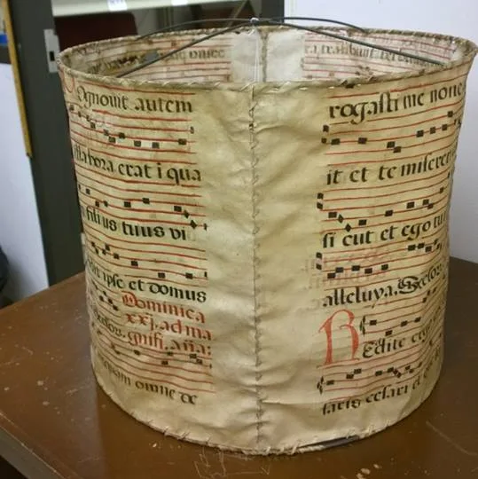
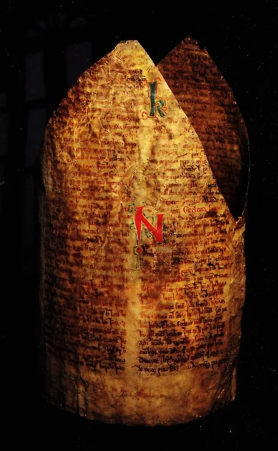

---
date:
  created: 2014-06-17
  updated: 2023-04-03
categories:
- Manuscript Curiosities
authors:
- giulio
slug: medieval-manuscript-lampshade
---
# A Truly Illuminated Manuscript!

One of my most beautiful experiences as an MA student in the Netherlands was field trip I did with my colleagues to the deep south of the Netherlands. In an abbey **we went through three different libraries searching for fragments in early modern books**. What I ended up finding was a full-page pastedown of a manuscript written in Italy in the 13th century. What a beauty it was, still today I think about it...

<!-- more -->

## A Manuscript Lampshade

Anyway, what we didn't find was **a lampshade made from a 16th century antiphonal**. This pleasure goes to Micah Erwin and his team, who are conducting a survey of medieval manuscript fragments used in bindings in the Harry Ransom Center. He states on the project's Facebook Page that the antiphonal used was probably circa 1600, coming from Southern Europe, from an antiphonal.Not sure of the date of the lampshade, but I am guessing not 17th century.

*The latest in interior decoration: a manuscript lampshade*

[Post](https://www.facebook.com/login/?next=https%3A%2F%2Fwww.facebook.com%2FTheFragmentsProject%2Fposts%2F542369739205021) by [The Medieval Fragments Project](https://www.facebook.com/TheFragmentsProject).

## Medieval Manuscripts as Clothes

As Micah rightfully states, this is a **a fantastic example of one of the many ways in which medieval manuscript fragments have been re-used**. Couldn't agree more! Recently, Dr. Kwakkel from Leiden University also posted about surprising reuses of medieval manuscripts. In his case, rather than putting them on a lamp, you can see how you could wear them.

*Den Arnamagnæanske Samling, MS AM 666 b 4to*

Dr. Erik Kwakkel runs an excellent [Tumblr blog](https://erikkwakkel.tumblr.com/), along with and equally excellent [research project blog](https://medievalfragments.wordpress.com/category/erik-kwakkel/) and a successful [twitter account](https://twitter.com/erik_kwakkel).
You can follow Micah Erwin's project on the [Facebook Page](https://www.facebook.com/TheFragmentsProject), but also on the project's Flickr Page, where his team and him regularly upload photos of the medieval fragments they find (soon to be added to the DMMmaps!)
Via: [Marjolein de Vos](https://twitter.com/marjolein442), via: [Awesome Archives](https://awesomearchives.tumblr.com/post/89067404511/a-manuscript-lampshade-via-the-fragments-project)
