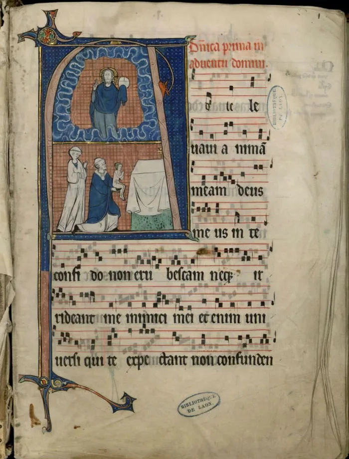
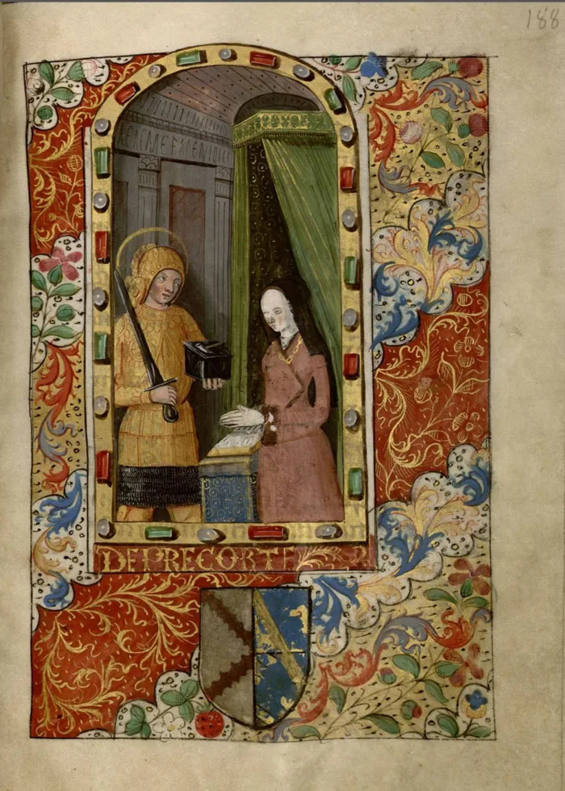
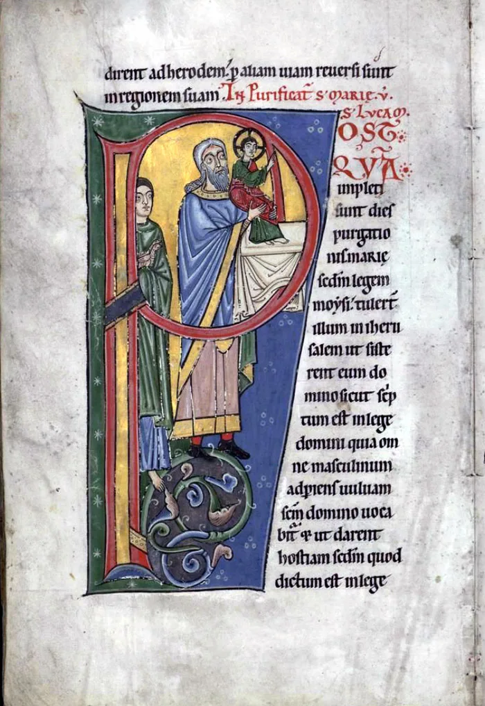

---
date:
  created: 2014-02-21
  updated: 2023-04-03
categories:
- Digital Humanities
authors:
- giulio
slug: medieval-music-ville-de-laon
---
# Medieval Music from the Ville de Laon library

Not all digitized libraries are created equal, and some are more interactive than others. Few let you listen to medieval music. One of the few is the Ville de Laon library.

<!-- more -->

## Medieval Music in the 21st century

A few days ago we received a tip for the [digitized medieval manuscripts maps](https://digitizedmedievalmanuscripts.org/) from Hipster Bookfairy ([@HipBookfairy](https://twitter.com/HipBookfairy)). She graciously sent us several links to various digitized libraries. Among these there was the link to the Ville de Laon library. Out of curiosity, I started browsing the website and all its manuscripts, and after visiting basically all the books available, I noticed a button next to the thumbnails of some of these. On this button there was written *Ecouter*, the French word for "Listen". I clicked and waited for the next page to load; once it did that, I was amazed by what was coming out of the speakers of my PC: Medieval music!

*Graduel de Vauclair from the XIII century, folio 1r.*

## Now, Listen.

In the boxes below, scroll down until you see an arrow pointing right. Click on the arrow to listen to what a church could have sounded like in those days.

Music coming from the 13th century was now filling my room here in the Netherlands. I have browsed thousands and thousands of medieval manuscripts, both digitally and in real life, and often I have come across books containing notation; I have often wondered what this music would sound like; the Ville de Laon library fulfills my curiosity.

*A full page illumination from Ms 243t, Heures de Devisme, representing the owner of the book.*

## More, Besides the Music

The Ville de Laon digitized library is home to several manuscripts containing notation, and most of these have, at least, a part of the manuscript sung; and **the quality of the audio is excellent** too.

*An historiated initial from Ms 550: Presentation of Jesus at the Temple*

I highly recommend visiting the Ville de Laon digital library, not only for the fantastic medieval music you can listen too, but also for the excellent quality of the digitized medieval manuscripts that are made available on the site.
This website is an example for many other digitizing projects. Go have a look!
