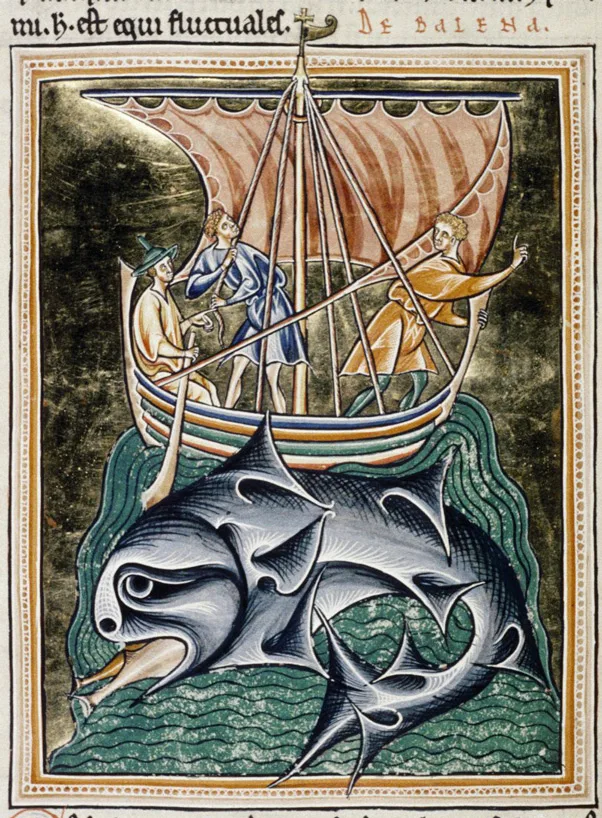

---
date:
  created: 2013-12-10
  updated: 2023-04-03
categories:
- Manuscript Curiosities
authors:
- giulio
slug: medieval-whale
---
# A Medieval Whale: MS. Ashmole 1511, Folio 86v

## Medieval Whaling. Arr!

<!-- more -->

*The Whale - Bodleian Library, MS. Ashmole 1511, Folio 86v.*

[venasaphena](https://venasaphena.tumblr.com/post/68357374132/bodleian-library-ms-ashmole-1511-folio-86v-a) shared this beautiful representation of a whale from Bodleian Library, MS. Ashmole 1511, Folio 86v:

> A common narrative about the whale in Medieval bestiaries involves the story of sailors who have spent many days at sea. On their journey, the sailors spot a tiny island where they land and anchor their ship at. However, unbeknownst to the sailors, the island is in actuality the back of a whale that has become covered with sand from floating at the surface for so long. Hungry, the sailors cook up some food for themselves when suddenly. After the heat from their fire has penetrated the whale’s thick skin, the “island” dives under the surface, taking the ship down and drowning the sailors with it.

As every animal in a medieval bestiary, **the whale is a symbol**: The whale deceives sailors and drags them down to their deaths, and (usually) **it signifies the devil**: it deceives those he drags down to hell. The sailors, in this case, represent those who are weak in faith who give in to the worldly desires and end up swallowed by the devil.
A [fantastic website concerning medieval bestiaries](https://bestiary.ca/beasts/beast282.htm) contains various descriptions of the whale in chronological order, and it's definitely worth a visit to see how the description of the beast varied through the centuries. The most interesting, in my opinion, is the **description by Isidore of Seville from the 7th century CE**, contained in the *Etymologies*, Book 12, 6:6:
> Whales (*ballenae*) conceive through coition with the sea-mouse. (Book 12, 6:7-8): Whales are immense beasts, with bodies equal to mountains. They have their name from emitting water, for the Greek *ballein* means emit; they raise waves higher than those of any other sea beast. They are called monsters (*cete*) because of their horribleness. **The whale that swallowed Jonah was of such size that its belly resembled hell;** as Jonah says (Jonah 2:2): "He heard me from the belly of hell."
