---
date:
  created: 2015-02-18
  updated: 2023-04-19
categories:
- Digital Humanities
- Maps of Digitized Medieval Manuscripts Available Online
- Resource
- vatican library
- website
authors:
- giulio
slug: new-digitized-manuscripts-from-the-vatican-library
---
# New digitized manuscripts from the Vatican Library!

Well, this is the third time here at Sexy Codicology that we are delighted to communicate that the Vatican Library has, once again, digitized and made available **a few hundreds new manuscripts!**
Since we started the DMMmaps project, **the Vatican Library has more than doubled the number of digitally available books.** Plus, they have reorganized the home page: Where once you could see the endless list of manuscripts available (now 1'500\+!), there is now a tidier page showing the collections and then number of digitized books you may find inside.
An old problem is still present: it is impossible to know which were the most recently uploaded books; unfortunately there is no RSS, nor is there any specific announcement which tells us what is new.
Too bad. I guess it is up to us users to explore!

<!-- more -->

### New manuscripts from the Vatican Library

[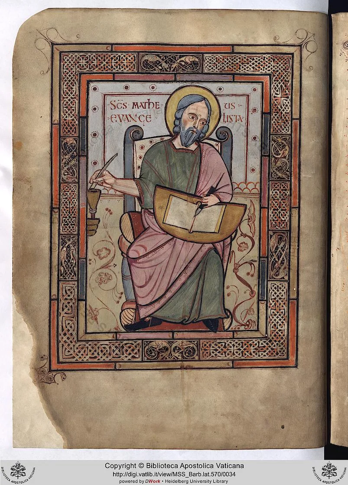](https://digi.vatlib.it/view/MSS_Barb.lat.570)

*Barb. lat. 570 11v*

[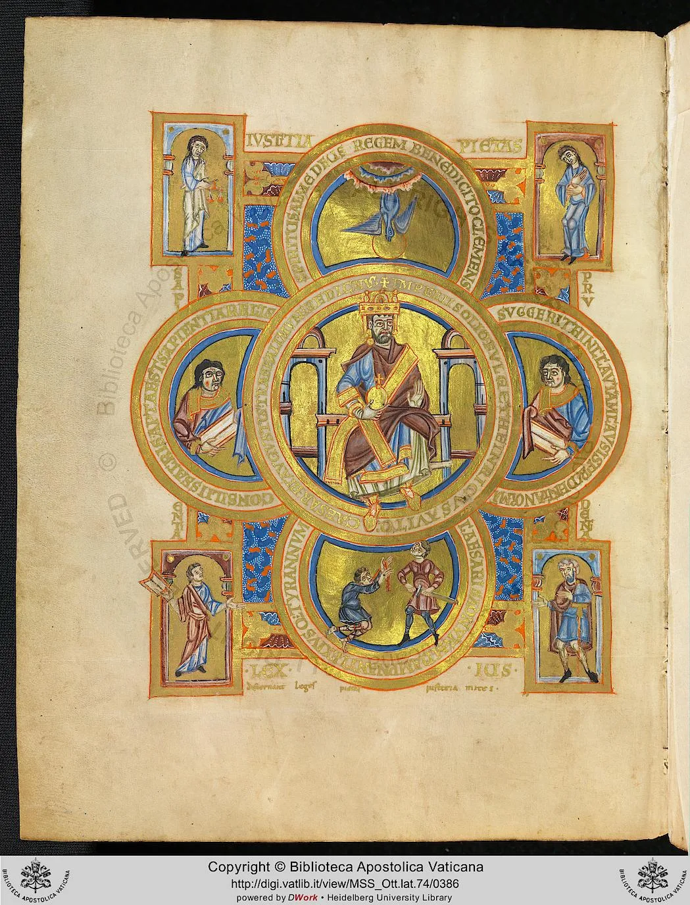](https://digi.vatlib.it/view/MSS_Ott.lat.74)

*Ott. lat. 74 193v*

[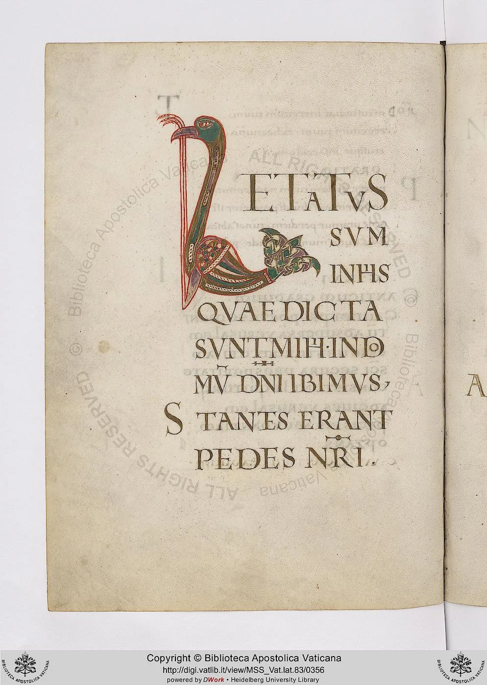](https://digi.vatlib.it/view/MSS_Vat.lat.83)

*Vat. lat. 83 170v*

[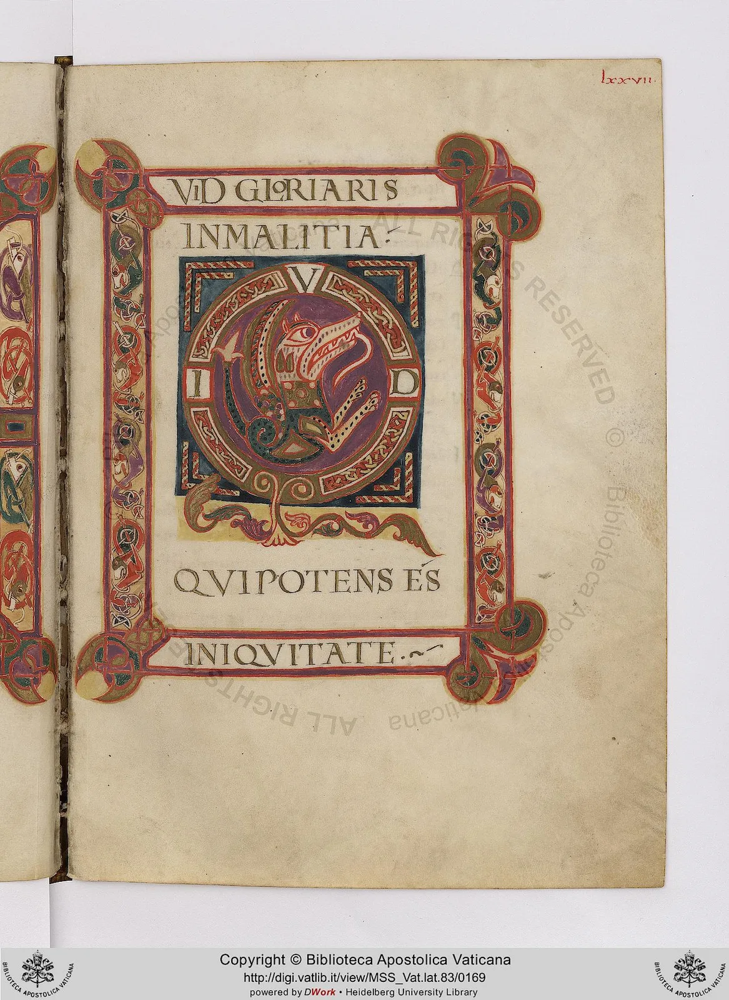](https://digi.vatlib.it/view/MSS_Vat.lat.83)

*Vat. lat. 83 77r*

[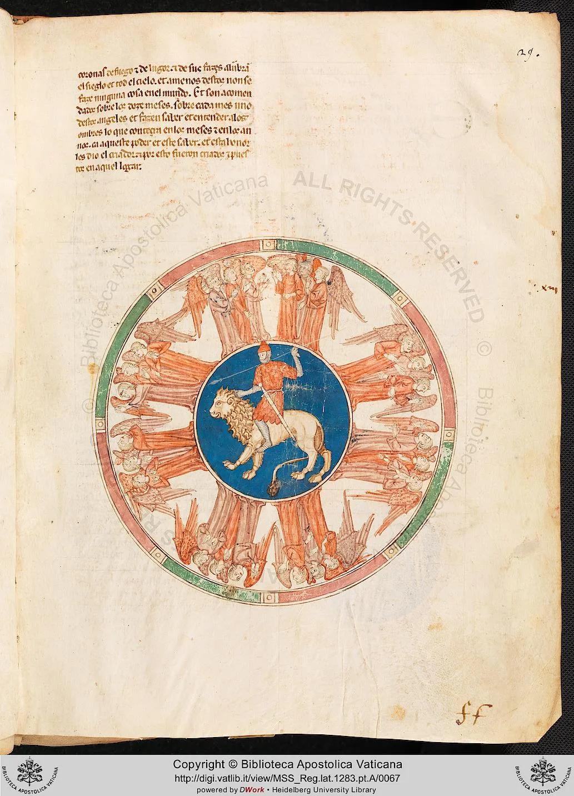](https://digi.vatlib.it/view/MSS_Reg.lat.1283.pt.A)

*Reg. lat. 1283 pt.A 29r*

[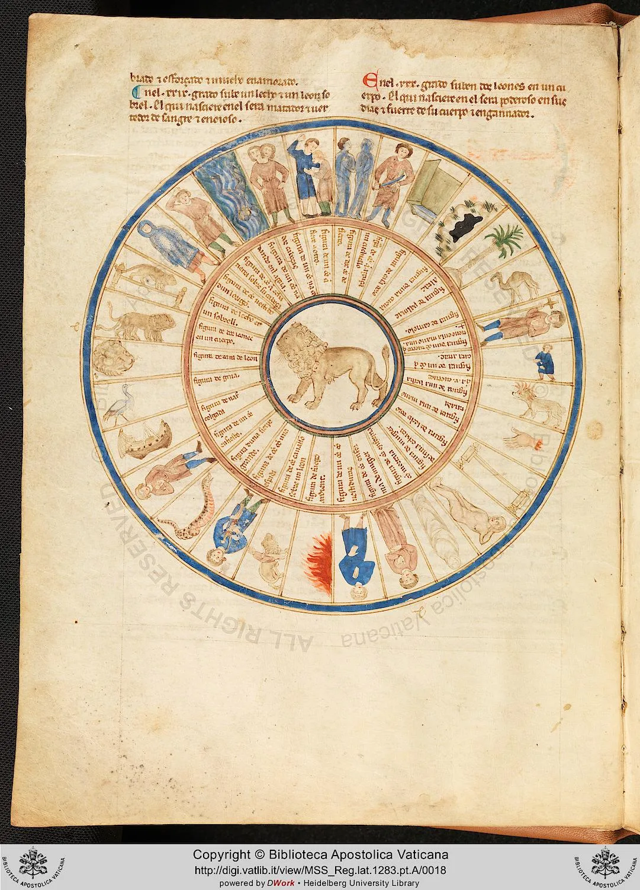](https://digi.vatlib.it/view/MSS_Reg.lat.1283.pt.A)

*Reg. lat. 1283 pt. A 4v*

[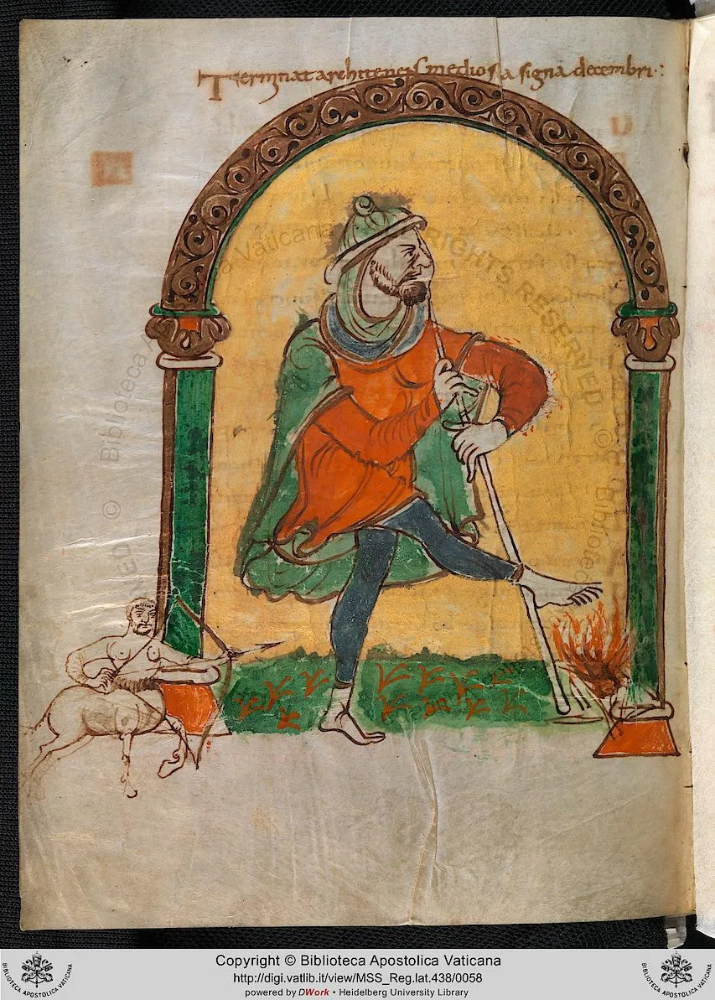](https://digi.vatlib.it/view/MSS_Reg.lat.438)

*Reg. lat. 438 27v*

[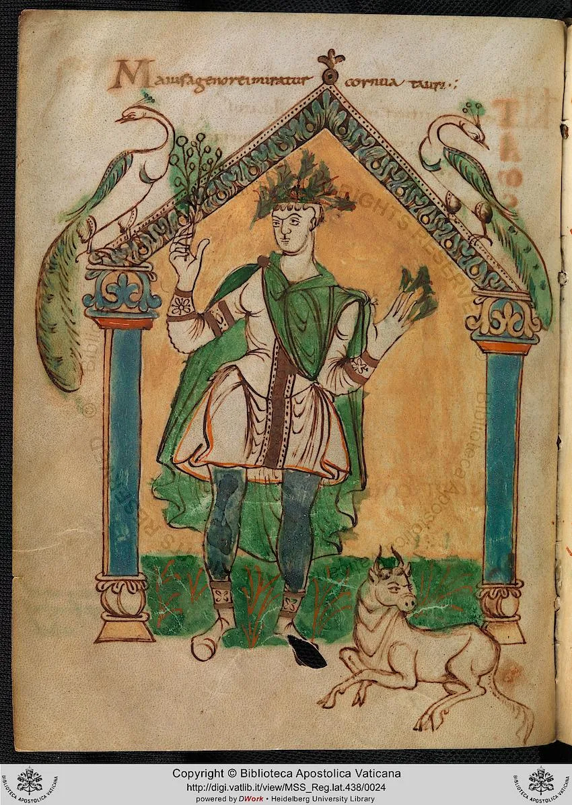](https://digi.vatlib.it/view/MSS_Reg.lat.438)

*Reg. lat. 438 10v*

[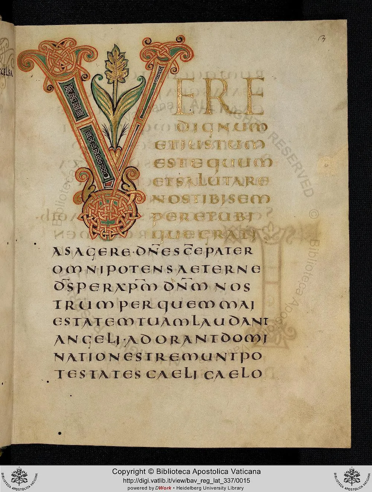](https://digi.vatlib.it/view/MSS_Reg.lat.337)

*Reg. lat. 337 3r*

[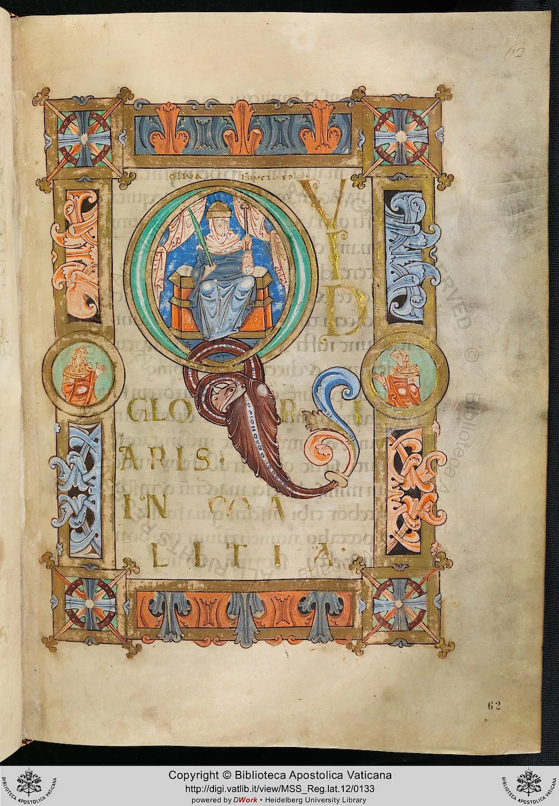](https://digi.vatlib.it/view/MSS_Reg.lat.12)

*Reg. lat. 12 62r*

[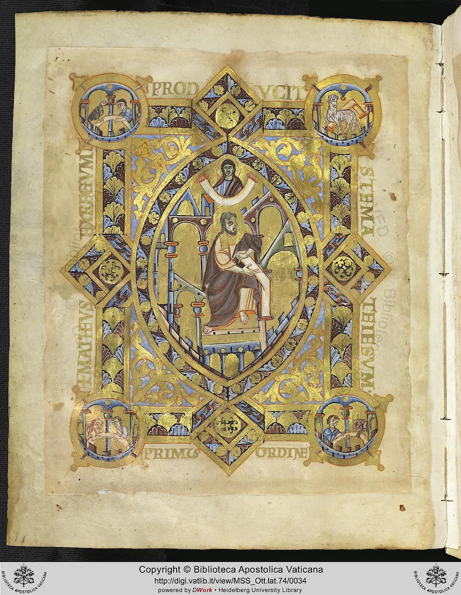](https://digi.vatlib.it/view/MSS_Ott.lat.74)

*Ott. lat. 74 15v*

[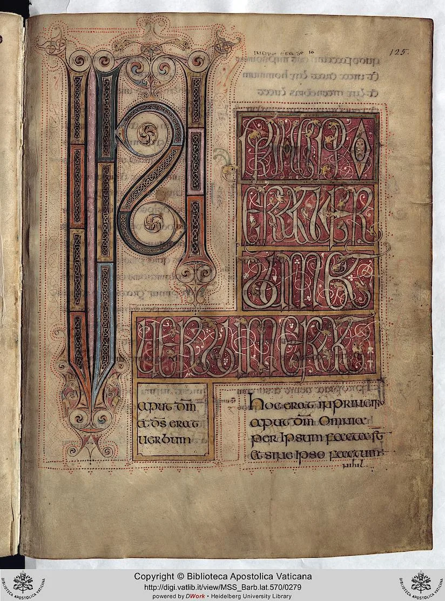](https://digi.vatlib.it/view/MSS_Barb.lat.570)

*Barb. lat. 570 125r*

We can't be sure these are completely new online, but nonetheless, **they are amazing.**
As always you can access the digital collection of the Vatican Library via the DMMapp, or have fun exploring one of the 300\+ other collections available all over the world.
