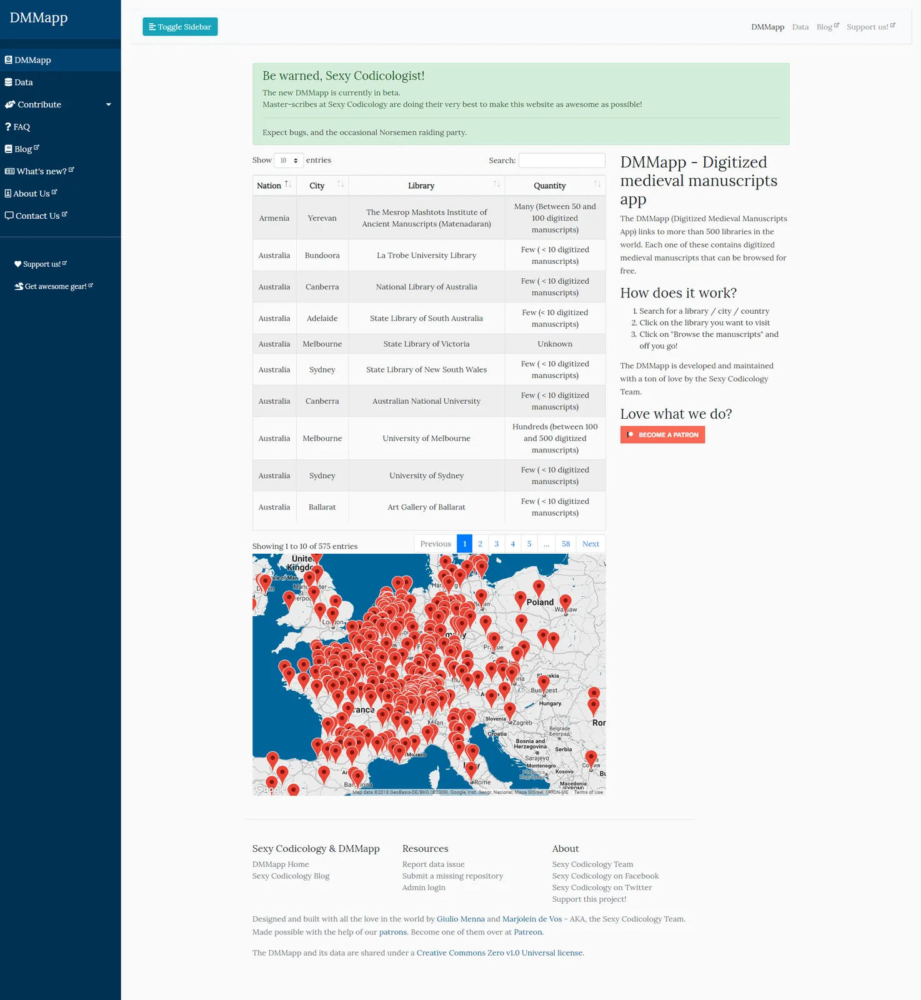
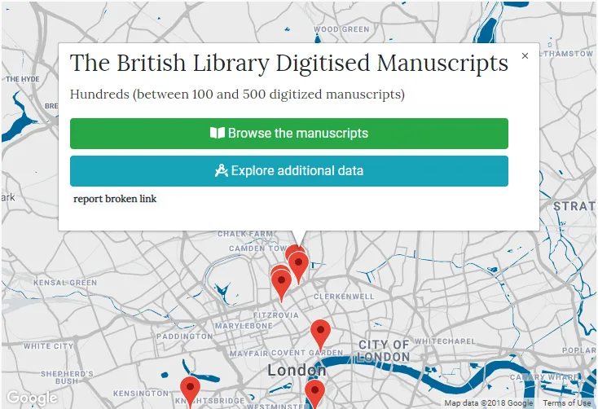

---
date:
  created: 2018-11-14
  updated: 2023-04-03
categories:
- Digital Humanities
- Digitized Libraries
- DMMapp Updates
authors:
- giulio
slug: new-dmmapp
---
# The New DMMapp

The goal of the DMMapp has always been to ease access to digitized medieval manuscripts across the web. We think did quite an OK job at that until now, but the time has come to radically improve what we currently have!

<!-- more -->

The DMMapp has grown so much in the past couple of years that it is no longer maintainable in its current form. Something had to be done. And something we did: We sat behind our PCs, we poured coffee in our hand-painted espresso cups from Amalfi, and we started smashing the keyboard, rewriting the code from zero, until we ended up with something awesome: the new DMMapp!

## A new DMMapp? Awesome! What's new?

We have to split this chapter in two: one part that explains what will change for you, the user, and one that will explain what will change for us, the Sexy Codicology team.

Let's start with you:

### A new interface

Let's start with the obvious: we have cleaned up the DMMapp, giving it a bit of a facelift and made it look like it's designed in 2018 and not 2008, with a more elegant font, keeping the app mobile-friendly, and presenting more useful links in one page.

The New DMMapp Interface

### New insight into our Data

The DMMapp data is built mainly around details sent by users pointing to new libraries, corrections, and broken links. This cooperation has been essential to make sure that the links we have would keep working, and that researchers, students, and manuscripts-enthusiasts could find what they were looking for, when they needed it.

Now, to make sure that all our data can be reviewed and updated / edited, **we have created individual pages for each institution.** Each page shows all the data we have collected: institution name, DMMapp ID, Nation, City, Latitude, Longitude, Quantity, Website, Copyright, and Notes. You can link to these pages, or you can share them around. Moreover: **if you happen to spot an error, a bright red button called "Report data issue"** is there waiting for you. Click on it and you will be taken to a form with the detail pre-filled, where you can tell us what is wrong and how it should be fixed.

An example of the data that is now visible to everyone.

**The aim, once out of beta, would be to create permalinks that will be valid for at least 5 years - depending on our technical possibilities.**

You can access these data pages in two ways:

1. Via our "data" page, where you can search or browse all our entries.
2. Via the new "Explore Additional Data" button that appears under the classic "Browse the manuscripts" button in the app.

The new "Explore Additional Data" button will take to the details page of the library you are looking at.

### Additional data

In the previous list you might have noticed a couple of data fields that were not present before: Copyright, and Notes.

We see the DMMapp as a developing organism, a platform to which we should be able to add many pieces that could be useful for researchers and students. With this iteration, **we are adding "Copyright statements" and "Notes" to our data**:

- **Copyright statements**

A crucial part piece of information for many: "Are the images there copyrighted? Yes? No? Maybe? Can I use them for my research? Can I use them for my presentation? Can I print it out?" Many institutions have started clearly labeling their images' copyright statements, and we believe it's important to reflect those in our data as much as possible. Overtime, the DMMapp database will be filled with this information.

- **Notes**

Certain institutions might not provide direct links to their digitized manuscripts, others might provide full digitized versions of books, others might have only one picture per item. This kind of information will be added to the "Notes" filed to provide everyone with useful insight on the collection.

## What changes for the Sexy Codicology team?

Well, A LOT.

**Mainly, We can now edit every entry, add new libraries, delete institutions if needed, etc. directly from an interface on our website.** We no longer have to manually edit the JSON file that constituted the old DMMapp data (yep, that's how we did it… line by line, JSON entry by JSON entry…).

That procedure took forever, and it rendered impossible for us to keep the DMMapp up-to-date: we already have a huge backlog concerning broken links for example.

This was the main reason for migrating to the new system. Finally  we can get to fix them all in a couple of hours by just clicking around instead of days!

## A Proud Sexy Codicology Team

Overall, we are extremely proud of the work we have carried out for this update. **It is a huge improvement for the "taking care of the data" side, and in turn it will be useful to everyone who has medieval manuscripts love in their hearts.**

We invite you to take a look at our current beta and to let us know if you spot any strange behavior, or broken component and we thank you all for your continued support!

The Sexy Codicology Team
