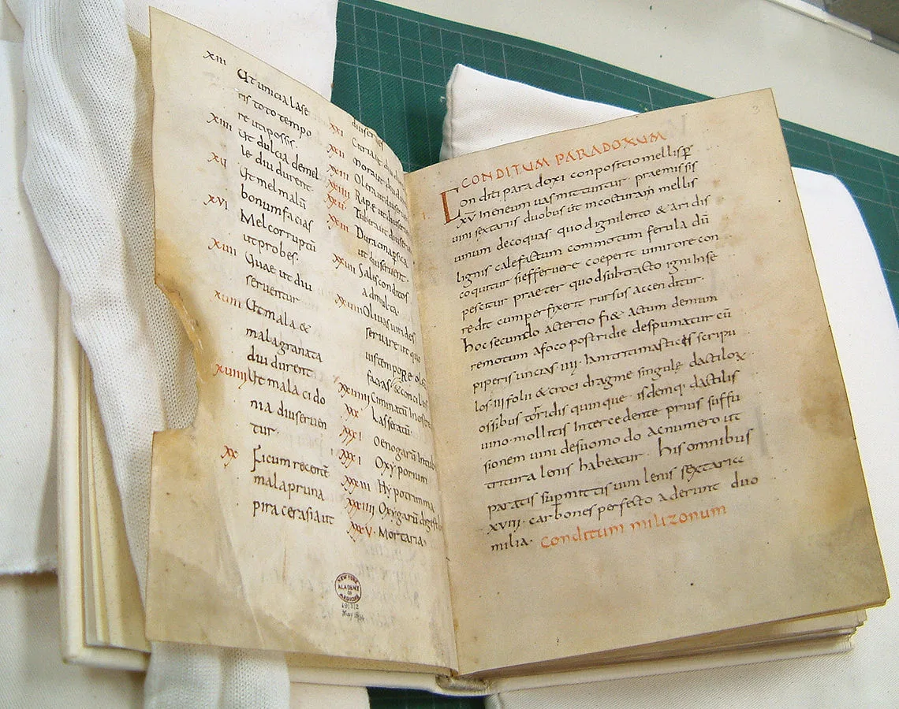
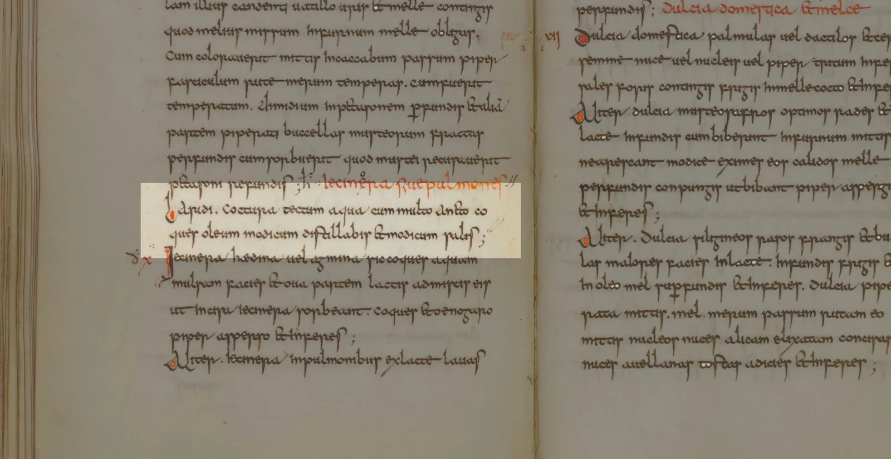

---
date:
  created: 2017-06-30
  updated: 2023-04-03
categories:
- Digitized Libraries
- New Additions
- crowdsourcing
- DMMapp
authors:
- giulio
slug: new-libraries-dmmapp-medieval-bacon
---
# New libraries in the DMMapp: Medieval Bacon Edition

We have received another four [new links to digitized manuscripts](https://blog.digitizedmedievalmanuscripts.org/new-libraries-dmmapp/) and we have added them to the [DMMapp](https://digitizedmedievalmanuscripts.org/)! This time around, the resources come from Slovenia, the US, and France. Let’s give a look!

<!-- more -->

## Digital Library of Slovenia \- dLib.si

The [Digital Library of Slovenia \- dLib.si](https://www.dlib.si/?&language=eng) is home to an “undefined quantity” of digitized medieval manuscripts. We know that there are more than 1000 digitized objects, but how many of these are from the medieval period is hard to calculate. We found a couple, and we would highlight the beautiful [De civitate Dei](https://www.dlib.si/details/URN:NBN:SI:IMG-0PKKFSM4) dated 1347 CE, containing masterfully decorated and illuminated initials. It also presents annotations, nota bene, bookmarks… It’s a wonderfully interesting book. Unfortunately, to see this manuscript you have to download a 615 MB PDF at 1MB/s or less... Takes a long while to download the file, but it’s definitely worth it!

## New York Academy of Medicine

*The Apicius manuscript (ca. 900 AD) of the monastery of Fulda in Germany, which was acquired in 1929 by the New York Academy of Medicine (from Wikipedia)*

Next up, the [New York Academy of Medicine](https://digitalcollections.nyam.org/islandora/search/mods_subject_topic_mt:%22Manuscripts%22). Two manuscripts here, both sensational. We highlight the [Apicius, De re culinaria Libri I-IX](https://en.wikipedia.org/wiki/Apicius). Why? Because food; and also because this manuscript is “Sometimes referred to as the oldest extant cookbook in the West(([Ipse dixit](https://digitalcollections.nyam.org/islandora/object/islandora:1116?solr_nav%5Bid%5D=b49de2932a27781fcd42&solr_nav%5Bpage%5D=0&solr_nav%5Boffset%5D=1#page/1/mode/2up)))”, written in Fulda (Germany) around 830 CE.
Yes, you have read correctly: A COOK BOOK. No fancy decorations here, no marginalia that will make you giggle. This book will make you drool!
The NYAM’s website describes this manuscripts perfectly on their website, so we strongly advise you go and give a look.
Ever wondered how to make flitch of bacon in 830 CE? Look in book VII “*ut carnes fine*” \- The name says it all!

*Apicius \[De re culinaria Libri I-IX\], Laridi coctura, Page 81,*

> Laridi coctura:
> tectum aqua cum multo anetho coques, oleum modicum distillabis et modicum salis((The text is found on “Page 81”, the folio is not indicated on the interface of the website. Too bad.)).
> Cover with water and cook with plenty of dill; sprinkle with a little oil and a trifle of salt.

AWESOME((see: [https://penelope.uchicago.edu/Thayer/E/Roman/Texts/Apicius/7\*.html#I](https://penelope.uchicago.edu/Thayer/E/Roman/Texts/Apicius/7*.html#I) \- the entire work is translated here, if you need some cooking inspiration!)).

## Bibliothèque de Verdun \& Centre Culturel Irlandais \- Irish College in Paris

The Manuscrits numérisés de la bibliothèque d'étude de Verdun and the Centre Culturel Irlandais \- Irish College in Paris both use the same interfaces for navigating their manuscripts and they are home to quite some manuscripts dating from the X century CE, up until the 1700s, with a majority being of medieval.
We leave this to you to explore; trust us, there are quite some treasures here! As Vasari would say: “Cerca Trova((Literally: “Search Find”, by extension: "search and you will find". It is a famous inscription found at the top of Vasari's fresco "The Battle of Marcian". It is said that Vasari hid a Leonardo painting, the Battle of Anghiari, “under” his own painting. More info on this story: https://en.wikipedia.org/wiki/The\_Battle\_of\_Anghiari\_(painting) ))”
