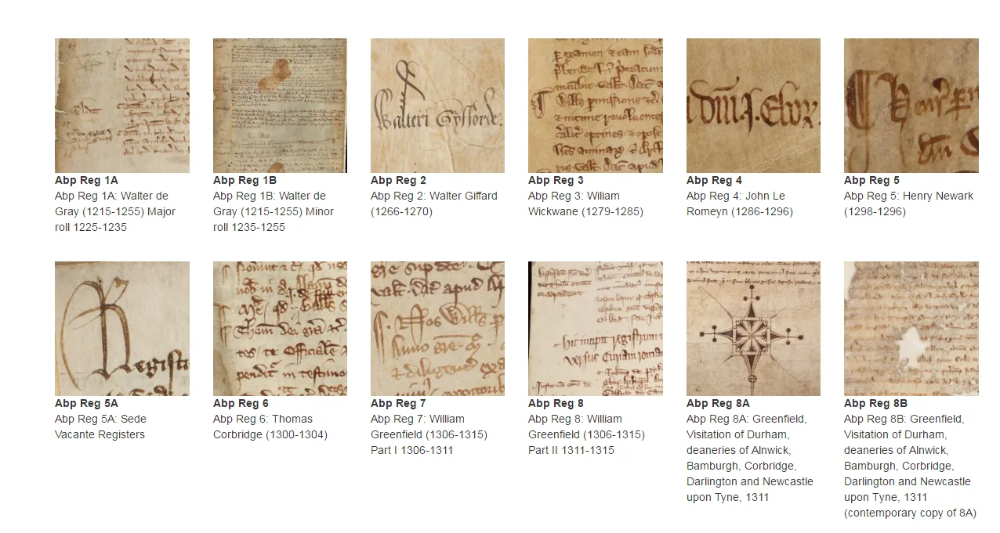
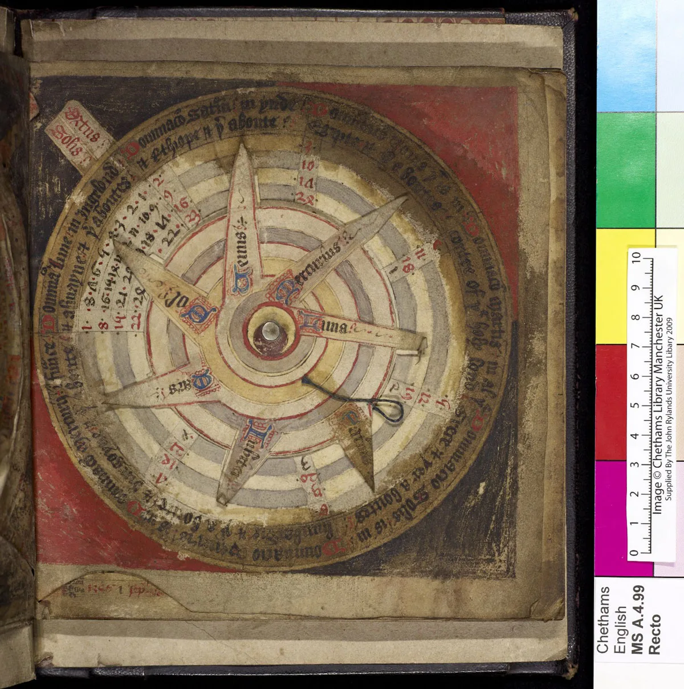

---
date:
  created: 2017-04-10
  updated: 2023-04-19
categories:
- Digitized Libraries
- crowdsourcing
- DMMapp
authors:
- giulio
slug: new-libraries-dmmapp
---
# New Libraries on the DMMapp!

It’s spring, the sun is shining, and the DMMapp has more links than ever thanks to the following additions:

<!-- more -->

- [Borthwick Archives](https://archbishopsregisters.york.ac.uk/)
- [University of South Carolina University Libraries](https://digital.tcl.sc.edu/digital/collection/pfp/search/order/ordern/ad/asc/cosuppress/0)
- [University of North Carolina at Greensboro](https://gateway.uncg.edu/home)
- [Missouri State University](https://cdm17307.contentdm.oclc.org/digital/collection/Medieval/search)
- [Durham University Library](https://www.durham.ac.uk/departments/library/)
- [Chetham's Library](https://library.chethams.com/collections/archives-manuscripts/medieval-manuscripts/)

We have also updated the link to the Biblioteca Teresiana which was reported as broken! This brings the total linked libraries in the DMMapp to 536\.

## What can we find?

We do not know, really! There are hundreds of new digitized manuscripts in these repositories, and it’s up to you to explore. For example: the [Borthwick Archives](https://archbishopsregisters.york.ac.uk/) will make everyone that is into charters more than books happy.

*A screenshot from the Borthwick Archives.*

While the [Chetham's Library](https://library.chethams.com/collections/archives-manuscripts/medieval-manuscripts/) has Chetham's MS Mun.A.4.99, which contains:
> Astrological and astronomical work containing volvelles, tables, charts of eclipses and other astronomical phenomena; with calendars and weather forecasting advice correlated with medical and therapeutic information. Also includes the labours of the twelve months.

I mean, look at this awesomeness:

*Chetham's MS Mun.A.4.99 f 2r \- Volvelle with the position of the planets and the moon.*

If you want to know more about medieval volvelles, don't miss [this post from the Getty](https://blogs.getty.edu/iris/decoding-the-medieval-volvelle/)!

## But wait, there’s much more!

Follow the links in this page, or visit the DMMapp and have fun finding hidden treasures! Found something awesome? Let everyone know! A big thank you to all those that reported the missing links. You made codicology even sexier.
As always, if you are aware of any library or repository that is not on the DMMapp, let us know.
