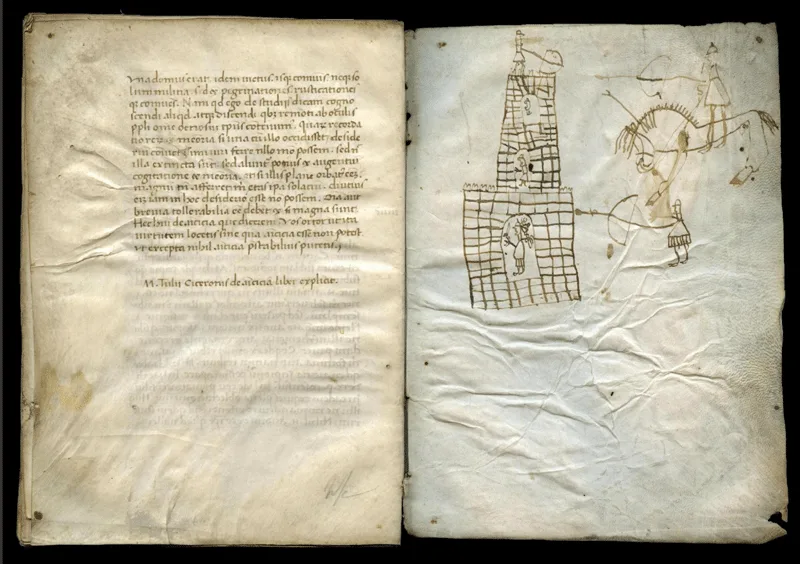
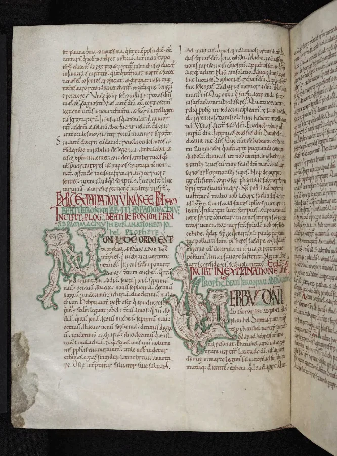

---
date:
  created: 2016-12-01
  updated: 2023-04-03
categories:
- Digital Humanities
- DMMapp Updates
authors:
- giulio
slug: new-old-missing-digitized-manuscripts
---
# New, old, and missing digitized manuscripts

As you might have read in our [previous post concerning the DMMapp 3.0](dmmapp3.md), one of the best features is that now we can easily see which links in our database are broken, along with quickly adding what we receive via the missing library form.

<!-- more -->

## Now you see me…

Let's start with the good news: It took us a while, but we are happy to have added the **Ruusbroecgenootschap** and **Universiteitsbibliotheek Antwerpen** to the list. Previously we had already a link for the University Library of Antwerp, but we were kindly provided with a better links to the catalog, where you can access digitized versions of the manuscripts from both the collections. We have also removed a duplicate link we noticed, always from Antwerp.
But wait! There's more!
**We have also added nine new repositories**:

- Medievalia: Fundamental texts of medieval Romanian culture
- Pomeranian Library of Szczecin
- Christ Church College
- University of British Columbia
- Pembroke College
- St Catharine's College
- Univerzitná knižnica v Bratislava (University Library, Bratislava)
- Durham Cathedral Library
- Rakow Library, Corning Museum of Glass

*St Catharine’s College MS 4 (Cicero, Laelius de Amicitia)*

## …now you don't!

Repositories are like organisms: they evolve, they change, they improve, they move. Sometimes, unfortunately, they simply **disappear**. This month we noticed ten broken links in our database, and we went on to fix them.
In five cases we had no problem: we found where the new links were and we restored the accessibility (301 Redirect, webmasters!) **In the remaining five cases we were unfortunately unable to find the new links to digitized manuscripts** and we were forced to remove the links from the DMMapp  (The change is documented on our [GitHub](https://github.com/SexyCodicology/DMMapp/commit/bfccbb74ac1c805b40c8976d9eb71942cc1e8a09))
These are the repositories we were unable to find any longer:
• Uppsala Universitetsbibliotek
• Greenslade Archives and Special Collections
• Museum Plantin-Moretus
• Benediktinerinnenkloster (Neuburg a.d.Donau)
• Moravian Land Library

*DCL MS B.II.9 St Jerome on the minor Old Testament prophets*

We are especially concerned for the Plantin Moretus Museum in Antwerp. The website reads: "The library of approximately 25,000 old printed books and 638 manuscripts can be explored in Antwerp’s Anet library network."  (Stated on [their website](https://museumplantinmoretus.be/en/page/collection-online)) This usually means that access to the digitized books is restricted to the people who are within a limited network, while the rest of the world can't see the content. There is a highlight page where a single folio of three (out of 638!) manuscripts are shown.  (The other three folios are [here](https://museumplantinmoretus.be/en/content/manuscripts)) That's quite little.
We did find some manuscripts in their online catalogue with a link to the digitized item, which, unfortunately does not load.
But we might be blind so, please, if you know where the digitized manuscripts from the repositories mentioned above can now be accessed, do let us know!
The code update is visible as always on [GitHub](https://github.com/SexyCodicology/DMMapp/commit/bfccbb74ac1c805b40c8976d9eb71942cc1e8a09). You can follow this specific file to be notified every time we update the [DMMapp database](https://github.com/SexyCodicology/DMMapp/blob/master/js/data.json).
