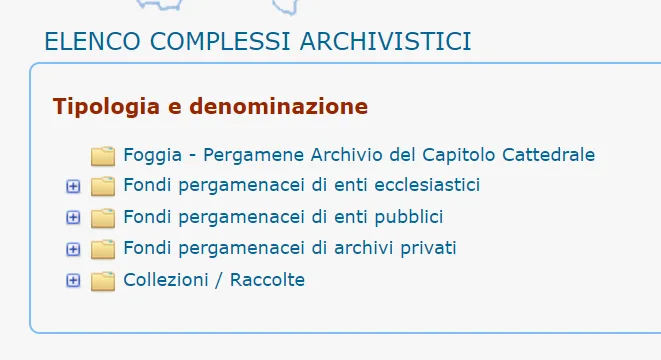
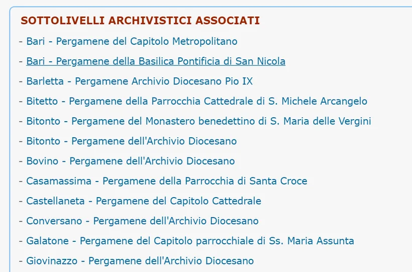
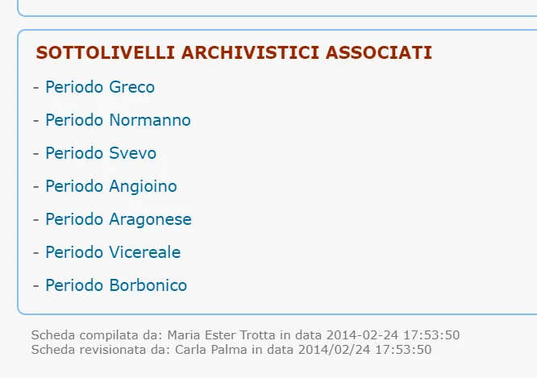
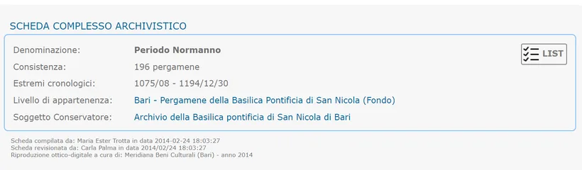
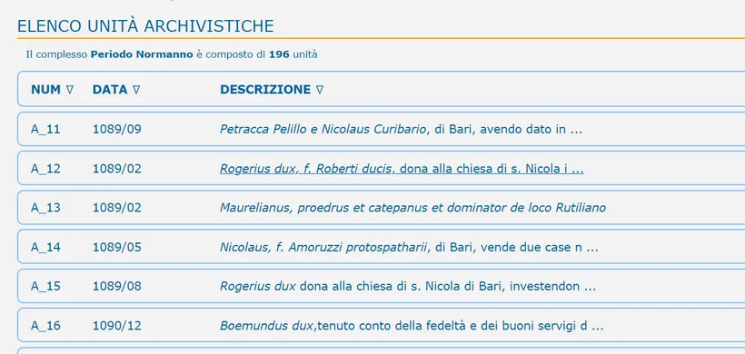
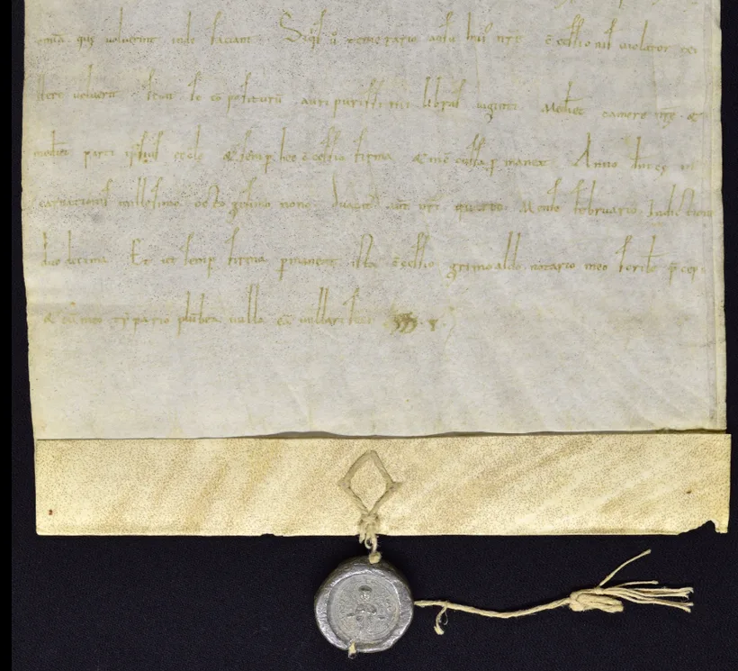

---
date:
  created: 2020-04-20
  updated: 2023-02-23
categories:
- Digitized Libraries
authors:
- giulio
slug: new-repository-soprintendenza-archivistica-e-bibliografica-della-puglia-e-della-basilicata
---
# New Repository: Soprintendenza Archivistica e Bibliografica della Puglia e della Basilicata

We have just added a link to the Soprintendenza Archivistica e Bibliografica della Puglia e della Basilicata to the DMMapp.
The website is super-interesting: unlike the vast majority of the links in the DMMapp, this is full of charters!
Accessing them is a bit complex and it involves quite some clicks, but the content is amazing.

<!-- more -->

The homepage looks like this:

Choose one of the items you are interested in. We'll go for charters from ecclesiastical entities ("Fondi pergamenacei di enti ecclesiastici")

A list of locations open. Pick one.
We'll go for the charters from the Basilica Pontificia di San Nicola.
Now, to get access to the charters, scroll all the way at the bottom until you see the sub-sections:

Now chose a period. We'll go for the Normans!

Click on "List", and the list of digitized items appears!

Have a look at A_12! There's an amazing seal to go with it:

Have fun exploring!
