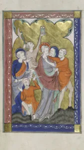
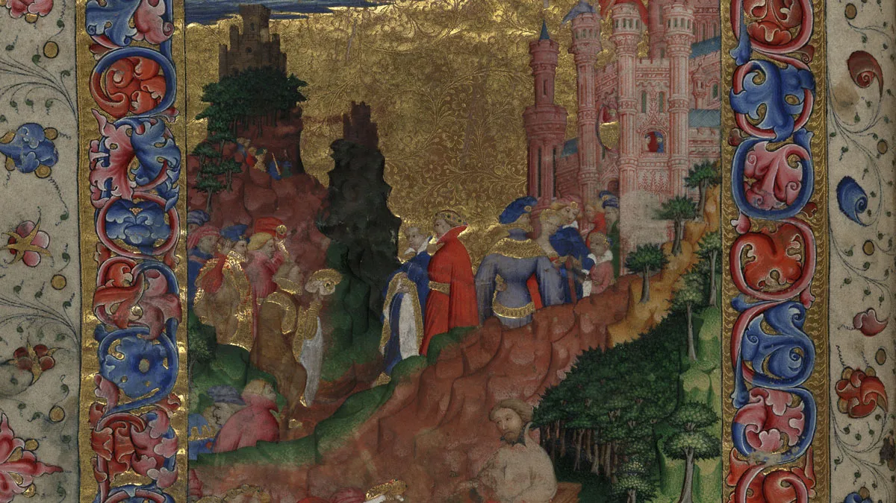
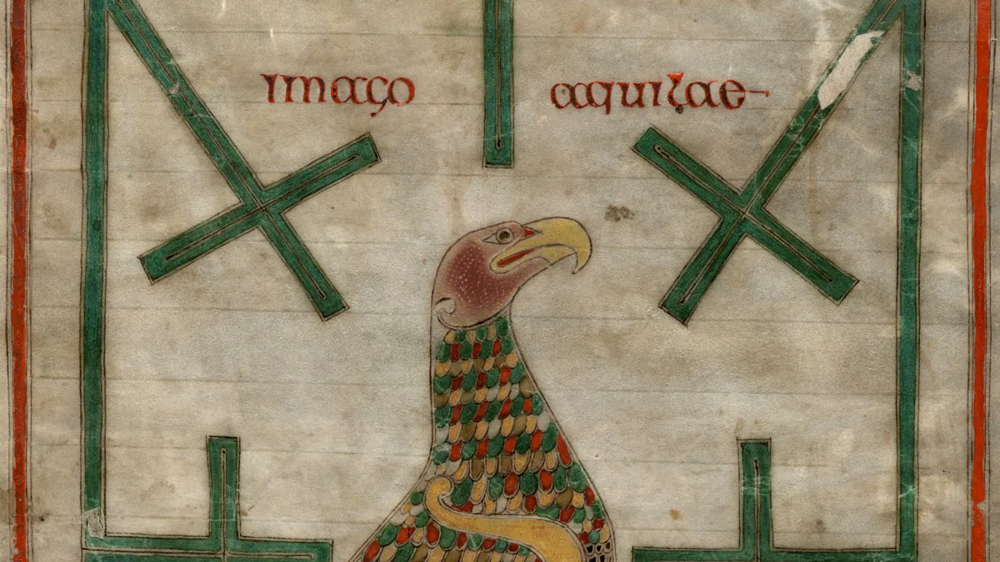
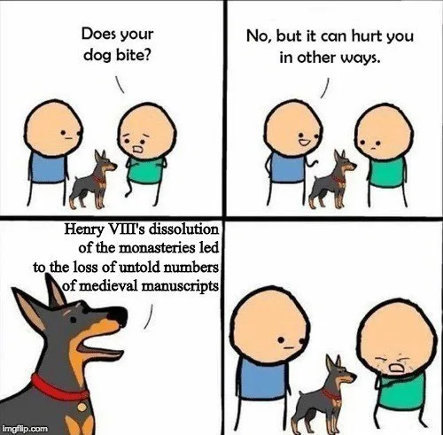

---
date:
  created: 2018-05-20
categories:
- Digitized Libraries
- Parker Library
authors:
- marjolein
slug: parker-library-digitized-manuscripts
---
# The Parker Library & Parker on the Web 2.0

In December 2017  the Parker Library announced in [a blog post](https://theparkerlibrary.wordpress.com/2017/12/20/parker-news-access-to-matthew-parkers-library-to-be-made-widely-accessible-online-in-2018/) that, soon, they would be launching their revamped website. Fast-forward to January 2018 and the Parker Library (Corpus Christi College) in Cambridge indeed launched their new website, [Parker on the Web 2.0](https://parker.stanford.edu/parker/), made in cooperation with Stanford University Libraries.
The improvements are many, but the biggest, and most exciting, is that now everyone can access their digitized manuscripts freely in **high-resolution, without needing an institutional license**.

<!-- more -->

*Cambridge, Corpus Christi College, MS 053: The Peterborough Psalter and Bestiary. 12r.*

The Library went even further than just giving open access to everyone: all manuscripts are following the IIIF framework (Want to know more about all the amazing features of IIIF? We wrote [a blogpost](https://blog.digitizedmedievalmanuscripts.org/iiif-international-image-interoperability-framework/) just for you!), and this means that they will make their content compatible with that of other institutions, such as the National Library of France, Bodleian Libraries, and e-codices (just to name a few), and make it possible to very easily compare two, or more, digitized objects from different institutions next to one another, in one viewer (see one example below) But also viewing manuscripts in great detail, or make annotations, are among the possibilities.
Here's a tidy list of the new features (from the library's website):

- A new manuscript viewing experience
- A new and improved approach to managing the growing bibliography about Parker manuscripts
- Interoperability features
- Page-level annotations
- A different approach to manuscript descriptions
- A clearly articulated Creative Commons license (From [their webpage](https://parker.stanford.edu/parker/feature/new-site-features))

But let's dig deeper in this wonderful collection!

*Cambridge, Corpus Christi College, MS 061: Geoffrey Chaucer, Troilus and Criseyde. f. 1v*

## What’s in the Parker Library's digitized collection?

The Parker Library was started by its namesake Matthew Parker (1504-1575), an important person in the English Reformation. He was an enthusiastic book collector, and donated his collection to the University of Cambridge’s Corpus Christi College in 1574.

*Cambridge, Corpus Christi College, MS 197B: The Northumbrian Gospels. p. 245 (detail)*

The renewed Parker Library website reflects his love for books by giving access to **556 digitized items**, ranging from the 6th to the 9th century CE, in a variety of languages (most items are in Latin, but also Greek, French, German, Arabic).
As imaginable, the Parker Library contains a mix of subjects and titles, but the biggest focus of Parker was on preserving manuscripts relating to Anglo-Saxon England, as the Parker Library itself mentions on their blog: "[the library owns] one of the most significant collections of Anglo-Saxon manuscripts anywhere in the world, including the earliest copy of the Anglo-Saxon Chronicle (c. 890) ([source](https://theparkerlibrary.wordpress.com/2017/12/20/parker-news-access-to-matthew-parkers-library-to-be-made-widely-accessible-online-in-2018/))."
Many of the works in the collection come from monasteries when they were dissolved in England under Henry VIII. Here, an accurate rendition of the effects of those events:

*via Twitter, @irinibus - click on the image to go to the original, hilarious, tweet!*

In addition to this, the Parker Library has preserved 16th-century documents about the English Reformation (Want to read more about Matthew Parker? Then head over to the [Parker Library’s website](https://parker.stanford.edu/parker/about/matthew-parker-the-parker-library)) to learn more.

## Licenses

Another feature that everyone will really appreciate about the new website is the clear Creative Commons rights statement (CC BY-NC-ND). Many libraries, unfortunately, don’t give clear guidelines on what rights they apply to their digitized material, which makes it sometimes a difficult journey through their website trying to understand how you can use images. It’s a pity that the license is not more open, but the reasons for this are understandable.

## Website Experience

The main page of the digital collection gives you some very nice browse entry points to start exploring the collection: *Manuscripts*, *Page-level detail*, and *Bibliography*. The *Hints* and *Tips* buttons at the bottom are also very helpful for getting started with the new website, or learning the basics of using Mirador (the IIIF viewer that they implemented on Parker on the Web 2.0).
The pages for each single manuscript are clear and easy to navigate with a bibliography at the bottom of the page and the option to view and download an extensive description. Side-by-side comparison of manuscripts from different collections is as easy as dragging and dropping the IIIF-icon next to or underneath the manuscript into another viewer where you have a manuscript already loaded.
As you can imagine, the amount of amazing material that the Parker Library has made digitally available is hard to capture in just a single blog post. The same goes for the ways in which they have improved the user experience on their new website. The best thing to do is to head over and experience it for yourself.
Every item in their collection is special, but a few beautiful and/or special manuscripts you should check out to get started are:

- The [Anglo-Saxon Chronicle](https://parker.stanford.edu/parker/catalog/wp146tq7625) (also called the Parker Chronicle): The earliest written history in English, extremely important in understanding Anglo-Saxon history. The version that the Parker Library owns is the oldest surviving copy.
- Geoffrey Chaucer’s [Troilus and Criseyde](https://parker.stanford.edu/parker/catalog/dh967mz5785): Unfinished luxury edition from between 1415-1425 of Chaucer’s poem.
- [Gospels of St. Augustine](https://parker.stanford.edu/parker/catalog/mk707wk3350): Late 6th-century Gospel book which was believed to have been owned by St. Augustine of Canterbury when he was sent to christianise England in 597. It has never been confirmed whether or not St. Augustine himself owned this manuscript, but it is certain that it came to England with one of the first waves of missionaries. Another reason to check out this work is that it is the earliest surviving illuminated Gospel book.
- [Peterborough Psalter and Bestiary](https://parker.stanford.edu/parker/catalog/gs233db8425): Lavishly illuminated manuscript containing a psalter, a chronicle of England and Peterborough Abbey, and a bestiary. It is named after the abbey for which the psalter was customized to.

[Images reproduced with the permission on The Parker Library - Cover: [Cambridge, Corpus Christi College, MS 003: The Dover Bible, Volume I.](https://parker.stanford.edu/parker/catalog/zv088kx4487) f.73v]
