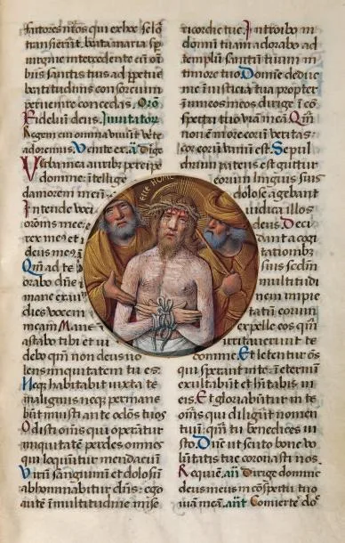
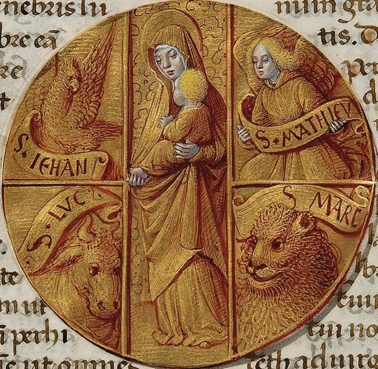
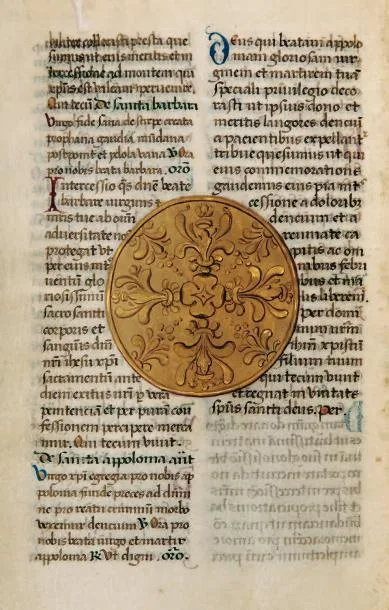

---
date:
  created: 2015-01-19
  updated: 2023-04-03
categories:
- A Medieval Manuscript a Week
- Book of Hours
authors:
- giulio
slug: petau-rothschild-hours
---
# The Unique Petau - Rothschild Hours

Last year we received a message on our Facebook page; it was a request for help finding the name and information concerning a manuscript. On a late evening we went on a quest to do just that. What we discovered during the adventure was the Petau - Rothschild Hours. **An incredible manuscript** we had never seen before!Dated between 1500 and 1510, the “Peteau Hours” or “Petau - Rothschild Hours” consists of 44 sheets of vellum of 230 x 140 mm, containing 33 lines per the page on two columns. It is written in humanistic script in brown ink. The headings are written in green, while capital letters are red or blue; there are also some initials which are painted on a golden background.

<!-- more -->

*One of the miniatures in the Petau - Rothschild Hours.*

The text is accompanied by **16 miniatures, shaped in  the form of medallions of 65 mm diameter each**, or monochrome decor with red highlights, white, blue, yellow and pink. These illuminations are attributed to John Bourdichon, painter of the illuminations in the "[Great Hours of Anne of Brittany](https://gallica.bnf.fr/ark:/12148/btv1b52500984v/f1.image.r=grandes%20heure.langEN)". However, in more recent times François Avril in his work on manuscript painting in France attributed these to Tourangeau Jean Poyet, who worked between 1490 and 1520, also painter of various other illuminated books.

## Avant-garde manuscript book design 1-on-1

The illuminations in the "Hours Petau" are exceptional, but what is **even more exceptional is the layout of the book**: Jean Poyet placed these miniatures in pairs (on the front, recto, and back, verso, of one folio) at the beginning and end of every office in the book. Nothing exceptional until now, but what is extremely rare is the fact that all the folios in the manuscript, except the ones home to these illuminations, have a circular cut in the middle that allows the reader to always look at the same miniature while going through the book of hours. See image below and the video!
Reading around we discovered that Jean Poyet created also another manuscript with a similar layout. It is kept by the Royal Library in Copenhagen, and called the "[Thott Hours](https://www5.kb.dk/permalink/2006/manus/775/eng/31)". In this case the miniatures and the cuts in the manuscript are diamond-shaped and not round. The Thott Hours have been digitized and are available for free to view online, but due to the fact that the images are scanned flat, it is difficult to notice that the folios have holes in them, and that there is only one miniature every few pages.

*Miniature from the Petau - Rothschild Hours: Symbols of the four evangelists and Mary with Child.*

### Provenance: Sold and gone for a long while (hopefully not for forever)

It is not clear for who the Petau - Rothschild Hours were originally made, but in the seventeenth century the manuscript was in possession of either Alexandre Petau (famous book collector) or his son, Paul. In the eighteenth century Alexandre’s collection was sold and dispersed. In the nineteenth century the book appears to have been in the collection of Baron James de Rothschild, whose arms are now visible on the binding.  After this we find that this book of hours  went in the possession of the New York Bookseller Kraus who kept the book until 1974, when Paul-Louis Weiller acquired it. The book then went on auction one last time in 2011, when it sold for 1’800’000 euros. To whom? We do not know, but what we do know is that, unfortunately, this means that the manuscript will probably not be digitized for a long, long time.
A rather sad ending for an otherwise wonderful story of a stunning manuscript. When we discovered it we were blown away. This goes to show that although here at Sexy Codicology we love manuscripts, we study them, explore them on a daily basis, there will always be something we have never seen before that will make us fall in love with these books again and again.
(The information in this post is partially based on the translation of [this page](https://www.gros-delettrez.com/lot/9489/1759474), from which we learned it went on auction and away.)

*Another folio from the Petau - Rothschild Hours.*
