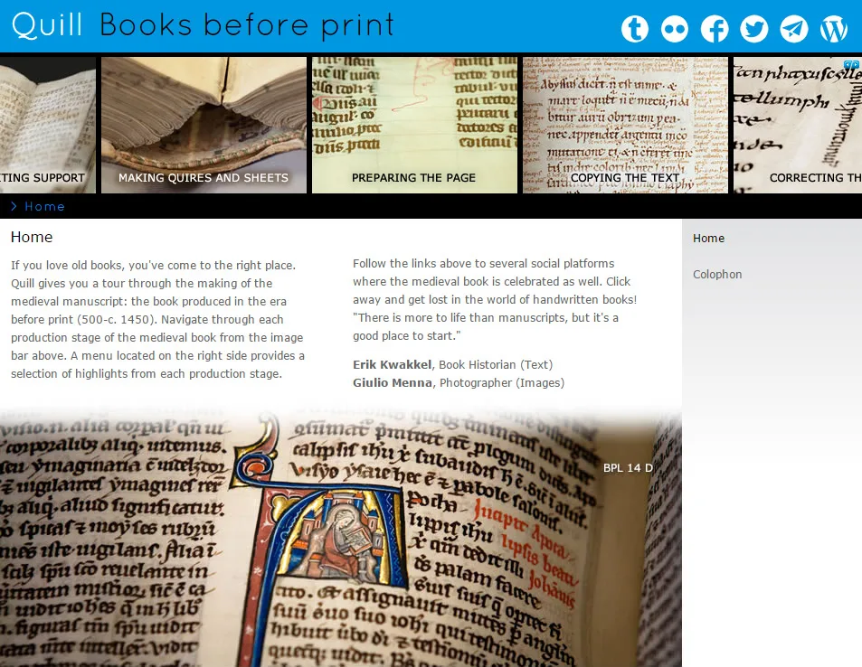
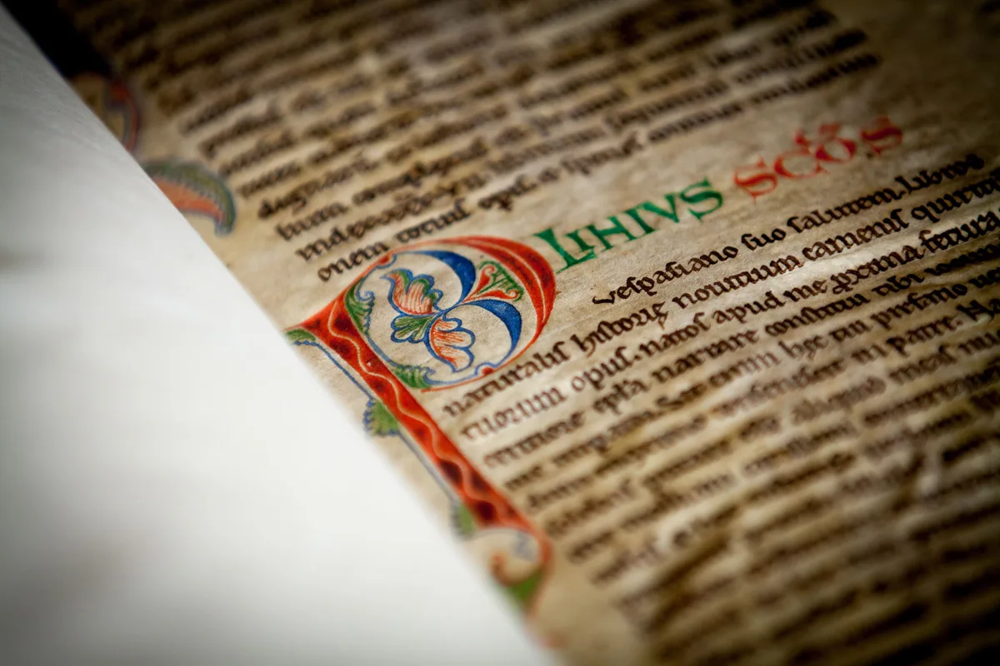
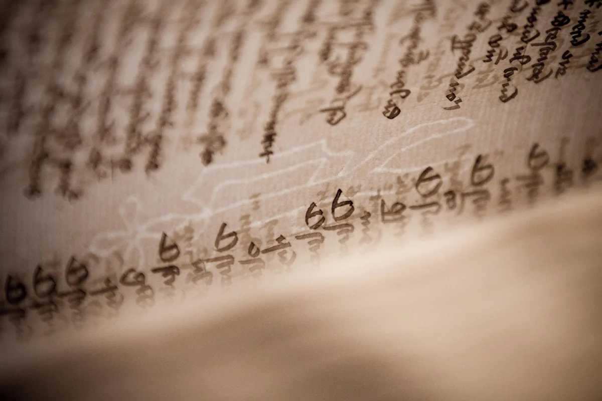

---
date:
  created: 2014-10-24
  updated: 2023-04-19
categories:
- Digital Humanities
authors:
- giulio
slug: quill-extended-edition
---
# On "Quill" - Extended edition

As you surely know, ["Quill" was recently launched](quill-medieval-manuscripts.md "Quill: a new website for medieval manuscript lovers!"). **Quill is a website a new website for medieval manuscript lovers** put together by Dr. Erik Kwakkel, who had the idea, took care of the texts and made sure it'd be a success, and I, who had the pleasure of taking care of the photos. Erik put together [a fantastic blog post about it](https://medievalbooks.nl/2014/10/17/meet-the-medieval-manuscript/ "Erik Kwakkel's post on the launch of Quill"), to which I contributed too. I ended up writing a bit too much for it, so it had to be reduced a bit in length in the end.

<!-- more -->

*Quill Books before print*

**Here follows the original text** I wrote, in case you are curious of what an awesome internship it was!

## Quill, how it all started

When I was asked to take pictures of medieval manuscripts for this project **I was thrilled**; when I was told I would have essentially unlimited access to the manuscripts from the exquisite collection in the Leiden University Library, I was as excited as the proverbial child in the candy store.
**What an opportunity!** But then the question dawned on me: How do you take photos of manuscripts? How do I make photos that will interest someone who might have never seen a manuscript before?
Thanks to Erik’s lessons at the time of my Master, I knew exactly what had to be photographed and an idea of where to find them (“internal pricking? It’ll be in a manuscript from England… VLF 1 is from England…” tadaaah!). I spent most of the time browsing through manuscript catalogs and manuscripts’ descriptions, searching for the right book to use for the shots. Once the desired detail was found, the actual photographing begun. But, first things first: respect the manuscript! It might happen that I would find a detail that could make a perfect picture, but to get the photo right I might have to mishandle the manuscript in some way. Of course, that was a no-no; if that happened, I would return the manuscript and go back to the catalog and start searching for another candidate. Once an ideal manuscript was found, I used the oldest trick in the box for directing viewer’s attention towards the detail described: **Depth of field**. This would ensure that only the detail in question would result focused in the picture, and the surroundings blurred (see the decorating the book page https://bookandbyte.org/quill/pages/decorating-the-book.php). I had a very good lens (f/2.8) that allowed me to do just that. **The lighting was a bit of a problem**, since I was in the Special Collections room, I had no direct control. Most of the time I had to wonder around the table and find the right angle at which there wouldn’t be shadows or strange reflections.
**Overall, it has been a wonderful experience** and I really feel blessed when I look back at the pictures I took and remember the excitement of opening every manuscript, wondering what beauties would be hidden inside.00

## Some 500 photos and around a thousand manuscripts after...

**There are two photos I am particularly fond of**: One is the initial P (Plinius) from VLF 1 f. 1r, and the second is the image of the watermark from BPL 304.
The initial from Pliny I simply find pleasing to the eye: I enjoy the contrast between the white modern paper addition on the left, and the parchment on the right: It is the opening page of the manuscript, and the “P” is welcoming us to the book, taking all our focus that, at a later stage, will shift to other elements in the same page. I like to believe that this photo captures the moment when you open a manuscript you have never seen before, and you are captivated by unexpected decoration.

*Initial P from Leiden VLQ 38, f. 23r*

**Taking a picture of a watermark was technically challenging instead**: The manuscript’s folios are made of paper, and although paper made in 1600’s is more resilient than the contemporary counterpart, it is still delicate and had to be handled with extra care. I had no control over light sources, but I knew that I would have needed a strong light to come through the back of a page, in order to let the watermark shine through. The plan then became to wait for the Sun to go down in the late afternoon, and let some of the light shine through the Special Collections’ windows onto the manuscript. All I had to do then was kneel before the book and take the picture of the naturally bending folio.

*BPL-304, f.142v, Watermark*
