---
date:
  created: 2013-10-15
  updated: 2023-04-03
categories:
- Digital Humanities
- Medieval Scribe
authors:
- giulio
slug: scribes-medieval-manuscripts
---
# Scribes in Medieval Manuscripts

## **Being scribes in medieval manuscripts makes you look quite cool.**

<!-- more -->

**Yes, you just saw a scribe riding a wyvern.**
Being scribes in medieval manuscripts gets you to be depicted in all kinds of ways. Let’s go on a short trip and see what you get to look like.
For sure it’s not always a lonely work, since you constantly get distracted by other people or animals. Yes, being a [scribe](https://en.wikipedia.org/wiki/Scribe) in medieval manuscripts means that you will be drawn with all kind of beings that will try to distract you from your noble intent. Sometimes it is Jesus or God:
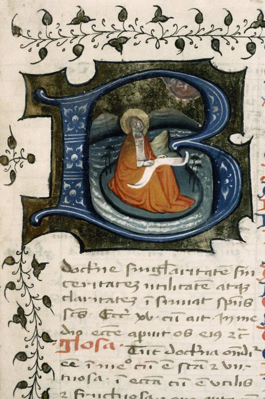

*St. John, seated on the island of Patmos, with scroll on his lap and quill in his hand. God the Father appears in clouds in upper left corner.*

Sometimes it is a bird, coming in just to poke your eye and be plainly annoying.
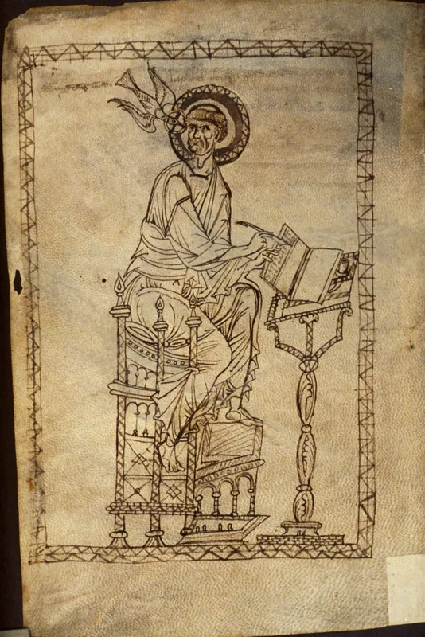

*St. Gregory writing, with the Holy Dove whispering in his ear, added 1st half of 13th cent. MS. Canon. Liturg. 297, f. 10v, Germany, 1154\.*

Sometimes it’s an awesome flying lion (but you need a promotion to the rank of “Evangelist” for that).
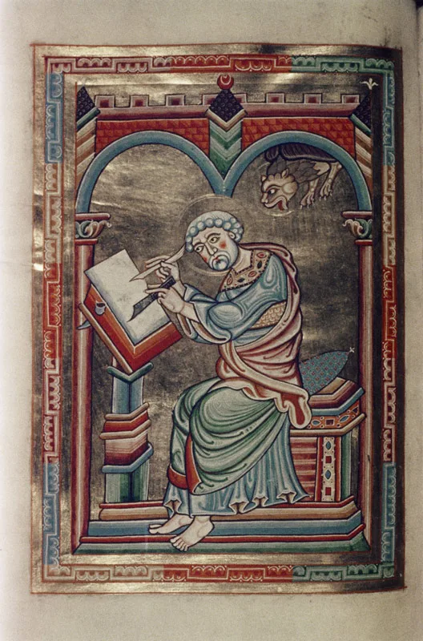

*St. Mark seated, writing; winged lion appears from above. MS. Canon. Bibl. Lat. 60,f. 48v, Austria, XII cent.*

Sometimes it’s your boss, who enjoys micromanagement.
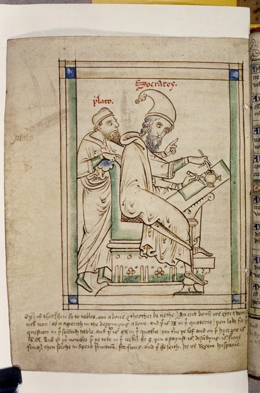

*Plato, micromanaging. MS. Ashmole 304, f. 31v, England, XIII cent.*

Sometimes it’s still your boss that just pops out of nowhere, you get startled and you point your knife at him because of the scare.
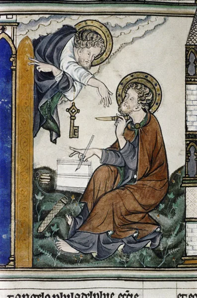

*Christ with the key of David points to the open door, speaking to John who is seated with writing implements. MS. Douce 180, f. 9r, England, ca. 1265\.*

Sometimes you get to be depicted while writing after your boss dictation…
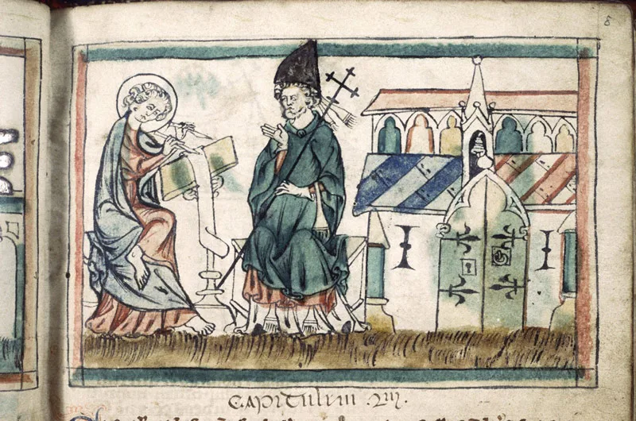

*MS. Auct. D. 4\. 14, St. John writing.*

…and when you protest because he is going too fast…
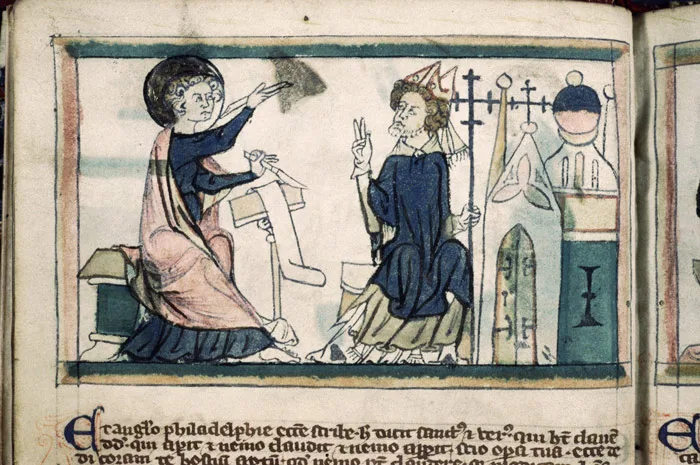

*MS. Auct. D. 4\. 14, St. John protesting.*

…and when your boss cordially reminds you what a useless scribe you are.
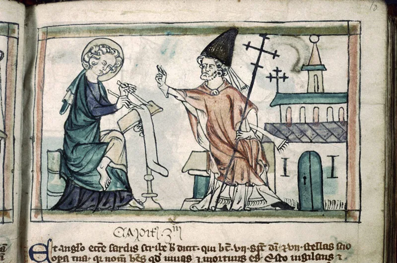

*MS. Auct. D. 4\. 14, St. John is put in his place.*

But it could be worse. You could be depicted as an animal (“Evangelist” promotion required).
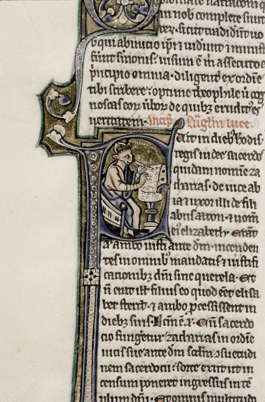

*St. Luke. Initial: St. Luke, with ox’s head, writing. MS. Auct. D. 4\. 8. f. 577v, England, Ca. 1240-1250.*

So it is no wonder that your figures of scribes in medieval manuscripts will be the one of a man with crazy eyes all busy writing a book about the end of the world.
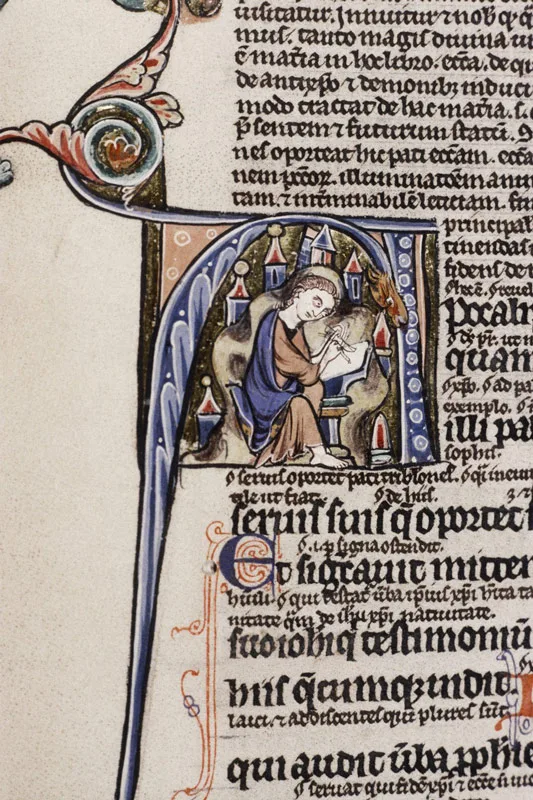

*St. John writing at desk. MS. Laud Lat. 9, France, Ca. 1220-1230*

But, in the end, what’s the coolest thing in being scribes in medieval manuscripts? Well, the fact that many manuscripts survive until our days can prove that once you were once a scribe, but then you  became a knight protecting the holy grail. And you met Indiana Jones. Proof? Proof:

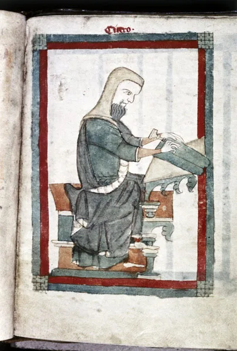

*Cicero seated at desk writing with stylus on tablets (before becoming immortal and a defender of the holy grail). MS. Digby 46, f. 76r, England, XIV cent.*

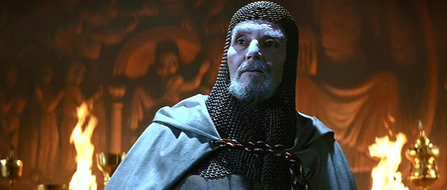

*Cicero as a knight in Indiana Jones and the Last Crusade.*
