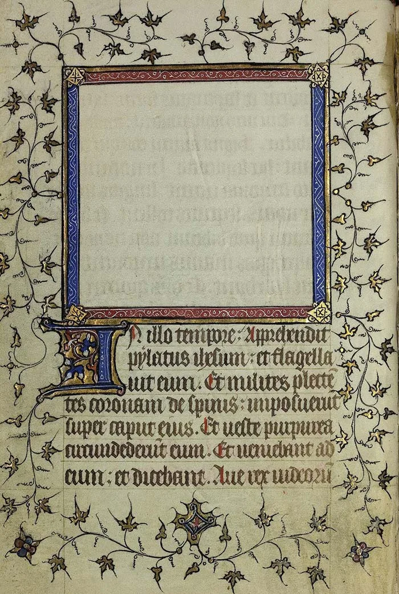

---
date:
  created: 2013-11-07
  updated: 2023-04-03
categories:
- Digital Humanities
- Video
- YouTube
authors:
- giulio
slug: sexy-codicology-youtube
---
# YouTube, Sexy Codicology, Full HD videos of Manuscripts' Details

## YouTube as a Tool to Promote Illuminated Manuscripts?

<!-- more -->

Medieval manuscripts are excellent material for YouTube videos. You can highlight the details and the beautiful colors and illuminations. We decided to give it a try, and yesterday we published [our first video](https://www.youtube.com/watch?v=lsEZW1IBru4) and launched our [YouTube Channel](https://www.youtube.com/sexycodicology?cbrd=1&ucbcb=1).

## What is the plan for our YouTube videos?

**We would like to create videos that go beyond showing the illuminations alone.** We want them to be beautiful, but informative and intriguing too. The aim of the whole Sexy Codicology project is to attract people to medieval manuscripts, but there is so much more beyond the pretty illumination: there are the symbols, the intricate system of manuscript production, the illuminators, the commissionaires and their own stories, etc. Synthesizing all of that in one minute movies is not possible, nor we have the possibility, both economical and technical, to extend the length of videos. Therefore, **videos will have more of a supporting role to what we publish on our blog.**
In example: we created a page about Book of Hours not too long ago. We are now working on a video that will assist the reader in the discovery of such books.

## Issues!

**Well, there are faults in this perfect plan: Copyrights and, most importantly, quality of the digitized medieval manuscript.**
The issue with copyrights is more technical than anything else. Some institutions, the Walters Art Museum in primis, allow use of their digitized medieval manuscripts images under a Creative Common license that allows anyone to use their pictures in any way. This means that we can take their images, optimize them in Photoshop, throw them in AfterEffects, and publish them on YouTube. Some other institutions do not like that, so before we do anything with images, we always have to carefully check that we are not infringing anyone's rights.
There is also an issue concerning music copyrights. We cannot use music that is copyrighted, unless we want YouTube to come to us and tell us we are bad boys. There are some royalty free music we are going to use thought, so we are covered from that point of view.
**Quality of the images is essential for a YouTube project.** Illuminated manuscripts are fantastic, but if you show them in low quality on YouTube, then they become a mass of comprehensible pixels on-screen. Personally, I have a BA in graphic and multimedia design (what does it mean? I still wonder. How did I go from that to medieval manuscripts? God knows), and experience in making short movies; I know that 1200px by 700px at 72dpi of 100kbyte will never be good enough for a full HD video, but a 1200x700 300dpi x 15MB can be enlarged enough without loosing detail. Again, not all institutions have this kind of quality available for users; and again, the Walter Art Museum actually has. Well, they have 300MB tiff images! Perfect. We hope that other institutions will allow bigger downloads so we can make more videos about more fantastic manuscripts.

*YouTube buffering on a Medieval Manuscript (Vatikan, Biblioteca Apostolica Vaticana, Pal. lat. 537)*
