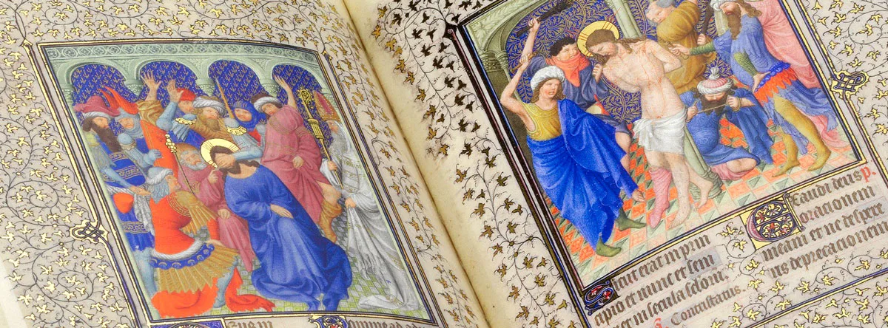

---
date:
  created: 2013-07-24
  updated: 2024-08-07
categories:
- Digital Humanities
- Maps of Digitized Medieval Manuscripts Available Online
authors:
- giulio
slug: sexy-sexy-codicology
---
# Putting the Sexy in Sexy Codicology

## Sexy Codicology, Year II

The Merriam-Webster Dictionary defines the term "Sexy" the following way:
> generally attractive or interesting **:** appealing \<a *sexy*stock\>

<!-- more -->

**And that is what Codicology is to me: Attractive and Interesting.**

*The Belles Heures of Jean de France, Duc de Berry  
France, 1408/1409  
Our [Facebook page](https://www.facebook.com/SexyCodicology) new cover.*

While I was thinking of a name for this blog, **Sexy Codicology was among the first names that clicked in my mind.** I thought it was catchy and well represented the interest that codicology can rise. And so this project begun.
After more than one year, the scene has grown: I am very pleased in seeing **many people sharing more and more images of medieval manuscripts and illuminations over the social media.** It makes me genuinely happy. I come across great posts and links that make me love manuscripts even more.
But then I asked myself: **what can we do more, here at Sexy Codicology?**
In my studies of Aesthetics and Heuristics, back in the days of my BA, I came across the Socialist Realism movement. It believed that [the value of art was to serve some moral or didactic purpose](https://en.wikipedia.org/wiki/Socialist_realism). Stripped of all its political sides, this was the idea behind Sexy Codicology: Use the beauty of manuscripts to spread love and knowledge about manuscripts.
It worked, for a while. But then it became the  movement's opposite: Théophile Gautier's *art pour l'art*, art for art's sake. I see it as an unavoidable development. But, as anyone deeply influenced by the Russian avant-garde of the early 20th century, I asked myself: what can I do more? What's the next step? **How can we put the Sexy back in Sexy Codicology?**

**The next logical step is, in my opinion, to offer tools.**
It's logical:

1. You show someone how cool illuminated manuscripts can be
2. This someone starts looking at manuscripts by him/herself
3. He/she shows them to someone else.
4. Repeat.

It's basically how social media works ([Tumblr](https://sexycodicology.tumblr.com/) *in primis*): "Mr. X sees a cool image; blogs it because he thinks it's cool; someone else thinks the same and does the same."
But what tools are out there really? There are many websites, indeed. But digital tools are lacking. The first thing that came to my map was to create a nice list of libraries and institutions that give access to their digitized illuminated manuscripts. But it wasn't enough: A list is boring, and it doesn't say much. "Let's create maps!" It would tell more: which countries are ahead in the digitization race, where are the most digitized manuscripts? Who is lagging behind?
**So, we decided to contribute by creating these maps.** And that's Sexy.
\[aio\_button align\="center" animation\="none" color\="blue" size\="small" icon\="map-marker" text\="Discover the maps" url\="https://blog.digitizedmedievalmanuscripts.org/digitized-medieval-manuscripts-online/"\]
