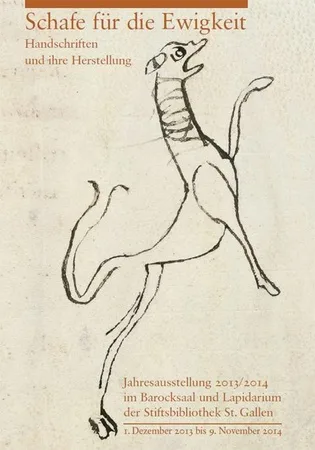
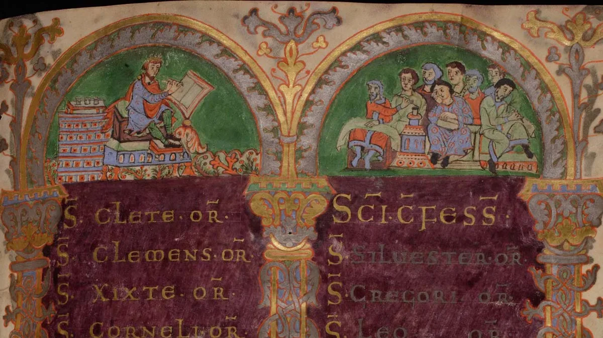
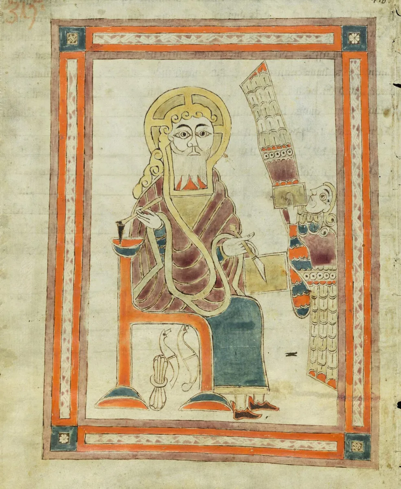
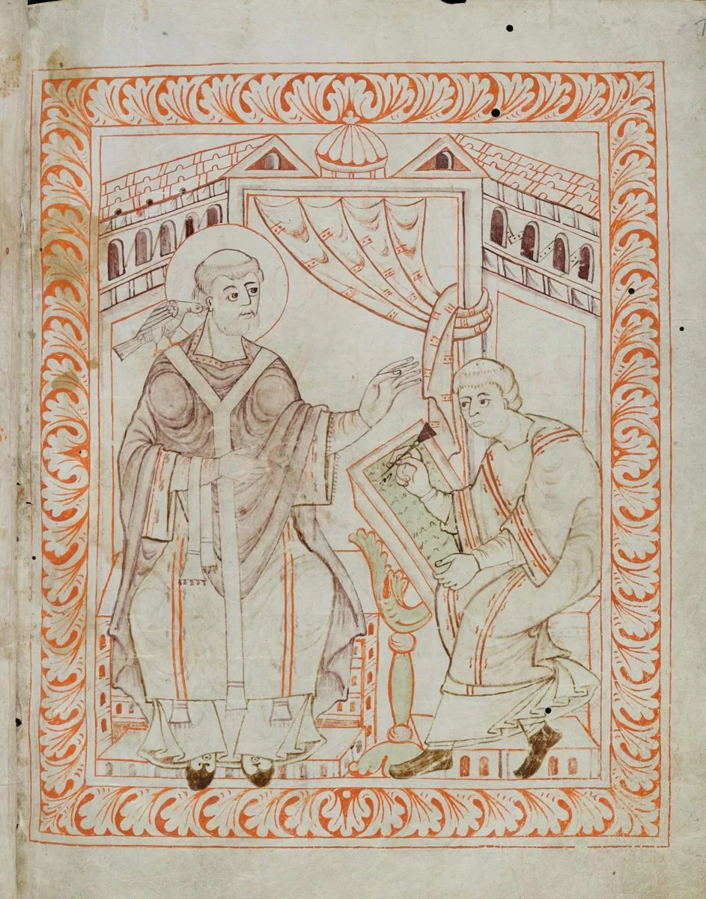

---
date:
  created: 2014-06-15
  updated: 2023-04-03
categories:
- Books
authors:
- giulio
slug: sheep-for-eternity-st-gallen
---
# Sheep for Eternity - The 2013 / 2014 exhibition at the Abbey Library of St. Gallen

[*Schafe für die Ewigkeit \- Handschriften und ihre Herstellung*](https://www.stiftsbezirk.ch/de/stiftsbibliothek/), or: *Sheep for Eternity \- Manuscripts and their Production*, is the name given to the 2013 / 2014 St. Gallen Abbey Library exhibition, running from 1 December, 2013 to November 9, 2014\. A couple of weeks ago I became the lucky winner of the exhibition's catalog.

<!-- more -->

## Sheep for Eternity?

First things first. The exhibition has a wonderful title: *Sheep for Eternity***.** As the flyer that comes with the book, the title is in sharp contrast with the actual maximal age of sheep: 20 years. The subtitle, "Manuscripts and their production" explains what is going on: **The theme of the exhibition and, therefore, of the book is the production of medieval manuscripts.**

*Sheep for eternity \- Schafe fur die Ewigkeit flyer*

Many medieval texts were written on parchment, on specially prepared skins of sheep, calves and goats. Manuscripts that were created more than 1100 years ago, are still excellently preserved today. And from here comes the genial title of this exhibition: *Schafe für die Ewigkeit \- Handschriften und ihre Herstellung*: S*heep for Eternity \- Manuscripts and their Production*.
The exhibition focuses on parchments in all its various qualities and manifestations, but also presents other form of writing supports from medieval times such as papyrus, paper or wax. Moreover, a part of the exhibition is also dedicated to bindings, ranging from covers of the Carolingian era up to the richly decorated deluxe binding with ivory, gold and precious stones or enamel.
The exhibition also looks at monks while writing: showing plenty of miniatures of their work along with the materials they used to create the books. This is also the section that I found most interesting in the catalog: the chapter about the end notes left by scribes extremely fascinating; they are small testimonies of how hard it was to write a manuscript in the middle ages: "three fingers write, but the whole body works". (More about scribal colophon in [this old post of mine](https://medievalfragments.wordpress.com/2012/09/28/give-me-a-drink-scribal-colophons-in-medieval-manuscripts/)!)

## About the Book

*St. Gallen, Stiftsbibliothek, Cod. Sang. 23 \- King David as writing authors and eight clerks, copyists and students*

The cover *Sheep for Eternity* is not the prettiest (in my humble opinion), but this doesn't matter. Once you open the book you can find an almost endless wealth of information concerning the manuscripts that are being exhibited at St. Gallen, along with accurate descriptions of how parchment was made, the miniatures, the rubrications, the treasure bindings and so forth. The layout is elegant and the chosen font is pleasant to the eye. Overall, just browsing through the book is a joy.
Unfortunately **the catalog is in German only**. I had the luck of studying the language in high school, so I can understand some of the text. With a little patience, and Google Translate on your side, anyone can go through this book and enjoy its contents. I would reccomend this book both to manuscripts' enthusiasts and to experts; there is the right mix of well known facts along with smaller details that one might not know. It's 143 pages, published by Verlag am Klosterhof St. Gallen. You can grab your copy [here](https://www.stibi.ch/de-ch/publikationenshop/ausstellungkataloge.aspx/).

## Digital Wunderbar

*St. Gallen, Stiftsbibliothek, Cod. Sang. 1395 \- S. John (?), sitting and writing the Apocalypse, an angel in front of him*

I also found this book to be an excellent companion when exploring the treasures that have been digitized by St. Gallen. **Almost every manuscript presented in the book can be found online.** I have visited the website several times before, but thanks to this book I was able to explore beautiful digitized manuscripts I had never seen before, just because I didn't know they existed. The St. Gallen digital library is part of the [E-Codices Project](https://www.e-codices.unifr.ch/en), you can also access it from our DMMapp.

*St. Gallen, Stiftsbibliothek, Cod. Sang. 390 \- Pope Gregory dictates, inspired by a holy dove.*

***S**heep** for Eternity*,*Schafe für die Ewigkeit,* exhibition is interesting beyond description for all those that are even remotely interested in medieval manuscripts.** Unfortunately, I don't live anywhere near St. Gallen and will not be able to visit the exhibition, but if you do get the chance, go visit. I am sure that looking at the manuscripts contained in the catalog in real life will be a sublime experience.
If you have attended, please share your experience with us!
