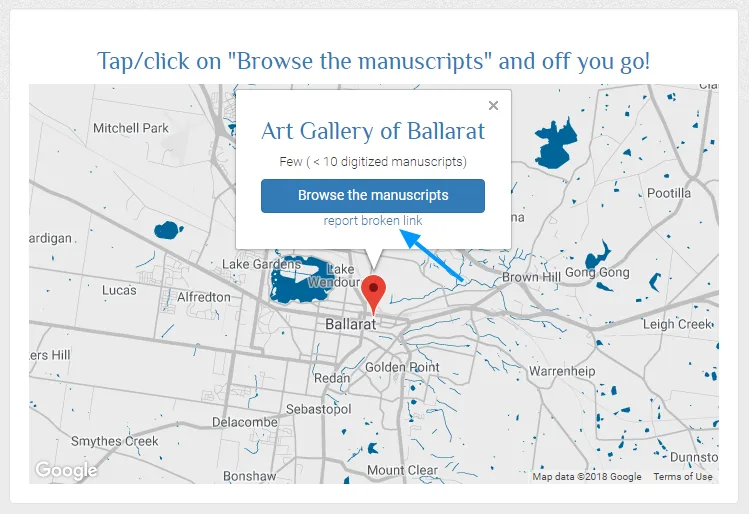
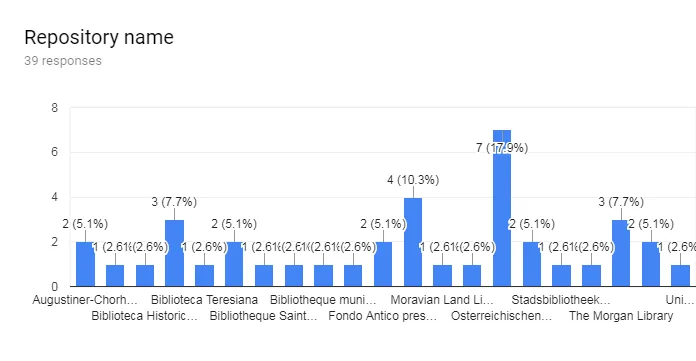
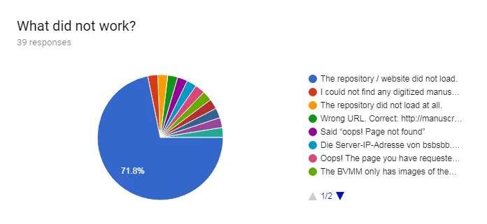

---
date:
  created: 2018-07-17
  updated: 2023-04-03
categories:
- Digital Humanities
authors:
- giulio
slug: tackling-broken-links
---
# Tackling Broken Links!

Some time ago [we published a blog post](https://blog.digitizedmedievalmanuscripts.org/digitized-manuscripts-broken-links/) showing how **broken links to digitized repositories on the DMMapp were a problem**, causing them to become inaccessible to users.
This was a major problem for us: Researchers count on the DMMapp to find and access digitized colletctions, and it is obviously a major blow to the project if they cannot achieve the one thing they came there to do. Also users that simply want to explore collections can easily get frustrated if they stumble upon broken links.

<!-- more -->

## Embrace the "broken links" problem

But how to fix it? The issue is not caused by us, but is systematic (Something called "Link Rot" - See: <https://en.wikipedia.org/wiki/Link_rot>). How can we defeat it? Well, we decided to **embrace the fact that links on the internet break over time** and that Sexy Codicology was not the one that are going to solve the issue for the whole internet; our strategy would be, rather,  a reactive one: we find a broken link, we fix it.
So we had a strategy. Fantastic! But then we had more than 500 links to test. A daunting task! So in the beginning we decided we would run a script that would periodically check all the links and log the servers’ response codes (Technical note: This meant converting the JSON list of links first, extracting only the URLs, then passing these to a PHP script that would recursively query the URLs and log their response.). Needless to say: this strategy proved inefficient and gimmicky and it would also not tell us if there was a particular repository that many users tried to access that did not work.
**We needed something better**, which could continuously warn us of issues and help us.

## Helping hands to the rescue!

After some creative thinking, the idea popped in our mind: “who better than the DMMapp users themselves?!”

*Our solution to the Broken Links issue!*

And just like that we started developing t**he “report broken link” button**. With some magic we managed to have Google Forms pick up the reported broken URLfrom the JSON, and send it to a Google Sheet and at the same time notify us. We implemented it in the DMMapp and watched as notifications came in, conflicted on whether to be pleased with the system working, or saddened by the amount of broken links.

## Benefits

What does the “report broken link” button mean for Sexy Codicology and the DMMapp? Well, the main advantage is the **possibility to quickly identify priorities between broken links and answer the question: “which link urgently requires an update?”**
“But Giulio, all repositories are important! They should be all fixed!”
This is true, and we do our best to have all our links working, but we cannot fix everything instantly because it is only the two of us. So we have to prioritize in some way, and this method we developed is helping us massively!
Here is a practical example:

*Graph showing broken links on the DMMapp reported in June 2018*

This is a graph of the reported broken links in the DMMapp in June 2018. As you can see, the link to the Österreichischen Nationalbibliothek was reported as broken by 7 users, more than any other repository.
This indicates a clear urgency, and we did tackle this repository first (We found a way to link to the digitized manuscripts in the end. It is not a permalink in any way, but you can now [access them here](https://search.onb.ac.at/primo-explore/search?query=any,contains,a&&facet=searchcreationdate,include,0500+|,|+1550&vid=ONB&search_scope=ONB_digital&sortby=rank&tab=onb_digital&lang=de_DE&mode=simple&fromRedirectFilter=true).).
**Perfect!**
Another advantage of the “Report Broken Link” functionality is that our users can tell us what went wrong: The website didn’t load? Are the manuscripts gone? Did we link to the wrong section of the website?

*Graph showing why a broken link was being reported on the DMMapp in June 2018*

A vast majority of the broken links reported so far were, indeed, well… broken links that needed to be updated, with just a couple of links that pointed to websites where digitized manuscripts could not to be found, indicating the need to find a better link that went directly to the books.

## Fixing it!

Now, Sexy Codicology and the DMMapp are projects managed by a dynamic duo and we do our very best to make sure that digitized collections remain accessible to everyone. Institutions should, though, also consider *findability* and *re-findability* when moving collections and URLs. A simple [301 - redirect](https://en.wikipedia.org/wiki/HTTP_301) can go a long, long way in making sure that digitized manuscripts stay accessible.
For example, you once had a digital collection that pointed to a very obscure URL, and now you have developed a new portal where all your collections are properly listed and easy to access. Instead of making the old URL simply die, implement a redirect. Visitors landing on the old URL will be redirected to the new portal, where they will see "manuscripts" and instantly know where to find the material.
Moreover, all the old permalinks, favorites, and links on other website (like the DMMapp) will still provide visitors to your portal. It's a win-win and it takes so little (This is just one o a million strategies for making sure your visitors keep enjoying your collections! There are many more strategies and considerations that one should keep in mind with migration projects.)!
But in our little project, we are very pleased with the solution we managed to come up with. It uses free tools, it is easy to use, and it is effective. So, go ahead! Have fun on the DMMapp and report those broken links! We’ll be there to investigate and fix them. Promised!
