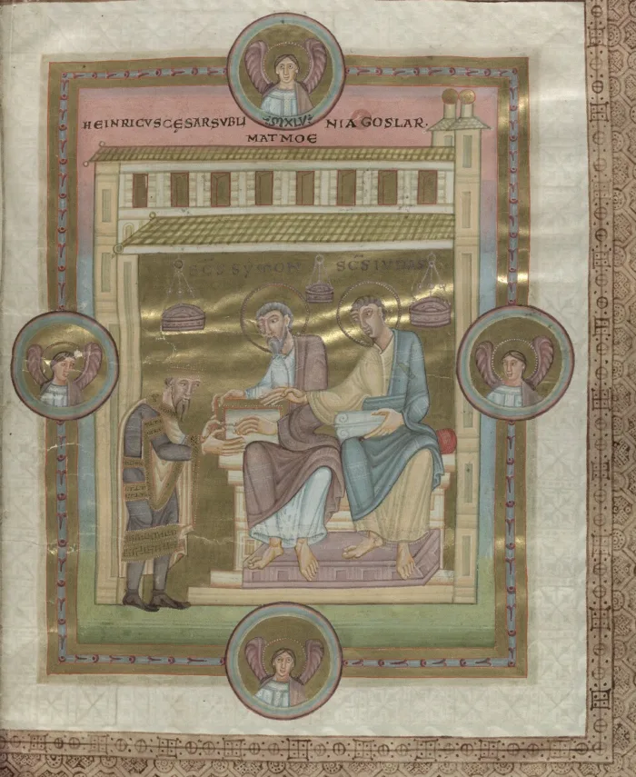

# Uppsala University Library / Uppsala Universitetsbiblioteket: New Repository and new Digitized Medeival Manuscripts

We are excited to announce the addition of the [Uppsala Universitetsbiblioteket / Uppsala University Library to the DMMapp](https://digitizedmedievalmanuscripts.org/Uppsala%20Universitetsbiblioteket)! This valuable link was brought to our attention through the "[Report Missing Institution](https://docs.google.com/forms/d/1EvEN3Ctzt1rQgGPPcyyAZ4UcSN3p-aqVqfOIUTE75Xk)" form, and we extend our heartfelt gratitude to the person who reported it.

<!-- more -->

Uppsala Universitetsbiblioteket is a significant addition to the DMMapp, as it is part of the [ALVIN](https://www.alvin-portal.org/) platform. ALVIN serves as a nationwide platform dedicated to safeguarding and granting access to digitized collections and digital cultural heritage materials from various Swedish cultural institutions. Furthermore, it functions as a comprehensive catalog for materials that are awaiting digitization.

The inclusion of Uppsala UB in the DMMapp is particularly exciting because it houses remarkable digitized treasures. One notable example is the "[Codex Caesareus](http://urn.kb.se/resolve?urn=urn:nbn:se:alvin:portal:record-56059)" (Uppsala, UUB ms C 93), whis is also known as Kejsar Henrik III:s evangeliarium, Kejsarbibeln, and Codex Caesareus Upsaliensis.In English, it is commonly known as "The Emperor's Bible."

## The Emperor's Bible

Written in Latin and created around 1050 in Luxemburg, it is an illuminated manuscript from the 11th century currently housed in Uppsala University Library in Sweden. Despite its name, it is not a complete Bible but rather a Gospel Book. This remarkable piece was crafted in the scriptorium of Echternach Abbey and is one of four large Gospel Books that have survived from the 11th century production at the abbey.

Emperor Henry III commissioned its creation and presented it as a gift to Goslar Cathedral, where it remained until the onset of the Thirty Years' War. Subsequently, the book was lost for approximately a century, and during this time, its previously ornate cover also vanished.

The manuscript resurfaced in the possession of Gustaf Celsing the Elder, a Swedish diplomat and civil servant. Following the passing of his son, the Bible was acquired by Uppsala University.

Adorned with intricate miniatures, including full-page illustrations of the Four Evangelists, illuminated canon tables, and a depiction of the emperor bestowing the book upon the patron saints of Goslar Cathedral, the manuscript showcases a lavish artistic style.

It is written in [Carolingian minuscule](https://blog.digitizedmedievalmanuscripts.org/codicology/medieval-scripts/caroline-minuscule/) and has been remarkably well-preserved overall(([Emperor's Bible \- Wikipedia](https://en.wikipedia.org/wiki/Emperor%27s_Bible))).

## Uppsala-Eddan

Another highlight is the [Uppsala-Eddan](https://www.alvin-portal.org/alvin/imageViewer.jsf?dsId=ATTACHMENT-0055&pid=alvin-record:54179), also known as Snorre Sturlassons Edda, Den prosaiska Eddan, or Den yngre Eddan. It is a significant manuscript written in Old Norse, Icelandic, and Norwegian. It was written by Snorre Sturlasson, who lived approximately from 1179 to 1241\.

Through its poetic verses and prose, this masterpiece not only conveys captivating tales of gods, heroes, and mythical creatures but also provides insights into the beliefs, values, and worldview of the people who shaped its narrative.

## Uppsala University Library's Copyright

Most digitizations that we saw from the Uppsala Universitetsbiblioteket digital repository are makred as Public Domain.

A fantastic addition!
