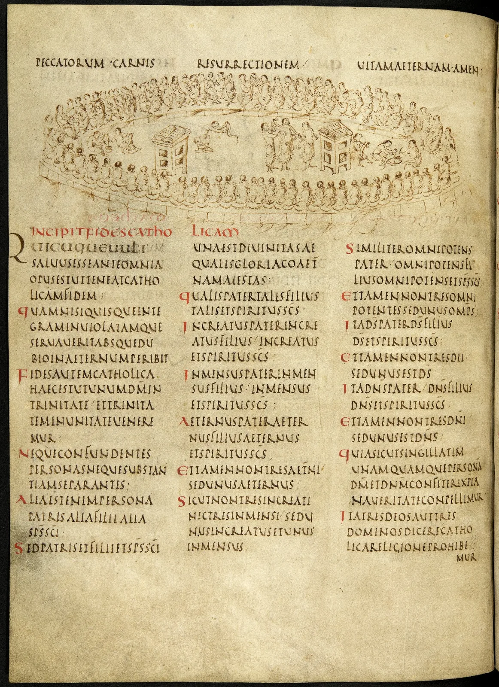

---
date:
  created: 2014-12-13
  updated: 2023-04-03
categories:
- A Medieval Manuscript a Week
- Digital Humanities
- Video
- Utrecht Psalter
authors:
- giulio
slug: utrecht-psalter
---
# The Utrecht Psalter or, "How to promote digitized manuscripts"

What do you do with a super-awesome manuscript like the Utrecht Psalter? You make a super-awesome website to go with it. Not only: you make super-awesome YouTube videos to promote it, and catchy animations so that also casual visitors will be intrigued by what is being shown; plus you make sure that you spread the word on the right social media channels to gain visibility.
This is exactly what the University of Utrecht ([Universiteit Utrecht](https://www.uu.nl/en)) has been doing. A message appeared recently on our [Facebook page](https://www.facebook.com/SexyCodicology):
> The Utrecht Psalter, currently owned by the Utrecht University Library, has just been nominated for UNESCO's Memory of the World Register. In 2015, UNESCO will decide whether the medieval manuscript will be given a place in this documentary heritage register. Dating back to the ninth century, the Utrecht Psalter is one of the most valuable manuscripts held in a Dutch collection. Check the new website (with complete digitized version of the psalter): [www.utrechtpsalter.nl](https://www.uu.nl/bijzondere-collecties/de-schatkamer/handschriften/utrechts-psalter)

<!-- more -->

We went to the indicated website to investigate. We already knew the manuscript: dated between 820 and 830 CE, it was either created in Reims or in the abbey of Hautvilliers; probably meant as a gift for Louis the Pious (son of Charlemagne), it is richly illustrated in a very distinct style that stood out when compared to other contemporary manuscript decorations.

Univeristeit Utrecht has gone great lengths to promote the Utrecht Psalter: Much about the manuscripts is explained in the excellent videos the placed on YouTube, explaining how it got to Utrecht and how and why it was made.The Utrecht Psalter has been nominated for the UNESCO list. The decision will be taken in mid-2015, to decide whether this masterpiece will find its place among others on the documentary heritage register.

## The Utrecht Psalter Online: an example for others

Useless to say, Utrecht University is setting an example on how a library (or any institution) should promote its contents. The website that has been created is informative, interesting and a pleasure to go through. I truly wish there would be a website like this for every manuscript in the world.
You can find out more about the Utrecht Psalter on the following channels:

- [The Official Website](https://www.uu.nl/bijzondere-collecties/de-schatkamer/handschriften/utrechts-psalter)
- [The Digitized Manuscript](https://objects.library.uu.nl/reader/index.php?obj=1874-284427&lan=nl#page//11/51/45/11514575807329943918974580038627186786.jpg/mode/1up)
- [Utrecht University on Facebook](https://www.facebook.com/UtrechtUniversity)
- [Utrecht University on Twitter](https://twitter.com/UniUtrecht)
