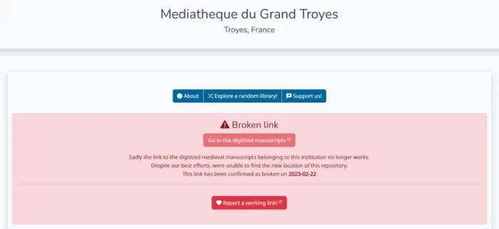
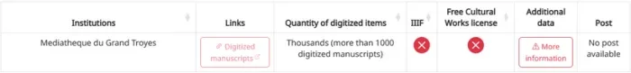
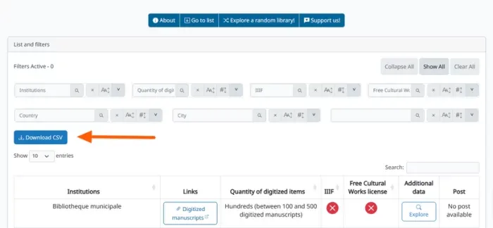
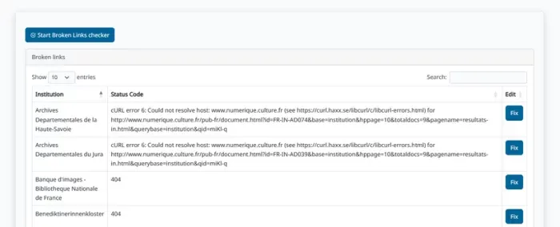
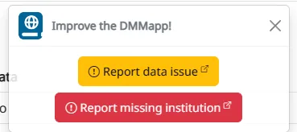
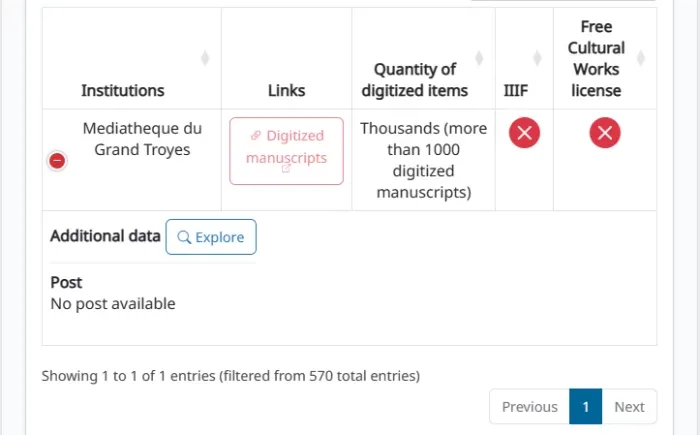

---
date:
  created: 2023-02-25
categories:
- Release Notes
authors:
- giulio
slug: whats-changed-the-dmmapps-february-2023-release-notes
---
# What's changed? The DMMapp's February 2023 release notes

We're excited to announce the February 2023 release of a new version of our [DMMapp](https://digitizedmedievalmanuscripts.org/) (officially known as **v.2023.02.23**)!

<!-- more -->


This latest update includes a range of new features and improvements that will make finding manuscripts smoother, faster, and more intuitive. We've listened carefully to your feedback and have worked hard to incorporate your suggestions into this release.


Let's take a look at what's new in this DMMapp iteration:


## Overview


One of the key changes we've made is a redesign of the user interface, especially when it comes to "broken links": **Libraries that were added to the DMMapp, but that no longer lead to digitized manuscripts are now clearly marked** in the [Data page](https://digitizedmedievalmanuscripts.org/data) and on the [Single Institution Page](https://digitizedmedievalmanuscripts.org/mediatheque-du-grand-troyes) - along with the date of when the broken link was confirmed broken, plus a button to report a working link to us.








Linked to this is the decision to **no longer delete institutions from the database**. The idea is that if there were digitized manuscripts at a certain point in time, they might still be around somewhere else. We just don't know where, and we hope that you will be able to help us fix these links.


One of the biggest requests has also been implemented: **it is now possible to download the DMMapp's database as CSV** so that you can use it for your own project!





In addition, **we have decided not to serve ads by Google and Amazon anymore**. Ads were present in [the blog](https://blog.digitizedmedievalmanuscripts.org/) and not on the DMMapp itself, but they contributed almost nothing to covering the hosting costs. Links to Patreon and our store on RedBubble are still present as they are essential to this project.


As a result of this change, and as you might have noticed already, we've have also simplified the layout and made it easier to navigate the DMMapp so that you can find digitized manuscripts more quickly.


Simplifying the layout also improved the overall performance of the DMMapp. These last two changes also apply to the blog, that has been completely restyled to align its looks with the DMMapp.


Next to all these updates we have added some features to the back-end that will simplify the management of the app for us. For example: it has now become easier to check if the DMMapp is working correctly, or if there are any critical issues we should be aware of.


On a slightly unrelated note to the DMMapp, **we have also made the choice to close our social media accounts on Twitter and Facebook**. The reason is simple: our team of two does not have the time to maintain them. Not posting on them made the the project look abandoned, while it's very much active instead!


A more detailed look at what we did:


### New Features


- **New "broken links" experience:** If a link to a repository is broken and the digitized manuscripts can no longer be found, they will be clearly marked, both on the filterable list, and on the institutions' individual page.
- **New "broken links" detector:** Every month, the DMMapp scans its database and checks every institution's individual link. If a repository cannot be reached, it is marked for review.





- **It is now possible do download the DMMapp database as a CSV via the Data page.**


### Improvements


- **Made it easier to report broken links or new repositories:** A dismissible tab has been added to the Data page, the Map page, and the Single-Institution page.





- **Optimized loading speeds:** removed as much fluff (external code, animations, etc.) as possible from the app.
- **Harmonized "looks":** The DMMapp and the DMMapp's blog now follow the same stylesheet and look as alike as possible.
- **Removed 'Fontawesome' in favor of 'Bootstrap Icons'.**
- **A plethora of typos and minor bugs have been fixed.**


### Changes


- **Libraries now load in random order when accessing the app:** Every time you visit the Data page or the Map, the orders of the repositories will always be different.
- **Removed social media links, except LinkedIn and Patreon:** consequence of having closed the accounts.
- **Removed Google AdSense and Amazon ads:** We no longer serve ads in general, except the links to our Patreon and RedBubble store.


### Known Issues


- **Broken links are not properly marked, yet, on the Map page:** This change is planned for the next update. The Map currently gets little traffic (< 5% of the total traffic to the DMMapp) and consequently has a lower priority.
- **On mobile devices:** the link to a repository without a working link will be correctly marked in red, but the normal 'Explore' button will still appear while the correct 'More information' button in red should appear instead. We are looking into a fix.





- **There are still unmarked broken links at the moment.** They need to be reviewed still and it is an ongoing process. As a consequence they will be properly marked or fixed over time.


Overall, this update is designed to make your experience with the DMMapp more efficient and effective: We've have given a hard look at the app, listened to your feedback, and worked hard to create an experience that meets your needs as a researcher or as a fan of medieval manuscripts.


We hope you'll take some time to try out the latest features and improvements that we've made. As always, we'd love to hear your feedback about these; if you have any thoughts or suggestions on how we can make the DMMapp even better, please don't hesitate to let us know.


We're also grateful for your support as we continue to develop the DMMapp: If you enjoy using the DMMapp and would like to support our continued development efforts, [**we'd be honored if you would consider supporting us on Patreon**](https://www.patreon.com/SexyCodicology)**.**


Your support helps us to keep improving the application and making it the best it can be.


```
Image: Missal
between about 1389 and 1400
Master of the Brussels Initials (Italian, active about 1389 - 1410)
https://www.getty.edu/art/collection/object/103RWN
Getty
https://digitizedmedievalmanuscripts.org/the-j-paul-getty-museum
```
