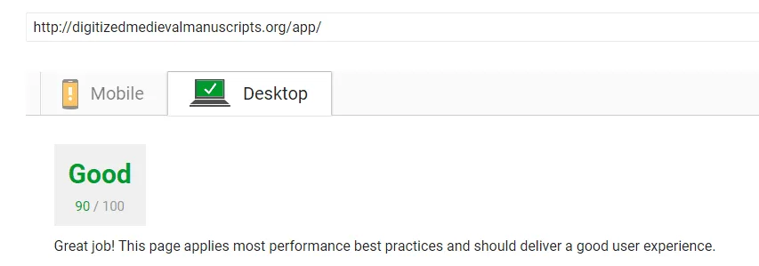
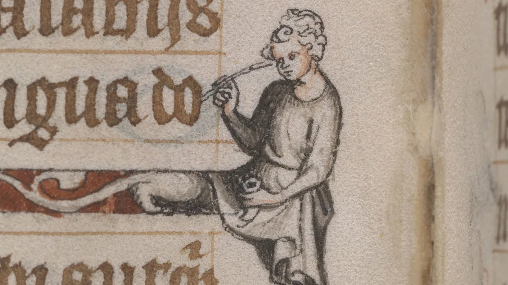

---
date:
  created: 2017-07-18
  updated: 2023-04-03
categories:
- Digital Humanities
- DMMapp
- Sexy Codicology Blog
- Update
authors:
- giulio
slug: whats-sexy-codicology-team
---
# What's the Sexy Codicology Team up to?

We have been working a bit in the shadows lately, and we thought it might be interesting to share what we have been up to! There are news concerning both the DMMapp, the Sexy Codicology Blog. Let's go with order:

<!-- more -->

## DMMapp updates

- **The "Added Resources" tab is growing with new links.** As we go, we see that there might be then need to expand the info that is given next to every link; unlike the "Digitized Manuscripts" tab, which, rather clearly, links to "digitized manuscripts" ("duh!"), the "added resources" links to a variety of content: blogs, collections, portals, etc. Up until now we have user placeholder names and we will investigate how to further improve the table. We would love you to chime in and help us; we are open to ideas!
- There has been a lot of work also in the depths of the DMMapp. We have further **optimized the performance for both mobile and desktop users**. Even Google compliments us...
  

  *The DMMapp is faster than ever!*

  There is always work to do, especially on the mobile side of things, yet we can proudly say that the DMMapp is faster than ever!
- **Feedback button**. AT LONG LAST! One of the most important buttons is finally available on the DMMapp. While using the app you will notice a new button at the bottom, sporting a very boring text: "Feedback". Click on it, and you will be able to tell us if there are any problems, issues, broken links, or simply say hello to us! Please do use it; we are very ashamed that it took so long for us to implement such an essential button. The best way to continue improving the app is via your suggestions!
- **Want to know the status of the DMMapp project?** Find out over at [GitHub](https://github.com/SexyCodicology/DMMapp/projects/1)! Whenever we encounter an issue, or we notice an angle for an improvement, we'll have it posted there.
- Small things: **a blue stripe on top of the app** will show you if the app is loading or not. Also the Patreon button has been updated with a new graphic.

## The Sexy Codicology Blog updates

*The Hours of Jeanne d'Evreux, Queen of France \- Folio 55v, detail*

- Also here: the aim was to **speed up the blog**, while keeping the website pretty. Here the results are not as good as we would like them to be… But still, improvement is improvement, we'll keep at it until we have a fast loading website.
- **We are (slowly) implementing MLA citation style throughout the blog**. Citations are important, and we hope they will be useful to users that visit our blog. This is a long term project that will proceed slowly, step by step, for the old content. New content will always have the proper references.
- **You want to know what we are working on for the Sexy Codicology blog, specifically?** Just like with the DMMapp, you can now do that on [GitHub](https://github.com/SexyCodicology/Sexy-Codicology/projects?query=is%3Aopen)! We have created a project page where you can see all of our ideas and the stage they are at.
- There is also a **fancy new newsletter subscription form**, by the way!

## Conference announcement

- We will be at a conference in Ghent later on this year (September). The theme of our presentation will be **"Discoverability of digitized medieval manuscripts"**. We'll have a post explaining what we will be speaking about exactly, so stay tuned!

*Header image: The Belles Heures of Jean de France, duc de Berry \-* 
*Folio 15r, Saint Catherine in Her Study \- The MET -https://www.metmuseum.org/art/collection/search/470306*
