# The Book of Hours - A Medieval Bestseller

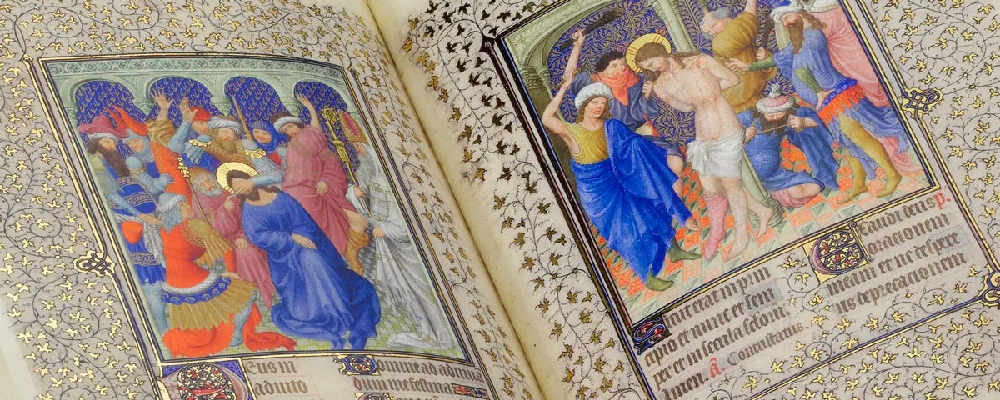

No other type of manuscript has survived in such great numbers as the Book of Hours. By the thirteenth century it had become the most used prayerbook in western Europe. On this page, we're going to give some basic information about these beautiful illuminated manuscripts, and discover some amazing miniatures in the process.

## The Origin of the name: "Book of Hours"

To understand why the Books of Hours are called this way, we have to look at the word "hour". It comes from the Greek word *ὅρα*, later *hora* in Latin, which indicated "a limited space of time", or, more specifically, the 3 seasons the ancient Greeks divided the year into. In the Middle Ages it slightly changed meaning and started to indicate the more or less exact space of time dedicated to praying or doing business. Ordinary people had the desire to follow the example of monastic orders, which had a routine of rituals and prayers observed every day. The Book of Hours had the aim of letting them do just that.

## The Composition of a "Book of Hours"

The Books of Hours are not all alike, and that's part of the beauty of these manuscripts. There is quite some variety in which devotional texts were included in a Book of Hours, although some sections were common to all of them. Let's go through the most common ones.

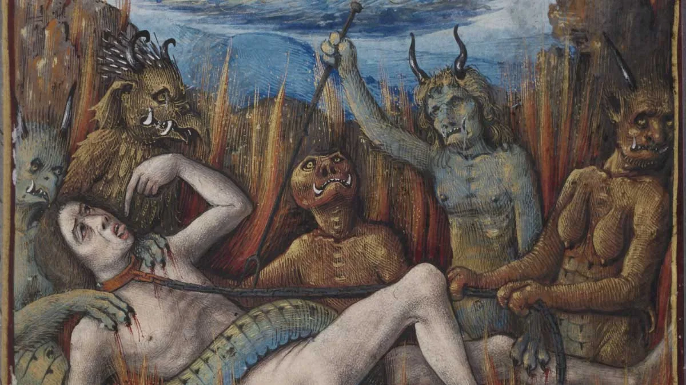
*Detail from the [Vanderbilt Hours](https://collections.library.yale.edu/catalog/2001877), f. 74r*

### Calendar

With a list of the saints' days for each month, the Calendar is always at the beginning of the Book of Hours. Important days, such as Christmas or feast days of the Apostles, are usually written in red ("red-letter days" comes from here) or gold. The rest of the saints or festivals are in normal black. It's an often-decorated part of the manuscript — it's easy to find illuminated pages of labours of the month or local activities, along with zodiac signs.

### Sequences from the Gospels

Usually beginning with an illumination of one of the four evangelists, the Sequences from the Gospels is a part often present in a Book of Hours, made of extracts from each of the Evangelists. The way they were portrayed is fairly standard: usually sitting at their desk, writing the Gospels, with their attribute (the angel, the bull, the eagle, the lion) next to them. Occasionally you may find Saint John on the Isle of Patmos, where he had a vision of the Apocalypse and wrote the Book of Revelation.

### Prayers to the Virgin

Typical of French Books of Hours, the Prayers to the Virgin were usually introduced by a representation of a Pietà or a Virgin and Child. In this section we can find two prayers: *Obsecro te*, with the owner of the book kneeling in an illustration nearby, and *O intemerata*, usually not illustrated.

| | | |
|---|---|---|
| 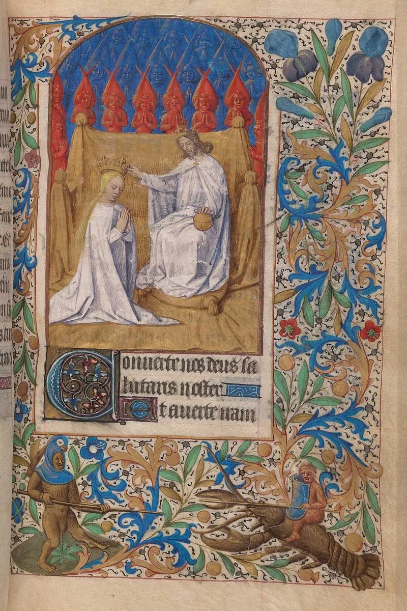 | 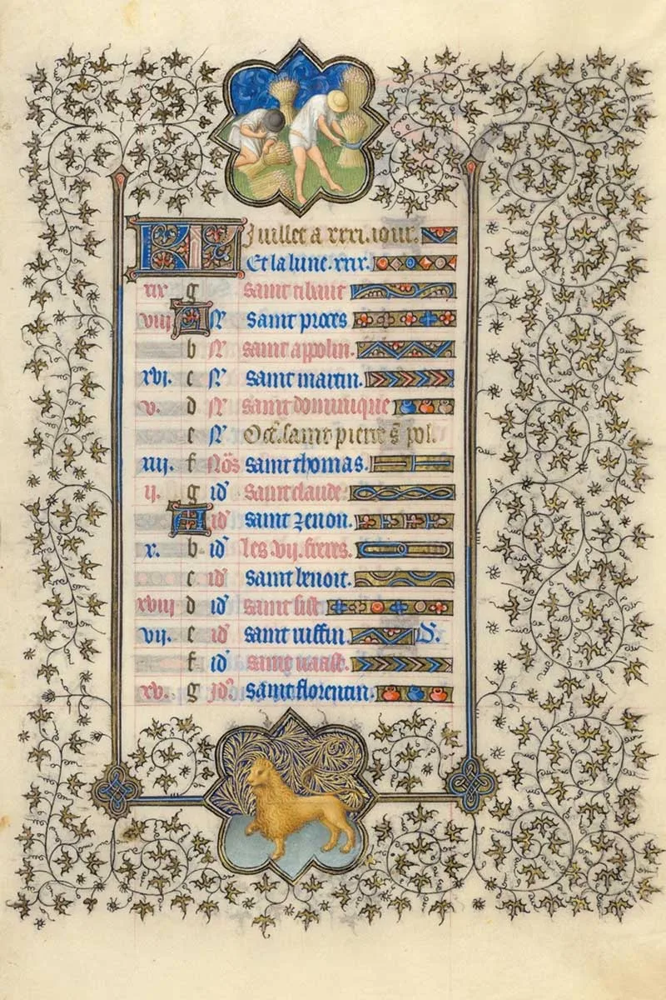 | 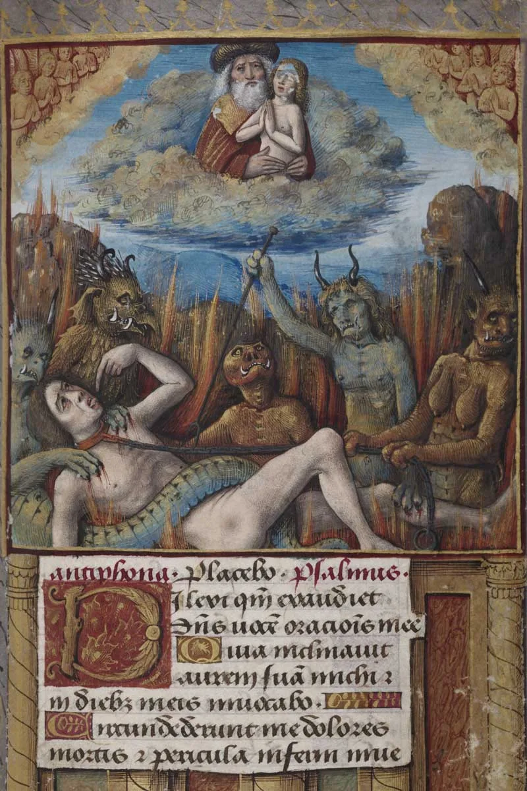 |
| *Coronation of the Virgin — [Beinecke MS 662](../libraries/beinecke-rare-book-manuscript-library-523.md), Book of Hours, use of Paris, f. 81* | *Belles Heures of Jean de France, Duc de Berry, f. 8r, Calendar: summer* | *The Vanderbilt Hours, f. 74r* |

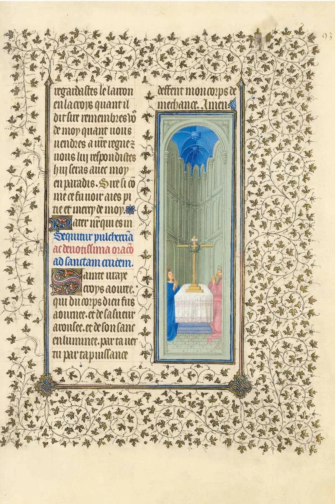
*Belles Heures of Jean de France, Duc de Berry, f. 93r, Hours of the Cross*

### Hours of the Virgin

The essential part of any Book of Hours. It is formed by a standard series of prayers along with psalms to be recited at each of the eight canonical hours of the day: *Matins, Lauds, Prime, Terce, Sext, None, Vespers and Compline*. Usually it's the most heavily decorated section of the manuscript, with each Hour decorated by a miniature representing an episode from the life of Mary.

### Hours of the Cross and Holy Spirit

Composed of a hymn, an antiphon and a prayer, these Hours are much shorter compared to the others, with little to no miniatures. The prayers here were used to supplement the standard hourly prayers.

### Penitential Psalms

Another core part of the Book of Hours, and the section with the most varied miniatures. Usually David is represented, being the author of the Psalms after having committed all of the Seven Deadly Sins. The psalms are an outcry of sorrow for the committed sins.

### Litany

The third essential part of the Book of Hours. The Litany is a cry for help addressed to the Holy Trinity, the Virgin Mary, the Archangels Gabriel, Michael and Raphael, and the Saints. As you'd imagine, there's little room for decoration in this section of the manuscript.

| | | |
|---|---|---|
| 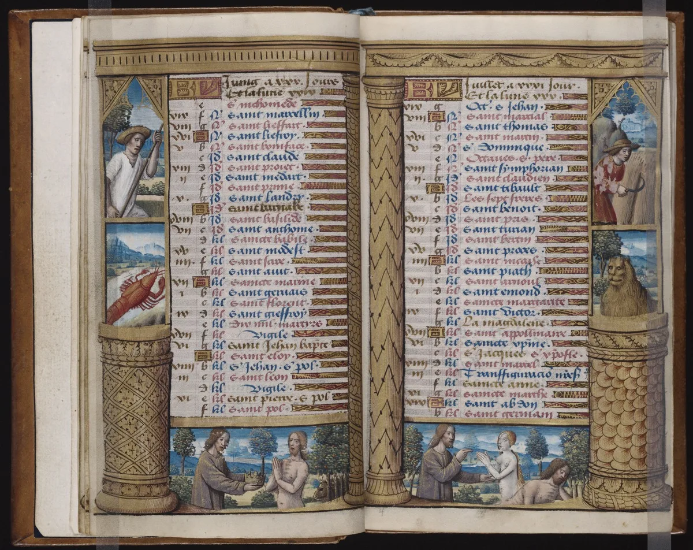 | 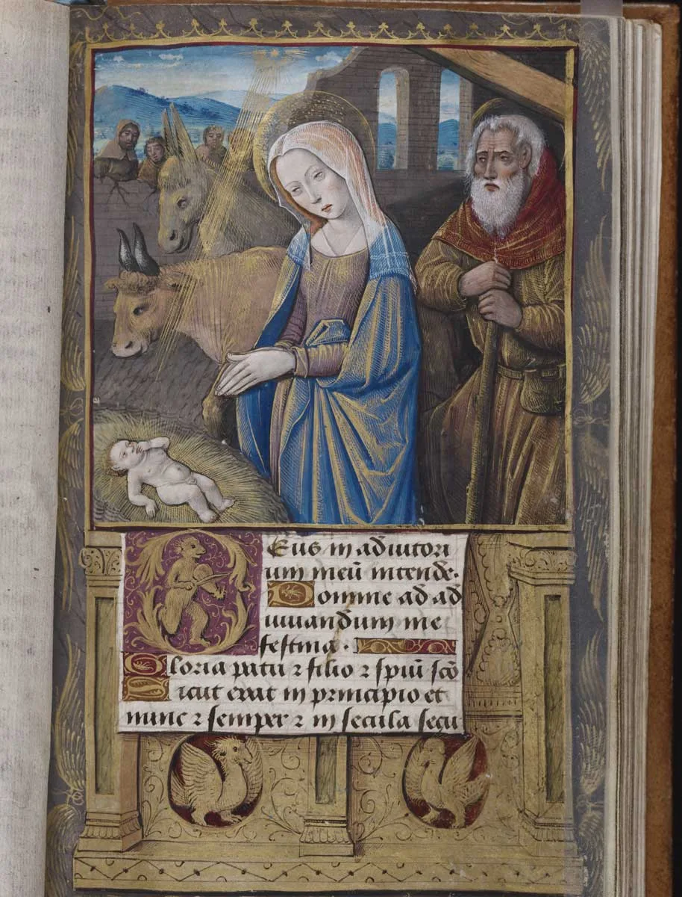 | 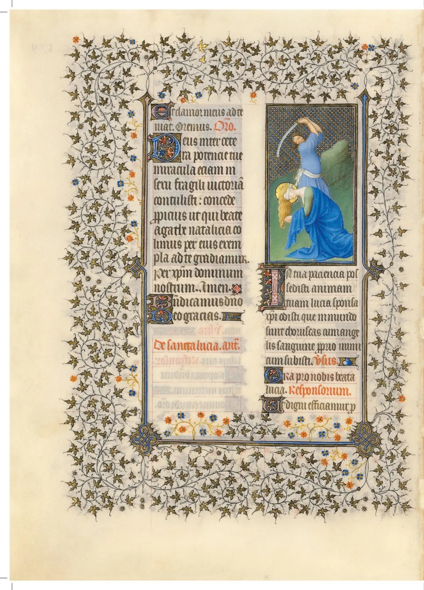 |
| *[Beinecke MS 436](../libraries/beinecke-rare-book-manuscript-library-523.md), Vanderbilt Hours, ff. 3v–4r, Calendar, June and July* | *Beinecke MS 436, Vanderbilt Hours, f. 27r, Nativity* | *Belles Heures of Jean de France, Duc de Berry, f. 179v, Saint Lucy* |

### Office of the Dead

Divided into two parts, Matins for the mornings and Vespers for the evening, the Office of the Dead consists of a series of prayers originally intended to be said over the coffin while it rested in a church. With death being such an important aspect of the medieval period, it's easy to imagine that this section of the Book of Hours is heavily decorated. Skulls, skeletons and *memento mori* are typical of later Books of Hours; earlier ones usually present the classic Universal Judgement.

### The Suffrages

The Suffrages are composed of short devotions with prayers to the Holy Trinity, the Virgin Mary, St. Michael, St. John the Baptist, and the Apostles, followed by an almost always unique selection of saints, represented with their traditional emblems. This is a heavily decorated part of the manuscript.

| | | |
|---|---|---|
| 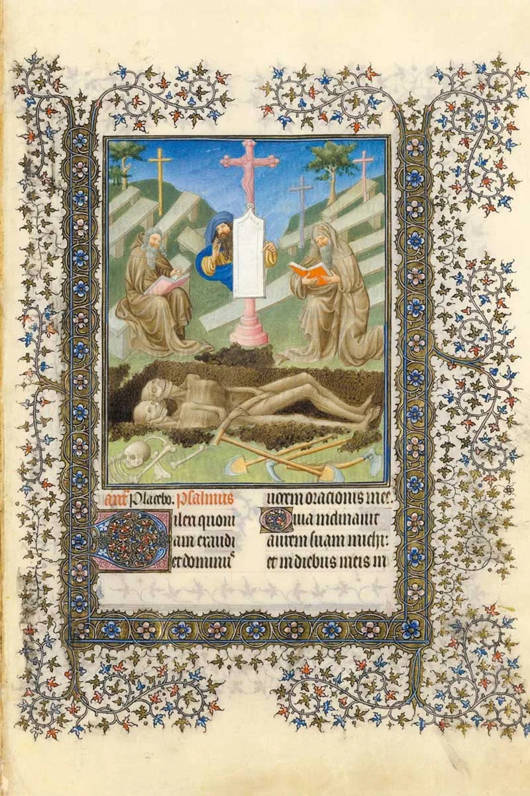 | 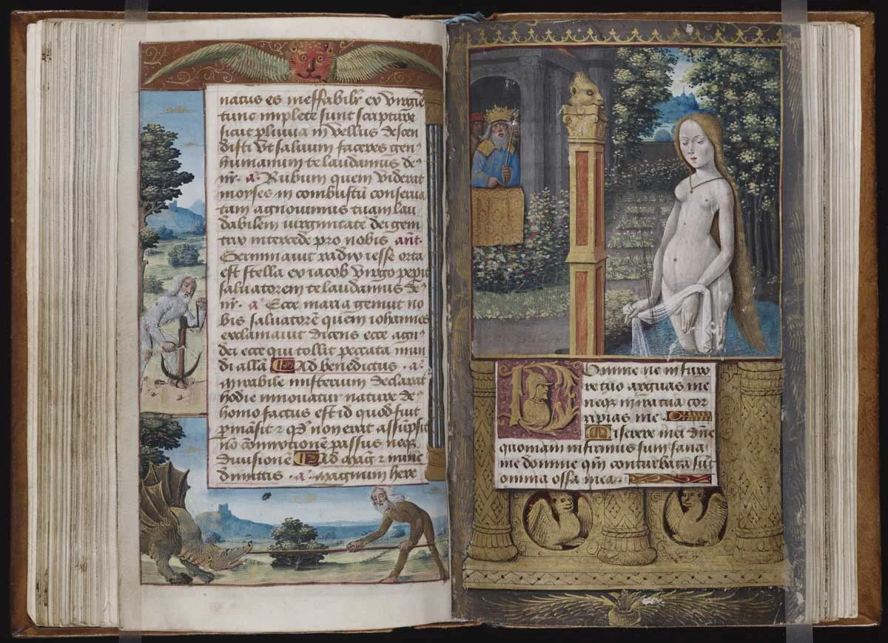 | 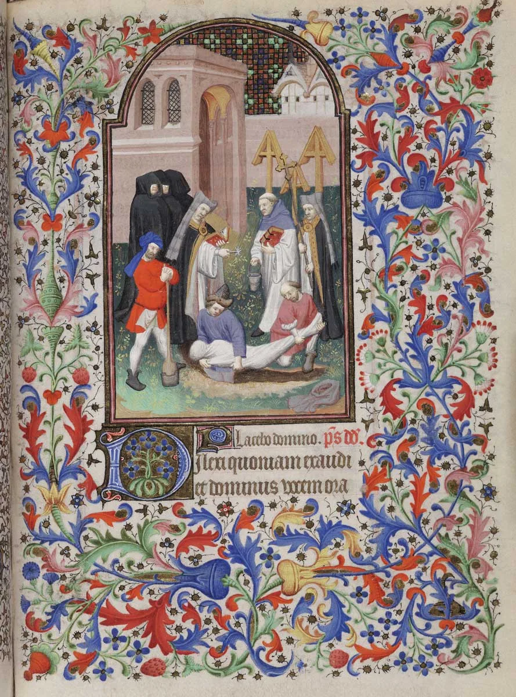 |
| *Belles Heures of Jean de France, Duc de Berry, f. 99r, Office of the Dead* | *Beinecke MS 436, Vanderbilt Hours, ff. 55v–56r, David spying on Bathsheba* | *[Beinecke MS 400](../libraries/beinecke-rare-book-manuscript-library-523.md), De Levis Hours, f. 130r, Office of the Dead* |

## Further Reading

On this page we've barely scratched the surface of these manuscripts. We hope we've made you curious and willing to know more about medieval manuscripts in general. Here are some useful resources where you can continue learning about Books of Hours:

- [Book of hours — Wikipedia](https://en.wikipedia.org/wiki/Book_of_hours)
- [The Text of the Hours — medievalist.net](https://www.medievalist.net/hourstxt/home.htm)
- *Introduction to Manuscript Studies* — an excellent and complete book to start off with if you're new to medieval manuscripts.
- *A History of Illuminated Manuscripts* — less technical, easy to read, and explains many details on how books were used in the medieval period.
- *Books of Hours (Phaidon Miniature Editions)* — focuses on Books of Hours only, small and with fascinating folios from various manuscripts.
- *The Hours of Catherine of Cleves: Devotion, Demons and Daily Life in the Fifteenth Century* — an impressive book, packed with information about one of the most beautiful Books of Hours.

Also, remember to visit your local library — you'll find hundreds of books on the matter.

Want to browse digitized Books of Hours yourself? [Yale's Beinecke Rare Book & Manuscript Library](../libraries/beinecke-rare-book-manuscript-library-523.md) — home to the Vanderbilt and De Levis Hours pictured above — is one of hundreds of collections on the DMMapp.

[Discover the DMMapp](../index.md){ .md-button .md-button--primary }
